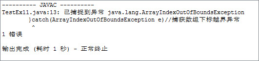
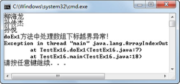
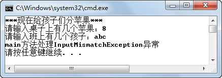

## 本章简介
 异常（Exception）处理是程序设计中一个非常重要的方面，也是程序设计的一大难点。也许用现有的知识，可能想到用if（！错误）｛正常代码｝else｛错误代码｝来控制错误，但这样做会非常痛苦。Java语言在设计的时候就考虑到了这个问题，提出了异常处理的机制，即抛出、捕获机制用来解决这样的问题。本章将详细介绍什么是异常以及异常的继承关系，如何使用try…catch…finally语句处理异常，以及自定义异常的使用，最后会列出编程过程中的常见异常让大家有所了解。

 

 

 

## 1.1  异常概述

&emsp;&emsp;在程序运行过程中，经常会出现一些意外的情况，这些意外会导致程序出错或者崩溃，从而影响程序的正常执行，如果不能很好地处理这些意外情况，程序的稳定性就会受到质疑。在Java语言中，将这些程序意外称为异常，出现异常时的处理称为异常处理，合理的异常处理可以使整个项目更加稳定，也可以使项目中正常的逻辑代码和错误处理的代码实现分离，便于代码的阅读和维护。

### 1.1.1  异常引入  

&emsp;&emsp;让我们来看下面的一段程序，运行程序，其运行结果如图1.1所示。


```
public class TestEx

{

    public static void main(String[] args) 

    {

        String teachers[]={"柳海龙","孙传杰","孙悦"};

        for(int i=0;i<4;i++){

            System.out.println(teachers[i]);

        }

        System.out.println("显示完毕！");

    }

}
```

<p align="center"></p>  
<p align="center">图1.1  异常引入</p>  
&emsp;&emsp;程序出错的原因很简单，程序员定义的数组长度是3，而在使用数组时，却访问了下标为3的第4个数组元素，所以程序出现异常。

&emsp;&emsp;让我们再看一个程序：


```
import java.util.Scanner;

public class TestEx2

{

    public static void main(String[] args) 

    {

        int appleNum = 0;                 //苹果数

        int stuNum = 0;                     //学生数

        System.out.println("***现在给孩子们分苹果***");

        Scanner input = new Scanner(System.in);

        System.out.print("请输入桌子上有几个苹果：");

        appleNum = input.nextInt();

        System.out.print("请输入班上有几个孩子：");

        stuNum = input.nextInt();

        System.out.println("班上每个孩子分得多少苹果：" + appleNum/stuNum);

        System.out.println("孩子们非常开心！");

    }

}
```


&emsp;&emsp;运行程序，分两次输入如下数值，程序运行结果如图1.2和图1.3所示。


<p align="center"></p>  
<p align="center">图1.2  异常引入</p>  


<p align="center"></p>  
<p align="center">图1.3  异常引入</p>  


&emsp;&emsp;如图1.2所示，把20个苹果分给10个孩子，每个孩子得到2个苹果。但是如果在输入的过程中，用户不小心在输入班上孩子数时，输入值为0，则出现了如图1.3所示的异常，程序运行结束。

&emsp;&emsp;如何解决上面的两个问题呢？

&emsp;&emsp;第一个案例解决方法很简单，在for循环的时候，将第二个表达式由“i < 4”改成“i < teachers. length”即可，这样通过数组的长度控制了循环的次数，保证不会出现数组下标越界的问题。

&emsp;&emsp;第二个案例的解决代码如下：


```
import java.util.Scanner;

public class TestEx4

{

    public static void main(String[] args) 

    {

        int appleNum = 0;                 //苹果数

        int stuNum = 0;                     //学生数

        System.out.println("***现在给孩子们分苹果***");

        Scanner input = new Scanner(System.in);

        System.out.print("请输入桌子上有几个苹果：");

        appleNum = input.nextInt();

        while( stuNum == 0)            //如果输入孩子数为0，则要求用户再次输入

        {

            System.out.print("请输入班上有几个孩子（孩子数不能为0）：");                  

            stuNum = input.nextInt();

        }

        System.out.println("班上每个孩子分得多少苹果：" + appleNum/stuNum);

        System.out.println("孩子们非常开心！");

    }

}
```


&emsp;&emsp;在修改后的代码中，采用了while循环的方式进行判断，如果用户输入的孩子数为0，则要求用户继续输入，通过这种方式，解决了除数为0的异常的产生，程序运行结果如图1.4所示。


<p align="center"></p>  
<p align="center">图1.4  异常引入</p>  


&emsp;&emsp;采用判断语句的方式进行异常的处理，首先需要意识到哪些地方可能出现异常，在可能出现异常的地方加入判断语句和处理代码。这种处理方式对程序员的要求高，而且代码量大，程序结构混乱。

### 1.1.2  异常分类  

&emsp;&emsp;想要知道异常的分类，了解Java异常的继承关系，首先了解Java异常的层次结构，如图1.5所示。

&emsp;&emsp;Throwable，所有异常都继承自java.lang.Throwable类，Throwable类有两个直接子类，Error类和Exception类。

&emsp;&emsp;Error类是Throwable类的子类，是Java应用程序本身无法恢复的严重错误，应用程序不需要捕获、处理这些严重错误。当程序发生这种严重错误时，通常的做法是通知用户并中止程序的执行。


<p align="center"></p>  
<p align="center">图1.5  Java异常层次结构图</p>  


&emsp;&emsp;Exception、Error表示Java应用程序本身无法恢复的严重错误，而不是这种Java应用程序无法恢复的严重错误，我们称之为异常。异常可分为运行时异常（RuntimeException）和检查时异常（CheckedException）两种。

&emsp;&emsp;RuntimeException，运行时异常即程序运行时抛出的异常，不要求程序员在编程时必须对这些异常进行处理，也能编译通过。前面数组下标越界异常和除数为0的异常都是运行时异常。

&emsp;&emsp;CheckedException，检查时异常又称为非运行时异常，这样的异常要求程序员必须在编程时进行处理，否则就会编译不通过。例如，在前面的学习过程中，经常在编译的时候发生类找不到的情况，这就是一个典型的检查时异常。

 

## 1.2  异常处理

 

&emsp;&emsp;所谓异常处理，就是发生异常之后，程序员要求程序该如何操作。

### 1.2.1  基本异常处理  

&emsp;&emsp;Java对异常的处理采取的是抛出、捕获的机制，即由一段可能抛出异常的程序抛出异常（也可能正常执行，不抛出异常），在这段程序外有专门的异常处理程序进行处理，针对抛出的不同类型的异常捕获后进行处理，这就是Java异常处理机制。Java异常处理机制的语法形式如下：

```

try{

	//可能抛出异常的语句块

}catch(SomeException1 e)// SomeException1特指某些异常，非Java中具体异常，下同

{

    //当捕获到SomeException1类型的异常时执行的语句块

} catch(SomeException2 e)

{

    //当捕获到SomeException2类型的异常时执行的语句块

}finally{

    //无论是否发生异常都会执行的代码

}
```


&emsp;&emsp;接下来还是先从程序开始，看看如何编写异常处理程序。


```
public class TestEx5

{

    public static void main(String[] args) 

    {

        try{

            String teachers[]={"柳海龙","孙传杰","孙悦"};

            for(int i = 0;i < 4;i++){

                System.out.println(teachers[i]);

            }

        }catch(Exception e)

        {

            System.out.println("数组下标越界，请修改程序！");

        }

        System.out.println("显示完毕！");

    }

}
```


&emsp;&emsp;该程序中，将可能抛出异常的代码放在了try语句块里，使用catch语句对所有异常（因为异常类型是Exception）进行捕获。如发生异常则输出“数组下标越界，请修改程序！”并且不退出程序，继续执行异常后面的代码，程序运行结果如图1.6所示。


<p align="center"></p>  
<p align="center">图1.6  try...catch...异常结构</p>  


&emsp;&emsp;如果try语句块中的代码不抛出异常，则执行完毕try语句块，catch语句块中的代码不被执行；如果try语句块抛出异常，则try语句块中发生异常后的代码将不再被执行，而由相应的catch语句进行捕获，catch语句块中的代码将会被执行。这里相应的catch语句是指，catch语句后面捕获异常声明的类型必须与try语句抛出异常的类型一致，或者是抛出异常类型的父类。

### 1.2.2  多个catch块  

&emsp;&emsp;将上面的程序做如下修改：

&emsp;&emsp;（1）修改for循环的第二个表达式，由“i < 4”改成“i < teachers.length”，使该段程序不会抛出数组下标越界异常；

&emsp;&emsp;（2）将“给孩子们分苹果”的程序代码加入到本程序的try语句块中。

&emsp;&emsp;具体代码如下，编译、运行，输入苹果数为8，孩子数为0，观察程序运行结果，如图1.7所示。


```
import java.util.Scanner;

public class TestEx6

{

    public static void main(String[] args) 

    {

        try{

            String teachers[]={"柳海龙","孙传杰","孙悦"};

            for(int i = 0;i < teachers.length;i++){

                System.out.println(teachers[i]);

            }                                  

            int appleNum = 0;        //苹果数

            int stuNum = 0;            //学生数

            System.out.println("***现在给孩子们分苹果***");

            Scanner input = new Scanner(System.in);

            System.out.print("请输入桌子上有几个苹果：");

            appleNum = input.nextInt();

            System.out.print("请输入班上有几个孩子：");

            stuNum = input.nextInt();

            System.out.println("班上每个孩子分得多少苹果：" + appleNum/stuNum);

            System.out.println("孩子们非常开心！");

        }catch(Exception e)

        {

            System.out.println("数组下标越界，请修改程序！");

        }

        System.out.println("显示完毕！");

    }

}
```


<p align="center"></p>  
<p align="center">图1.7  异常处理中的问题</p>  


&emsp;&emsp;仔细观察程序运行结果会发现，程序中明明抛出的是除数为0的算数异常，但显示的却是“数组下标越界，请修改程序！”的内容。出现这个问题的原因是，该程序catch语句后面捕获的是Exception类型的异常，即捕获所有类型的异常，包括除数为0的算数异常，并在捕获后执行显示“数组下标越界，请修改程序！”的代码。接下来修改上面的代码，思路为在catch语句后，针对不同类型的异常，执行不同的异常处理程序，具体代码如下：


```
import java.util.Scanner;

public class TestEx7

{

    public static void main(String[] args) 

    {

        try{

            String teachers[]={"柳海龙","孙传杰","孙悦"};

            for(int i = 0;i < teachers.length;i++){       //可以将循环次数改回4，再次运行

                System.out.println(teachers[i]);

            }

            //省略“给孩子们分苹果”程序的代码

        }catch(ArrayIndexOutOfBoundsException e)  //捕获数组下标越界异常

        {

            System.out.println("数组下标越界，请修改程序！");

        }catch(ArithmeticException e)                        //捕获算数异常

        {

            System.out.println("算数异常，请检查程序！");

        }

        System.out.println("程序执行完毕！");

    }

}
```


&emsp;&emsp;编译、运行程序，依然输入苹果数为8，孩子数为0，显示“算数异常，请检查程序！”，如图1.8所示。


<p align="center"></p>  
<p align="center">图1.8  异常处理中多个catch语句一</p>  


&emsp;&emsp;将for循环中“i < teachers.length”改回“i < 4”，再次运行程序，显示“数组下标越界，请修改程序！”，如图1.9所示。这样处理的好处是，try语句块可能抛出不同类型的异常，catch语句根据异常类型的不同分别进行捕获，执行不同的异常处理程序，使异常的处理更加合理。


<p align="center"></p>  
<p align="center">图1.9  异常处理中多个catch语句二</p>  


### 1.2.3  finally语句  

&emsp;&emsp;接下来的案例是一个客户/服务器程序，其中使用的技术之前没有学习过，但案例中已经进行了注释，需要大家能够读懂并理解含义。在以后的学习、工作中，不是所有的技术我们之前都系统学习过，肯定会碰到新技术、新问题，这就需要我们一边学一边掌握。


```
import java.net.*;                                                                //导入Java网络包

import java.io.*;                                                        //导入I/O包

public class TestEx8

{

    //声明服务器端套接字对象

    public static ServerSocket ss = null; 

    //暂不理会throws IOException代码的含义，之后的课程会详细介绍

    public static void main(String[] args) throws IOException

    {

        try {

            //实例化服务器端套接字，服务器套接字等待请求通过网络传入

            ss = new ServerSocket(5678);        //其中5678为端口号

            //侦听并接受此套接字的连接

            Socket socket = ss.accept();

            //省略其他代码

            //当发生某种I/O异常时，抛出IOException异常

        }catch (IOException e) {

            //关闭此套接字

            ss.close();

            //省略其他代码

        }

        //省略其他代码

    }

}
```


&emsp;&emsp;阅读程序，在try语句块中实例化出一个服务器端套接字并进行了处理，如果try语句块中出现IOException异常，则catch语句块进行捕获和处理，关闭这个服务器套接字，并执行其他操作。但如果程序没有抛出IOException异常，正常执行，则关闭服务器端套接字的代码将不会执行，这个套接字不会被关闭，而是继续占用系统资源，这并不是程序开发人员希望的。接下来使用finally语句块，保证无论是否发生异常，finally语句块中的代码总被执行，具体代码如下：


```
import java.net.*;

import java.io.*;

public class TestEx9

{

    public static ServerSocket ss = null;

    public static void main(String[] args) throws IOException

    {

        try {

            ss = new ServerSocket(5678); 

            Socket socket = ss.accept();

            //省略其他代码

        }catch (IOException e) {

            //省略其他代码

        }finally{

            //关闭此套接字

            ss.close();

        }

        //省略其他代码

    }

}
```


&emsp;&emsp;使用finally语句块，保证了不论try语句块中是否出现异常，finally语句块中的代码都会被执行。本例中服务器端套接字ss对象都会被关闭。

&emsp;&emsp;在try…catch…finally异常处理结构中，try语句块是必须的，catch和finally语句块均为可选，但两个语句块中至少出现一个。

&emsp;&emsp;也许有人会有这样的疑问，如果在try语句块中或者catch语句块中存在return语句，finally语句块中的代码还会执行吗？不是说return语句的作用是将结果返回给调用者，而不再执行return语句后面的代码吗！Java异常处理机制对这个问题的处理是，当try或catch语句块中有return语句时，执行try或catch语句块中return语句之前的代码，再执行finally语句块中的代码，之后再返回。所以，即使在try或catch语句块中有return语句，finally语句块中的代码仍然会被执行。

&emsp;&emsp;在异常处理结构中，finally语句块不执行的唯一一种情况就是在catch语句中出现System.exit(1)的代码，则直接退出JVM，finally语句块不再执行。接下来通过修改数组下标越界的案例来进行一下验证，具体代码如下：


```
public class TestEx10

{

    public static void main(String[] args) 

    {

        try{

            String teachers[]={"柳海龙","孙传杰","孙悦"};

            for(int i = 0;i < 4;i++){

                System.out.println(teachers[i]);

        	}

        }catch(Exception e)

        {

            System.out.println("数组下标越界，请修改程序！");

            //return;                        // finally语句块仍然执行             

            //System.exit(1);           //直接退出JVM，finally语句块不再执行

        }finally{

            System.out.println("显示完毕！");

        }

    }

}
```


&emsp;&emsp;编译、运行该程序，运行结果如图1.10所示。


<p align="center"></p>  
<p align="center">图1.10  finally语句块的使用一</p>  


&emsp;&emsp;删除return;语句前的“//”，编译、运行该程序，发现finally语句块中的代码仍然会被执行，显示出“显示完毕！”的内容，运行结果如图1.11所示。


<p align="center"></p>  
<p align="center">图1.11  finally语句块的使用二</p>  


&emsp;&emsp;注释掉return;语句，删除System.exit(1);语句前的“//”，编译、运行该程序，发现直接退出JVM，finally语句块中的代码不再被执行，运行结果如图1.12所示。


<p align="center"></p>  
<p align="center">图1.12  finally语句块的使用三</p>  


 


## 1.3  上机任务

#### 目标：完成本章1.2节的所有程序。

 


时间：30分钟。


形式：每个学员独立完成，小组组长检查。


工具：EditPlus。

 

## 1.4  异常使用注意事项

 

&emsp;&emsp;Java程序采用了try…catch…finally结构对异常进行处理，结构清晰，利于理解。下面我们总结一下在Java异常处理程序中需要注意的地方，避免出现问题。

### 1.4.1  异常捕获顺序  

&emsp;&emsp;在前面介绍异常捕获时提到过，catch语句后的异常类型必须与try语句块中抛出异常的类型一致，或者是抛出异常类型的父类，catch语句块的代码才会被执行。如果try语句块中抛出一个异常，而多个catch语句后声明捕获的异常类型，分别是这个抛出的异常类型和这个抛出的异常类型的父类（包括父类的父类），则这些catch语句都能捕获并处理这个异常，程序该如何运行呢？接下来还是通过数组下标越界的案例来理解异常捕获的顺序问题，请看下面的代码：


```
public class TestEx11

{

    public static void main(String[] args) 

    {

        try{

            String teachers[]={"柳海龙","孙传杰","孙悦"};

            for(int i = 0;i < 4;i++){

                System.out.println(teachers[i]);

            }

        }catch(RuntimeException e)                                     //捕获运行时异常

        {

            System.out.println("发生运行时异常，成功捕获！");

        }catch(ArrayIndexOutOfBoundsException e)           //捕获数组下标越界异常

        {

            System.out.println("发生数组下标越界异常，成功捕获！");

        }catch(Exception e)                                                  //捕获所有异常

        {

            System.out.println("发生异常，成功捕获！");

        }finally{

            System.out.println("显示完毕！");

        }

    }

}
```


&emsp;&emsp;编译上面的程序，编译器报错，显示错误信息如图1.13所示。

&emsp;&emsp;从继承关系上来说，数组下标越界异常ArrayIndexOutOfBoundsException是运行时异常RuntimeException的子类，而运行时异常RuntimeException又是Exception异常的子类，我们在捕获异常的时候，应该按照“从小到大”的顺序捕获异常，这样才能保证逐层捕获，从而避免父类的大的异常进行了捕获，导致子类的小的异常无法进行捕获的情况。将上面的代码调整为先捕获数组下标越界异常ArrayIndexOutOfBoundsException，再捕获运行时异常RuntimeException，编译运行，程序运行结果如图1.14所示。


<p align="center"></p>  
<p align="center">图1.13  异常捕获顺序一</p>  


<p align="center"></p>  
<p align="center">图1.14  异常捕获顺序二</p>  


### 1.4.2  异常对象  

&emsp;&emsp;在前面编写异常处理代码时，catch语句后，针对捕获的不同类型的异常，都获取了该异常的对象。例如下面的代码中，对象e即表示捕获到的数组下标越界异常。


```
try{

    //try代码块

}catch(ArrayIndexOutOfBoundsException e)//捕获数组下标越界异常

{

    //异常处理代码

}

```

&emsp;&emsp;在前面的异常处理代码中，都没有使用这个捕获到的异常对象。在实际编程中，常用的异常对象的方法有两个，一个方法是printStackTrace()，用于输出异常的堆栈信息，其中堆栈信息包括程序运行到当前类的执行流程，显示方法调用序列；另一个方法是getMessage()，用于返回异常详细信息的字符串。两个方法的具体代码如下：


```
public class TestEx13

{

    public static void main(String[] args) 

    {

        try{

            String teachers[]={"柳海龙","孙传杰","孙悦"};

            for(int i = 0;i < 4;i++){

                System.out.println(teachers[i]);

            }

        }catch(ArrayIndexOutOfBoundsException e)

        {

            System.out.println("调用异常对象的getMessage()方法：");

            System.out.println(e.getMessage());

            System.out.println("调用异常对象的printStackTrace()方法：");

            e.printStackTrace();

        }finally{

            System.out.println("显示完毕！");

        }

    }

}

```

&emsp;&emsp;编译、运行程序，程序捕获数组下标越界异常之后，先输出异常对象的getMessage()方法的结果，之后再调用异常对象的printStackTrace()方法输出堆栈信息。程序运行结果如图1.15所示。


<p align="center"></p>  
<p align="center">图1.15  异常对象的使用</p>  


### 1.4.3  常见异常  

&emsp;&emsp;在今后的编程中，异常处理将会被频繁使用，所以对于大家而言，了解一些常见的异常（即使这些异常现在来说还不能被完全理解）也是非常有必要的。前面用到的数组下标越界异常以及算数异常，这里不再赘述。

- NullPointerException

&emsp;&emsp;空指针异常（程序员经常会遇到）属于运行时异常。解释为程序遇到了空指针，简单地说，就是调用了未经初始化的对象或者不存在的对象，或是访问或修改null对象的属性。比如说，对数组操作时出现空指针，很多情况下是程序员把数组的初始化和数组元素的初始化混淆起来了，如果在数组元素还没有初始化的情况下调用了该数组元素，则会抛出空指针异常。

- ClassNotFoundException

&emsp;&emsp;望文知义，该异常为类没能找到的异常。出现这种情况一般有三种原因，一是的确不存在该类；二是开发环境进行了调整，例如类的目录结构发生了变化，编译、运行路径发生了变化等；三是在修改类名时，没有修改调用该类的其他类，导致类找不到的情况。

- IllegalArgumentException 

&emsp;&emsp;抛出该异常表明向方法传递了一个不合法或不正确的参数。

 

- InputMismatchException

&emsp;&emsp;由Scanner抛出，表明Scanner获取的内容与期望类型的模式不匹配，或者该内容超出期望类型的范围。例如需要输入的是能转换为int型的字符串，结果却输入了abc，则会抛出这个异常。

- IllegalAccessException

&emsp;&emsp;当应用程序试图创建一个实例、设置或获取一个属性，或者调用一个方法，但当前正在执行的方法无法访问指定类、属性、方法或构造方法的定义时，抛出IllegalAccessException。

- ClassCastException 

&emsp;&emsp;当试图将对象强制转换为不是实例的子类时，抛出该异常。

- SQLException

&emsp;&emsp;提供关于数据库访问错误或其他错误信息的异常。

- IOException

&emsp;&emsp;当发生某种I/O异常时，抛出此异常。此类是失败或中断的I/O操作生成的异常的通用类。


## 1.5  上机任务


#### 目标：

 


&emsp;&emsp;（1）运行下面的程序代码，输入苹果数为10，孩子数为a，程序运行结果如图1.16所示，程序抛出异常并退出。


<p align="center"></p>  
<p align="center">图1.16  获取输入与期望类型不匹配</p>  


&emsp;&emsp;（2）参考1.4.3小节中的内容，增加异常处理代码，使程序能捕获该异常，不至于程序抛出异常后直接退出。


```
import java.util.Scanner;

public class TestEx14

{

    public static void main(String[] args) 

    {

        try{

            int appleNum = 0;                 //苹果数

            int stuNum = 0;                     //学生数

            System.out.println("***现在给孩子们分苹果***");

            Scanner input = new Scanner(System.in);

            System.out.print("请输入桌子上有几个苹果：");

            appleNum = input.nextInt();

            System.out.print("请输入班上有几个孩子：");

            stuNum = input.nextInt();

            System.out.println("班上每个孩子分得多少苹果：" + appleNum/stuNum);

            System.out.println("孩子们非常开心！");

        }catch(ArrayIndexOutOfBoundsException e)

        {

            System.out.println("数组下标越界，请修改程序！");

        }

        System.out.println("程序执行完毕！");

    }

}
```


时间：20分钟。

 


形式：每个学员独立完成，小组组长检查。

 


工具：EditPlus。

 

 

 


## 1.6  抛出异常

 

&emsp;&emsp;异常处理学习到现在，所有的异常都是由系统抛出。作为程序员，有时需要手工抛出一个异常，让异常处理程序进行处理。接下来将学习如果使用throw关键字手工抛出异常。

### 1.6.1  手工抛出异常  


&emsp;&emsp;在Java语言中，可以使用throw关键字手工抛出一个异常，手工抛出异常的语法形式为：


```
throw 异常对象;
```


&emsp;&emsp;例如，手工抛出一个算数异常的代码为：


```
throw new ArithmeticException();
```


&emsp;&emsp;观察下面的代码，通过throw new NullPointerException("the ");语句，手工抛出了一个空指针异常，指定信息为“the ”。catch语句块对空指针异常进行捕获，输出异常对象e.getMessage()的值（“the ”），程序运行结果如图1.17所示。


```
public class TestEx15

{

    public static void main(String[] args) 

    {

        System.out.print("Now ");

        try{  

            System.out.print("is ");

            throw new NullPointerException("the ");                  //抛出一个空指针异常，指定信息为“the”

            //System.out.print("此句不会被执行!"); 

        }catch(NullPointerException e){                              //捕获抛出的空指针异常

            System.out.print(e.getMessage()); 

        }

        System.out.print("time. \n"); 

    }

}

```

<p align="center"></p>  
<p align="center">图1.17  手工抛出异常</p>  


### 1.6.2  再次抛出异常  

&emsp;&emsp;catch语句捕获到的异常对象e，在catch语句块的处理程序中，可以使用throw e;语句再次将这个异常抛出，以便它能被外部catch语句捕获。再次抛出异常最常见的情况是允许多个程序处理一个异常。例如，需要一个异常处理代码块处理异常的一个方面，另一个异常处理代码块处理另一个方面，则可以在一个异常处理代码块处理完毕之后再次抛出该异常，让另一个异常处理代码块继续进行处理。通过下面的代码可熟悉如何在两个方法中处理同一个异常。


```
public class TestEx16{

    public static void doEx1() 

    {

        try{

            String teachers[]={"柳海龙","孙传杰","孙悦"};

            for(int i = 0;i < 4;i++){

            System.out.println(teachers[i]);

        }       

        }catch(ArrayIndexOutOfBoundsException e)           //捕获数组下标越界异常

        {

            System.out.println("doEx1方法中处理数组下标越界异常！"); 

            throw e;                             //再次抛出该数组下标越界异常

        }

    }

    public static void main(String[] args) 

    {

        try{  

            doEx1();

        }catch(ArrayIndexOutOfBoundsException e)           //再次捕获数组下标越界异常

        {

            System.out.println("main方法中处理数组下标越界异常！"); 

        }finally{

            System.out.println("程序结束！"); 

        } 

    }

}
```


&emsp;&emsp;在该段程序中，doEx1()方法中的异常处理代码块捕获并处理了数组下标越界异常，在处理结束后，又将该异常抛出给调用doEx1()方法的main()方法进行异常处理，main()方法中的异常处理代码块又捕获处理了数组下标越界异常。程序运行结果如图1.18所示。


<p align="center"></p>  
<p align="center">图1.18  再次抛出异常</p>  


&emsp;&emsp;数组下标越界异常属于运行时异常，所以main()方法在调用这个需要抛出数组下标越界异常的doEx1()方法时，即使不对这个抛出的异常进行捕获处理，也能编译通过，只是在运行时会抛出异常而已。去掉main()方法中的异常处理程序，只保留对doEx1()方法的调用，编译、运行程序，程序运行结果如图1.19所示。通过程序运行结果可以看出，在doEx1()方法中的捕获处理代码得到了运行，main()方法未捕获处理抛出的异常，所以运行时抛出异常。


<p align="center"></p>  
<p align="center">图1.19  运行时异常抛出不捕获处理</p>  


### 1.6.3  抛出检查时异常  

&emsp;&emsp;前面介绍检查时异常的时候提到过，检查时异常要求程序员必须在程序中对异常进行捕获处理，否则程序不能编译通过。还是刚才的程序结构，只是doEx1()方法里抛出的异常不再是运行时异常，而是检查时异常，会出现什么样的结果呢？程序代码如下：


```
import java.net.*;

import java.io.*;

public class TestEx17{

    public static ServerSocket ss = null;

    public static void doEx1() 

    {

        try {           

            ss = new ServerSocket(5678);

            Socket socket = ss.accept();

        }catch (IOException e) {               //捕获IOException异常

            System.out.println("doEx1方法中处理IOException异常！"); 

            throw e;                                //再次抛出该IOException异常

        }

    }

    public static void main(String[] args) 

    {

        try{  

            doEx1();

        }catch(IOException e)                   //再次捕获IOException异常

        {

            System.out.println("main方法中处理IOException异常！"); 

        }finally{

            System.out.println("程序结束！"); 

        } 

    }

}
```


&emsp;&emsp;编译程序，编译器报错，如图1.20所示。


<p align="center"></p>  
<p align="center">图1.20  检查时异常抛出不捕获</p>  


&emsp;&emsp;仔细查看错误原因，提示为throw e;语句抛出一个检查时异常，必须要对其进行捕捉或声明以便抛出。该程序的目的就是再次抛出该异常，让调用doEx1()方法的main()方法再次进行异常捕获处理，所以如果在doEx1()方法里继续进行捕获则失去了该程序的定义。如何解决这个问题呢？接下来我们通过声明方法抛出异常的方式，处理这个问题。

### 1.6.4  声明方法抛出异常  

&emsp;&emsp;所谓声明方法抛出异常，就是当方法本身不知道或者不愿意处理某个可能抛出的异常时，可以选择用throws关键字将该异常提交给调用该方法的方法进行处理。当这个异常是检查时异常时，该方法必须进行声明，调用该方法的方法必须进行处理或再次声明向外抛出。声明方法抛出异常很简单，需要在方法的参数列表之后，在方法体的大括号前，增加“throws异常列表”进行声明。

&emsp;&emsp;修改前面的代码，在doEx1()后增加throws IOException，声明doEx1()方法可能抛出IOException异常，因为在main()方法中已有对IOException异常的捕获和处理代码，所以程序可以编译通过。

&emsp;&emsp;在此可使用声明方法抛出异常的方式，处理“给孩子们分苹果”的程序中，孩子数输入不能转换为数字的字符时的问题，具体代码如下：


```
import java.util.*;                                    //InputMismatchException在java.util包下

public class TestEx18{

    //抛出InputMismatchException异常，自己不处理，让方法的直接调用者来处理

    private static void p() throws InputMismatchException {  

        int appleNum = 0;                 //苹果数

        int stuNum = 0;                     //学生数

        System.out.println("***现在给孩子们分苹果***");

        Scanner input = new Scanner(System.in);

        System.out.print("请输入桌子上有几个苹果：");

        appleNum = input.nextInt();

        System.out.print("请输入班上有几个孩子：");

        stuNum = input.nextInt();      //用户输入“abc”，则系统会抛出InputMismatchException异常

        System.out.println("班上每个孩子分得多少苹果：" + appleNum/stuNum);

        System.out.println("孩子们非常开心！");

    } 

    public static void main(String args[]){   

        try{

            p();                              //方法的直接调用者捕获、处理异常

        }catch(InputMismatchException e) { 

            System.out.println("main方法处理InputMismatchException异常");

        } 

    }

}
```


&emsp;&emsp;p()方法声明该方法可能抛出InputMismatchException异常，调用p()方法的main()方法处理了p()方法中不处理并声明抛出的这个异常。程序运行结果如图1.21所示。


<p align="center"></p>  
<p align="center">图1.21  声明方法抛出异常</p>  


## 1.7  上机任务

目标：完成本章1.6节的所有程序。

 


时间：20分钟。

 


形式：每个学员独立完成，小组组长检查。

 


工具：EditPlus。

 


## 1.8  自定义异常类


&emsp;&emsp;自定义异常，顾名思义，就是程序员自己定义的异常。当Java类库中的异常不能满足程序需求时，程序员可以自己定义并使用异常。下面结合一个实际的例子，介绍如何定义并使用自定义异常。

### 1.8.1  自定义异常类定义  

&emsp;&emsp;Exception类是Java中所有异常类的父类，所以定义自定义异常类时，通常继承自该类。现在定义一个自定义异常类AgeException，它有一个构造函数和一个toString()方法，具体代码如下：


```
//自定义异常类，处理年龄大于120或小于0的Person

class AgeException extends Exception{

    private String message;

    public AgeException(int age)                  //自定义异常类构造方法

    {

        message = "年龄设置为：" + age + "不合理!";

    }

    public String toString()                           //自定义异常类toString()方法

    {

        return message;

    }

}
```
### 1.8.2  自定义异常类使用  

&emsp;&emsp;接下来通过Person类和TestEx19这两个类，来使用这个自定义异常类。具体代码如下（其中注释简要说明了重要步骤的含义）：


```
class Person{

    private int age;

    //声明setAge(int age)方法可能抛出AgeException自定义异常

    public void setAge(int age) throws AgeException 

    {

        if(age <=0 || age >= 120){

            throw new AgeException(age);//抛出AgeException自定义异常

        }else{

            this.age = age;

        }

    }

    public int getAge(){

        return age;

    }

}

public class TestEx19{

    public static void main(String[] args) 

    {

        Person p1 = new Person();

        Person p2 = new Person();

        try {

            p1.setAge(150);                    //会抛出AgeException自定义异常

            System.out.println("正确输出年龄为：" + p1.getAge());

        } catch (AgeException e) {            //进行异常捕获处理

            System.out.println(e.toString());

        }

        try {

            p2.setAge(60);                      //不会抛出AgeException自定义异常

            System.out.println("正确输出年龄为：" + p2.getAge());

        } catch (AgeException e1) {

            System.out.println(e1.toString());

        }

    }

}
```


程序运行结果如图1.22所示。


<p align="center"></p>  
<p align="center">图1.22  自定义异常类使用</p>  


## 1.9  本章练习

1  下列（    ）异常表示向方法传递了一个不合法或不正确的参数。（选择一项）

A．IllegalAccessException

B．IllegalArgumentException

C．ClassCastException

D．InputMismatchException

2  请描述运行时异常和检查时异常的区别。

 

 

3  请描述Java异常处理中try、catch、finally、throw、throws这些关键字的作用。

 

 

4  多个catch语句捕获异常时，如果这些异常之间存在继承关系，则需要注意什么？

 

 

5  请描述编程过程中的常见异常。

