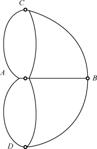
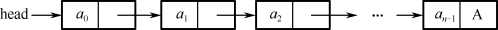
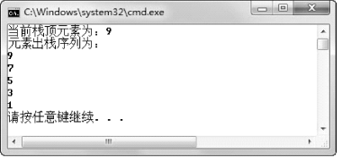

## 本章简介
&emsp;&emsp;也许有人看到本章名称时会有疑问，用Java语言进行程序开发，为什么还要学数据结构这种基础知识呢？客观地说，如果只是从事一些系统上层功能的开发，学习数据结构的用处可能不大，因为Java已经提供了一些类，封装了常用的数据结构。但如果要从事一些底层的开发，或者是一些关注系统性能的开发，学习数据结构的作用就会非常明显。作为一个Java工程师，要想在软件设计、开发领域能有所发展，学好数据结构是必须的。

 

 

 

## 2.1  数据逻辑结构

 

&emsp;&emsp;数据结构从大的方向上分，可以分为逻辑结构和存储结构。逻辑结构还可以分为以下四类。

- 集合：数据元素间没有任何关系。

- 线性结构：数据元素间有线性关系。所谓线性关系是指除第一个元素外，其他元素有且只有一个前驱，除最后一个元素外，其他元素有且只有一个后继。

- 树结构：数据元素间有层状关系。

- 图结构：数据元素间有网状关系。

&emsp;&emsp;集合在程序开发中使用得非常广泛，将会在第3章详细介绍，本章仅介绍后面三种逻辑结构，其中重点介绍线性结构。

### 2.1.1  数据基本概念  

&emsp;&emsp;在介绍数据的逻辑结构之前，应先了解一下有关数据的基本概念。

- 数据

&emsp;&emsp;在计算机系统中，各种字母和数字符号的组合、语音、图形、图像等统称为数据。数据又指所有能输入到计算机并被计算机程序处理的符号的总称，是用于输入计算机进行处理，具有一定意义的数字、字母、符号和模拟量等的通称。  

&emsp;&emsp;数据按性质进行分类，可以分为：  


&emsp;&emsp;（1）定位的，如GPS系统定位的经纬度数据。  


&emsp;&emsp;（2）定性的，如表示事物本性的数据，例如桥梁、沙漠、火车、飞机等。  


&emsp;&emsp;（3）定量的，如反映事物数量特征的数据，如长度、面积、体积等几何量或重量、速度等物理量。  


&emsp;&emsp;（4）定时的，反映事物时间特性的数据，如年、月、日、时、分、秒等。  


- 数据元素  


&emsp;&emsp;数据元素是数据的基本单位，在计算机程序中通常作为一个整体进行考虑和处理。有时，一个数据元素可由若干个数据项组成，例如，一本书的书目信息为一个数据元素，而书目信息的每一项（如书名、作者名等）为一个数据项。  


&emsp;&emsp;数据项是具有独立含义的最小单位，是数据元的一个具体值，是数据记录中最基本的、不可分的有名数据单位。  

### 2.1.2  线性结构  

&emsp;&emsp;线性结构是*N*个数据元素的有序集合，这个集合中必存在第一个元素和最后一个元素，除第一个元素外，其他元素都有唯一的前一个元素，除最后一个元素外，其他元素都有唯一的下一个元素。之前我们学过的数组就是一个典型的线性结构，常用的线性结构有线性表、栈和队列等。

&emsp;&emsp;例如，某学校有一个学生信息表，表里包括序号、姓名、性别和出生日期等方面信息，如图2.1所示。其中一行表示一条数据记录，即表示某个学生的信息，一列代表一个属性，表示该记录中某一方面的属性。每个学生按序号有先后次序，学生之间形成一种线性关系，这种数据结构称为线性关系。


<p align="center"></p>  
<p align="center">图2.1  线性结构—学生信息表</p>  


&emsp;&emsp;对线性结构的主要操作有查找线性结构中某个信息、修改线性结构中某个信息、在固定的位置插入和删除相应的信息等，即查询、插入、删除、修改等相关操作。

### 2.1.3  树结构  

&emsp;&emsp;树结构是一种重要的非线性数据结构，它是数据元素（在树中称为节点）按分支关系组织起来的结构，像自然界中的树那样。除根节点外，每个节点都有唯一的父节点；除叶子节点（没有子节点的节点）外，每个节点允许有若干个子节点。

&emsp;&emsp;树结构是用来表示层次关系的逻辑结构。树结构在客观世界中广泛存在，例如公司的组织结构图就是一种典型的树结构。树在计算机领域中也得到了广泛应用，操作系统中文件系统的组织形式就是树结构。

&emsp;&emsp;一棵树是由N个元素组成的有限集合，其中每个元素都称为节点（Node）。有一个特定的节点，称为根节点；除根节点外，其余节点被分成若干个互不相交的有限集合，而每个子集又都是一棵树，称为原树的子树。

&emsp;&emsp;操作系统中文件系统（以C盘为例）的目录结构如图2.2所示，C盘根目录下有四个子目录（USER、WINDOWS、DOWNLOADS、WMPUB），每个子目录下面又设有两个子目录，它们之间形成了一种层次关系，这就是一种树结构（也称为层次结构），每个目录都是该树结构中的节点，节点之间形成了一对多的关系。


<p align="center"></p>  
<p align="center">图2.2  树结构—C盘目录结构</p>  


&emsp;&emsp;对树结构可以进行的操作主要有：查找节点、节点信息的修改、节点的插入和删除等。

&emsp;&emsp;树结构的基本概念包括：

- 度：宽度。简单地说，就是节点的分支数。以组成该树各节点中最大的度作为该树的度。树中度为0的节点称为叶节点，树中度不为0的节点称为分支节点，除根节点外的分支节点统称为内部节点。

- 层次：根节点的层次为1，其他节点的层次等于它的父节点的层次数加1。

- 深度：组成该树各节点的最大层次。

- 路径：对于一棵树中的任意两个不同的节点，从一个节点出发，沿着一个个树枝到达另一个节点，它们之间存在着一条路径。可以用路径所经过的节点序列表示路径，路径的长度等于路径上的节点个数减1。

- 森林：指若干棵互不相交的树的集合。

### 2.1.4  图结构  

&emsp;&emsp;图结构是一种复杂的数据结构，数据元素间的关系是任意的。其他数据结构（如树结构、线性结构等）的数据元素之间都有明确的条件限制，而图形结构中任意两个数据元素间均可相关联。

&emsp;&emsp;先来看一个著名的案例—哥尼斯堡七桥问题。在18世纪的东普鲁士的哥尼斯堡城，有条横贯全城的普雷格尔河和两个岛屿，在河的两岸与岛屿之间架设了7座桥，把它们连接起来，如图2.3所示。将图2.3所示的问题抽象成一个数学问题，就形成一个如图2.4所示的图结构。


<p align="center"></p>  
<p align="center">图2.3  哥尼斯堡七桥问题</p>  


<p align="center"></p>  
<p align="center">图2.4  图结构—哥尼斯堡七桥问题</p>  


​                                

&emsp;&emsp;由图2.4可以看出，*A*、*B*、*C*、*D*四个节点之间都可以产生联系，即多对多的关系，这就是数据结构中的图结构（也称为网状结构）。

&emsp;&emsp;对图结构中可以进行的操作有：检索顶点、查找某顶点到其他顶点之间的路径，求最短距离，求关键路径等。

&emsp;&emsp;总结一下，根据数据结构中相关元素之间的不同关系，可以将数据结构分为集合结构、线性结构、树结构和图结构，四者之间的差异如图2.5所示。


<p align="center"></p>  
<p align="center">图2.5  四种数据逻辑结构示意图</p>  


## 2.2  数据存储结构

 

&emsp;&emsp;数据的存储结构是指数据的逻辑结构在计算机中的表示，即在计算机中如何进行物理存储。数据存储结构通常分为两类：顺序存储结构和链式存储结构。

&emsp;&emsp;顺序存储结构是把逻辑上相邻的节点存储在物理位置相邻的存储单元里，节点间的逻辑关系由存储单元的邻接关系来体现，由此得到的存储表示称为顺序存储结构。顺序存储结构是一种最基本的存储表示方法，通常借助于程序设计语言中的数组来实现。

&emsp;&emsp;链式存储结构不要求逻辑上相邻的节点在物理位置上也相邻，节点间的逻辑关系是由附加的指针字段表示的，由此得到的存储表示称为链式存储结构。链式存储结构通常借助于程序设计语言中的指针/引用类型来实现。


### 2.2.1  顺序存储结构  

&emsp;&emsp;在计算机中用一组地址连续的存储单元依次存储数据逻辑结构的各个数据元素，称作顺序存储结构。　

&emsp;&emsp;顺序存储结构是存储结构类型中的一种。顺序存储结构的主要优点有两个，一是节省存储空间，因为分配的存储单元全用来存放节点的数据，节点之间的逻辑关系没有占用额外的存储空间；二是增加了访问速度，因为采用这种方式，可实现对节点的随机存取，即每个节点对应一个序号，由该序号可以直接计算节点的存储地址。

&emsp;&emsp;顺序存储结构的主要缺点是插入、删除元素时速度较慢。因为对节点进行插入、删除操作时，需要向后或向前移动一系列的节点，比较消耗系统资源。顺序存储结构如图2.6所示。


<p align="center"></p>  
<p align="center">图2.6  顺序存储结构示意图</p>  


### 2.2.2  链式存储结构  

&emsp;&emsp;链式存储结构是在计算机中，用一组任意的存储单元，存储数据逻辑结构的数据元素。链式存储结构不要求逻辑上相邻的元素在物理位置上也相邻，而是通过指针来实现数据逻辑结构数据元素之间的相邻关系。可以说，链式存储结构和顺序存储结构的优缺点正好相反，下面是对链式存储结构特点的总结。  

&emsp;&emsp;（1）链式存储结构每个节点是由数据域和指针域组成的。  

&emsp;&emsp;（2）链式存储结构比顺序存储结构空间占用大，因为每个节点都由数据域和指针域组成，所以相同空间内假设全存满的话，顺序存储结构比链式存储结构存储数据更多。  

&emsp;&emsp;（3）链式存储结构插入、删除灵活，不必移动节点，只要改变节点中的指针即可。  

&emsp;&emsp;（4）链式存储结构查找节点时要比顺序存储结构速度慢，因为要通过指针逐个查找。  

&emsp;&emsp;链式存储结构如图2.7所示。  


<p align="center"></p>  
<p align="center">图2.7  链式存储结构示意图</p>  


 

 

## 2.3  线性结构

 

&emsp;&emsp;前面在介绍线性结构的时候已经提到，常用的线性结构有线性表、栈和队列等。本节将简要介绍线性表、栈和队列的概念，并且采用面向接口编程的方式，使用Java语言确定这些逻辑结构的基本操作接口。


### 2.3.1  线性表的存储结构  

&emsp;&emsp;线性表的结构特点主要表现在两个方面：一是均匀性，虽然不同数据表的数据元素可以是各式各样的，但对于同一线性表的各数据元素必定具有相同的数据类型和长度。二是有序性，各数据元素在线性表中按序排列，数据元素之间的相对位置是线性的，即存在唯一的“第一个”和“最后一个”数据元素，除了第一个和最后一个外，其他元素前面均只有一个数据元素（直接前驱）且后面均只有一个数据元素（直接后继）。

&emsp;&emsp;在实现线性表数据元素的存储方面，一般可用顺序存储结构和链式存储结构两种方法。栈、队列是线性表的特殊情况，是受限的线性结构，只是在数据结构的操作上有区别，在存储结构方面和线性表一样。

&emsp;&emsp;线性表的顺序存储结构如图2.8所示。


<p align="center"></p>  
<p align="center">图2.8  线性表的顺序存储结构</p>  


&emsp;&emsp;线性表的链式存储有三种形式：单链表、循环链表和双向链表。

- 单链表

&emsp;&emsp;在单链表中，每个节点都包含指向下一个节点的指针，最后一个节点的指针为空，以标记是最后一个节点。之所以称为单链表是因为每个节点只存在一个节点指针，所以只能依次顺序访问下一个节点，访问完某节点之后再想往回查找是不可以的。为了记住单链表的第一个位置，可以定义一个头指针。单链表的链式存储结构如图2.7所示。

- 循环链表

&emsp;&emsp;在单链表的基础上，可以让最后一个节点的指针指向第一个节点，这样循环起来形成的链表即为循环链表。循环列表可以顺序访问下一个节点，访问完某节点之后可以通过下一个循环再次访问到该节点。为了记住单链表的第一个位置和最后一个位置，可以定义一个头指针和一个尾指针。循环链表的链式存储结构如图2.9所示。


<p align="center"></p>  
<p align="center">图2.9  循环链表</p>  


- 双向链表

&emsp;&emsp;双向链表比单链表多出了一个节点指针，用来指向前一个节点的数据，这样做的好处是避免了寻找前面节点时发生的不便之举。双向链表的链式存储结构如图2.10所示。


<p align="center"></p>  
<p align="center">图2.10  双向链表</p>  


### 2.3.2  线性表  

&emsp;&emsp;通过对线性结构的分析，可得到如下结论：对线性结构的主要操作有查找线性结构中某个信息、修改线性结构中某个信息、在固定的位置插入和删除相应的信息等，即查询、插入、删除、修改等相关操作。接下来以面向接口编程的方式，定义一个线性表接口，该接口具有如下基本操作。

&emsp;&emsp;（1）插入数据元素。

&emsp;&emsp;（2）删除数据元素。

&emsp;&emsp;（3）替换数据元素。

&emsp;&emsp;（4）获取数据元素。

&emsp;&emsp;（5）获取线性表中数据元素个数。

&emsp;&emsp;（6）判断线性表是否为空。

&emsp;&emsp;下面是线性表接口的代码：


```
public interface List {

    //在指定下标位置插入数据元素

    public void insert(int i, Object obj) throws Exception;

    //删除指定下标位置的数据元素

    public Object delete(int i) throws Exception;

    //替换指定下标位置的数据元素

    public void update(int i, Object obj) throws Exception;

    //获取指定下标位置的数据元素

    public Object getData(int i) throws Exception;

    //获取线性表数据元素个数

    public int size();

    //判断线性表是否为空

    public boolean isEmpty();

}
```


&emsp;&emsp;接下来用顺序存储结构的数组，来存储线性表的逻辑结构，同时实现上面定义的List接口。请认真阅读该段代码，细节部分已通过注释加以描述，具体代码如下：


```
public class SeqList implements List{

    final int defaultSize = 10;               //默认线性表长度       

    int maxSize;                                    //线性表长度

    int size;                                           //线性表中现有元素个数

    Object[] listArray;                          //用对象数组存储线性表

    //无参构造方法

    SeqList(){

        initiate(defaultSize);

    }

    //带线性表长度的构造方法

    SeqList(int size){

        initiate(size);

    }

    //初始化方法，设置线性表长度、现有元素个数和初始化对象数组（用线性表长度）

    public void initiate(int sz){

        maxSize = sz;

        size = 0;

        listArray = new Object[sz];

    }

    //实现在指定下标位置插入数据元素

    public void insert(int i,Object obj) throws Exception{                 

        if (size == maxSize){

            throw new Exception("线性表已满，无法插入！");

        }

        //只允许在现有线性表数据元素之前或之后插入，不允许隔着一个空位置之后插入数据元素

        if (i > size){

            throw new Exception("插入下标位置错误！");

        }

        //将插入位置后的数据元素全部后移   

        for(int j = size; j > i; j--){

            listArray[j] = listArray[j-1];

        }

        //插入数据元素，并增加线性表中现有元素个数

        listArray[i] = obj;

        size++; 

    }

    //实现删除指定下标位置的数据元素

    public Object delete(int i) throws Exception{            

        if(size == 0){

            throw new Exception("线性表已空，无法删除！");

        }

        if (i > size-1){

            throw new Exception("删除下标位置错误！");

        }

        //获得被删除的数据元素

        Object it = listArray[i];

        //将删除位置后的数据元素全部前移

        for(int j = i; j < size-1; j++){

            listArray[j] = listArray[j+1]; 

        }

        //返回被删除数据元素，并减少线性表中现有元素个数        

        size--;

        return it;     

    }

    //实现替换指定下标位置的数据元素

    public void update(int i, Object obj) throws Exception{              

        if(size == 0){

            throw new Exception("线性表已空，无法替换！");

        }

        if (i > size-1){

            throw new Exception("替换下标位置错误！");

        }

        //替换指定下标的数据元素

        listArray[i] = obj;         

    }

    //实现获取指定下标位置的数据元素

    public Object getData(int i) throws Exception{                  

        if(size == 0){

            throw new Exception("线性表已空，无法获取！");

        }

        if(i >= size){

            throw new Exception("获得下标位置错误！");

        }

        return listArray[i];

    }

    //实现获取线性表数据元素个数

    public int size(){

        return size;

    }

    //实现判断线性表是否为空

    public boolean isEmpty(){

        return size == 0;

    }

}
```


&emsp;&emsp;上述代码中，关于插入位置i和线性表中现有元素个数size的比较非常细致，也正确体现了线性表的特性，需要认真理解。例如在实现在指定下标位置插入数据元素的代码中，if(i > size){…}这行判断语句，可以理解为如果线性表中现有3个数据元素，即size值为3，则只允许在下标为0、1、2、3这四个位置（其中下标为3的这个位置是第一个空着的位置）插入数据元素，不允许让下标为3的位置空着，在下标大于3的位置插入数据元素。

### 2.3.3  栈  

&emsp;&emsp;栈作为一种数据结构，是一种只能在一端进行插入和删除操作的特殊的线性表。它按照后进先出的原则存储数据，先进入的数据被压入栈底，最后进入的数据在栈顶，需要读取数据的时候是从栈顶开始弹出数据（最后一个进入的数据被第一个读出来）。

&emsp;&emsp;仍然以面向接口编程的方式，定义一个栈接口，该接口具有如下基本操作。

&emsp;&emsp;（1）把数据元素压入栈—进栈。

&emsp;&emsp;（2）获取并删除栈顶数据元素—退栈。

&emsp;&emsp;（3）获取但不删除栈顶数据元素。

&emsp;&emsp;（4）判断栈是否为空。

&emsp;&emsp;下面是栈接口的代码：


```
public interface Stack{

    //把数据元素压入栈—进栈

    public void push(Object obj) throws Exception;

    //获取并删除栈顶数据元素—退栈

    public Object pop() throws Exception;

    //获取但不删除栈顶数据元素

    public Object getTop() throws Exception;

    //判断栈是否为空

    public boolean notEmpty();

}
```


&emsp;&emsp;接下来仍然用顺序存储结构的数组来存储栈的逻辑结构，同时实现上面定义的Stack接口，具体代码如下：


```
public class SeqStack implements Stack{

    final int defaultSize = 10;

    int top;//标记栈内元素个数，即栈顶元素

    Object[] stack;

    int maxStackSize;

    public SeqStack(){

        initiate(defaultSize);

    }       

    public SeqStack(int sz){

        initiate(sz);

    }       

    private void initiate(int sz){

        maxStackSize = sz;

        top = 0;

        stack = new Object[sz];

    }

    //实现把数据元素压入栈—进栈       

    public void push(Object obj) throws Exception{

        if(top == maxStackSize){

            throw new Exception("堆栈已满！");

        }

        //进栈，栈顶标记加1

        stack[top] = obj;

        top++;

    }

    //实现获取并删除栈顶数据元素—退栈

    public Object pop() throws Exception{

        if(top == 0){

            throw new Exception("堆栈已空！");

        }

        //返回退栈数据元素，栈顶标记减1实现删除（实际并未删除）

        top--;

        return stack[top];

    }

    //实现获取但不删除栈顶数据元素

    public Object getTop() throws Exception{

        if(top == 0){

            throw new Exception("堆栈已空！");

        }

        return stack[top - 1];

    }

    //实现判断栈是否为空

    public boolean notEmpty(){

        return (top > 0);

    }

}
```


&emsp;&emsp;该段代码比较简单，唯一需要注意的是在实现获取并删除栈顶数据元素—退栈的操作时，并没有真正删除该数据元素，而是通过top栈顶标记减1实现删除的。

&emsp;&emsp;接下来的程序演示了如何使用栈这样的数据结构，具体代码如下：


```
public class TestSeqStack{    

    public static void main(String[] args){

        //创建一个空栈

        SeqStack myStack = new SeqStack();              

        int test[] = {1, 3, 5, 7, 9};

        int n = 5;             

        try{

            //依次将长度为5的整型数组中的数转换为Integer类型入栈

            for(int i = 0; i < n; i++){

                myStack.push(new Integer(test[i]));

            }

            //获取栈顶元素

            System.out.println("当前栈顶元素为：" + myStack.getTop());                    

            System.out.println("元素出栈序列为：");

            while(myStack.notEmpty()){                                      //判断栈是否为空

                System.out.println(myStack.pop());                  //逐个出栈

            }

        }catch(Exception e){

            System.out.println(e.getMessage());

        }

    }

}
```


&emsp;&emsp;编译、运行程序，程序运行结果如图2.11所示。


<p align="center"></p>  
<p align="center">图2.11  栈结构的使用</p>  


### 2.3.4  队列  

&emsp;&emsp;队列也是一种特殊的线性结构，它只允许在该结构的前端进行删除操作，在后端进行插入操作。进行插入操作的端称为队尾，进行删除操作的端称为队头。队列中没有元素时，称为空队列。

&emsp;&emsp;在队列这种数据结构中，最先插入的元素将是最先被删除的元素，反之最后插入的元素将是最后被删除的元素，因此队列又称为“先进先出”的线性结构。

&emsp;&emsp;接下来定义一个队列接口，该接口具有如下基本操作。

&emsp;&emsp;（1）把数据元素插入队列尾部—入队。

&emsp;&emsp;（2）获取并删除队列头部数据元素—出队。

&emsp;&emsp;（3）获取但不删除队列头部数据元素。

&emsp;&emsp;（4）判断队列是否为空。

&emsp;&emsp;下面是队列接口的代码：


```
public interface Queue{

    //把数据元素插入队列尾部—入队

    public void EnQueue(Object obj) throws Exception;

    //获取并删除队列头部数据元素—出队

    public Object DeQueue() throws Exception;

    //获取但不删除队列头部数据元素

    public Object QueueFront() throws Exception;

    //判断队列是否为空

    public boolean notEmpty();

}
```


&emsp;&emsp;关于如何使用数组来存储队列的逻辑结构，同时实现上面定义的Queue接口，将是留给大家的上机任务。


## 2.4  上机任务

#### 目标：完成本章2.3节的所有程序。

 


时间：30分钟。

 


形式：每个学员独立完成，小组组长检查。

 


工具：EditPlus。

 

 

 


## 2.5  上机任务

#### 目标：使用数组来存储队列的逻辑结构，同时实现2.3.4小节定义的Queue接口。

 


时间：15分钟。

 


形式：每个学员独立完成，小组组长检查。

 


工具：EditPlus。

 

 

 


## 2.6  查找


&emsp;&emsp;所谓查找，就是在一组数据中判断元素是否存在，或返回元素及其位置。查找的场景分两类，一类是在无序表中进行查找，另一类是在有序表中进行查找。

### 2.6.1  无序查找  

&emsp;&emsp;无序查找就是顺序查找这组数据（无序数据组）中的每个元素，判断要查找的数据元素是否存在。如果查找成功，则返回该元素在数据组中的位置，若查找失败，则返回-1，具体查找代码如下：


```
public class SeqSeach{

    public static int seqSeach(int[] a, int elem){

        int n = a.length;

        int i = 0;

        while(i < n && a[i] != elem){

            i++;                     //逐个比对，不相同则数组下标数加1

        }

        if (i == n)                     //数组下标数等于数组长度则表明没查到指定的数据元素

        {

            return -1;             //返回-1

        }else{

            return i+1;           //返回数组下标数+1

        } 

    }       

    public static void main(String[] args){

        int[] test = {123,456,789,234,567,890,345,678,901,33};

        int elem = 234;

        int res = seqSeach(test, elem);

        if(res != -1)

            System.out.println("查找成功! 该元素为第" + res + "个元素");

        else  

            System.out.println("查找失败! 该元素在数据组中不存在");

    }

}
```


&emsp;&emsp;编译、运行上面的代码，程序运行结果如图2.12所示。


<p align="center"></p>  
<p align="center">图2.12  无序查找</p>  


###  2.6.2  有序查找—二分查找  

&emsp;&emsp;上面是在一个无序的数据组中进行查找，使用了逐个比对的方法。假设现在需要在一个有序的数据组中进行查找，例如，上面案例的数组test在查找前已经进行了排序，在数组中按照升序进行了排列，其形式为{33,123,234,345,456,567,678,789,890,901}，难道还用逐个比对的方法进行查找吗？答案是否定的。我们可以采用二分查找的方式进行查找，具体代码如下：


```
public class BiSeach{

    public static int biSeach(int[] a, int elem){

        int n = a.length;

        //定义低位下标、高位下标、中间位下标

        int low = 0, high = n - 1, mid;

        //二分查找

        while(low <= high){

            mid = (low + high)/2;

            if(a[mid] == elem){

                return mid + 1;//返回数组下标数加1

            }else if(a[mid] < elem){

                low = mid + 1;

            }else{

                high = mid - 1;

            }

        }

        return -1;

	}

    public static void main(String[] args){

        int[] test = {33,123,234,345,456,567,678,789,890,901};

        int elem = 234;

        int res = biSeach(test, elem);

        if(res != -1)

            System.out.println("查找成功! 该元素为第" + res + "个元素");

        else  System.out.println("查找失败! 该元素在数据组中不存在");

    }

}
```


&emsp;&emsp;二分查找又称折半查找，优点是比较次数少，查找速度快，平均性能好，其缺点是要求待查数据结构为有序数据结构，且插入、删除困难。因此，二分查找适用于数据不经常变动而查找频繁的有序数据结构。

&emsp;&emsp;假设数据结构中元素是按升序排列的，将数据结构中间位置记录的数据与要查找数据进行比较，如果两者相等，则查找成功；否则利用中间位置记录将数据结构分成前、后两个子数据结构，如果中间位置记录的数据大于要查找数据，则进一步查找前一子数据结构，否则进一步查找后一子数据结构。重复以上过程，直到找到满足条件的数据，则查找成功，或直到子数据结构不存在为止，此时查找不成功。


## 2.7  上机任务

#### 目标：完成本章2.6节的所有程序。

 


时间：30分钟。

 


形式：每个学员独立完成，小组组长检查。

 


工具：EditPlus。

 

 

 


## 2.8  本章练习

 

1  请介绍数据的逻辑结构分哪几类，并简要描述。

 

 

2  请描述顺序存储结构和链式存储结构的优缺点。

 

 

3  请描述栈和队列这两种数据结构的特点。

 

 

4  请介绍二分查找的使用范围。

 