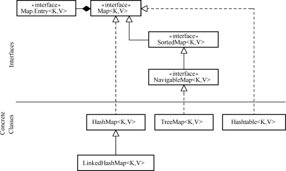
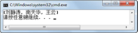
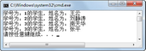
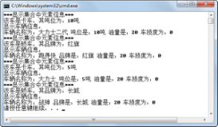
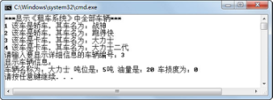
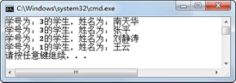
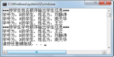
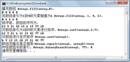

## 本章简介
&emsp;&emsp;在第2章中学习了数据结构的基本概念，讲解了数据逻辑结构和存储结构，重点学习了线性结构，并编写了线性表、栈和队列的接口。本章将重点学习在Java开发过程中，使用范围非常广的集合。

&emsp;&emsp;在介绍集合的过程中，将主要围绕Collection接口和Map接口进行讲解，尤其是Collection接口中的Set接口、List接口和Iterator接口以及实现List接口的常用集合类，需要大家重点掌握。在本章的最后，还会介绍JDK1.5的两个特性—自动拆箱、装箱和泛型，也需要大家掌握。

 

 

 

## 3.1  集合框架

 

&emsp;&emsp;集合，也称为容器，它可以将一系列元素组合成一个单元，用于存储、提取、管理数据。JDK提供的集合API都包含在java.util包内。

&emsp;&emsp;Java集合的框架主要分两大部分，一部分实现了Collection接口，该接口定义了存取一组对象的方法，其子接口Set和List分别定义了存取方式；另一部分是Map接口，该接口定义了存储一组“键（key）值（value）”映射对的方法。

### 3.1.1  集合引入  

&emsp;&emsp;在介绍面向对象编程课程时，我们一直使用的“租车系统”如果想存放多个轿车的信息，该如何实现呢？以大家现有的知识储备，使用数组解决这个问题是最合理的方式。但是使用数组存放“租车系统”中多个轿车的信息，也会存在很多问题。

&emsp;&emsp;首先，Java语言中的数组长度是固定的，一旦创建出指定长度的数组以后，就给内存分配了相应的存储空间。这样就会给程序员造成很大的困惑，如果数组长度设置小了，不能满足程序需求，如果数组长度设置大了，又会造成大量的空间浪费。

&emsp;&emsp;其次，如果使用长度为20的轿车对象数组来存放轿车的信息，但是实际上只存放了8辆轿车的信息，这时要获取这个数组中实际存放了多少辆轿车信息的数字，就不是数组这个数据结构自己能解决的问题了。数组只提供了length属性来获取数组的长度，而不能获取数组中实际存放有用信息的个数。

&emsp;&emsp;最后，数组在内存空间中是连续存放的，这样如果在数组中删除一个元素，为了保持数组内数据元素的有序性，之后的数组元素全部要前移一位，这样非常消耗系统资源。

&emsp;&emsp;通过上面的分析大家可以看出，使用数组虽然可以实现之前的目的，但会有诸多的麻烦。为了解决这个问题，Java语言给我们提供了集合这种类型。集合是一种逻辑结构，提供了更多的方法，让使用者更加方便。针对不同的需求，Java提供了不同的集合，解决各类问题。

### 3.1.2  Collection接口框架  

&emsp;&emsp;Collection是最基本的集合接口，一个Collection代表一组Object，每个Object即为Collection中的元素。一些Collection接口的实现类允许有重复的元素，而另一些则不允许；一些 Collection 是有序的，而另一些则是无序的。

&emsp;&emsp;JDK不提供Collection接口的任何直接实现类，而是提供了更具体的子接口（如Set接口和List接口）实现。这些Set和 List子接口继承Collection接口的方法，从而保证Collection接口具有更广泛的普遍性。Collection接口框架如图3.1所示。


<p align="center"></p>  
<p align="center">图3.1  Collection接口框架</p>  


&emsp;&emsp;从图3.1中可以看出，Collection接口继承自Iterable接口，因为Iterable接口允许对象成为 foreach语句的目标，所以所有集合类都可以成为JDK1.5的新特性，增强for循环的目标。

&emsp;&emsp;Collection接口主要有三个子接口，分别是List接口、Set接口和Queue接口，下面简要介绍这三个接口。

- List接口

&emsp;&emsp;实现List接口的集合是一个有序的 Collection序列。操作此接口的用户可以对这个序列中每个元素的位置进行精确控制，用户可以根据元素的索引访问元素。List接口中的元素是可以重复的。

- Set接口

&emsp;&emsp;实现Set接口的集合是一个无序的 Collection序列，该序列中的元素不可重复。因为Set接口是无序的，所以不可以通过索引访问Set接口中的数据元素。


- Queue接口

&emsp;&emsp;Queue接口用于在处理元素前保存元素的Collection序列。除了具有Collection接口基本的操作外，Queue接口还提供了其他的插入、提取和检查等操作。

### 3.1.3  Map接口框架  

&emsp;&emsp;Map接口定义了存储和操作一组“键（key）值（value）”映射对的方法。

&emsp;&emsp;Map接口和Collection接口的本质区别在于，Collection接口里存放的是一个个对象，而Map接口里存放的是一系列的键值对。Map接口集合中的key不要求有序，对于一个集合里的映射对而言，不能包含重复的键，每个键最多只能映射到一个值。Map接口框架如图3.2所示。


<p align="center"></p>  
<p align="center">图3.2  Map接口框架</p>  


&emsp;&emsp;从图3.2中可以看出，HashMap和Hashtable是实现Map接口的集合类，这两个类十分类似，在后面的章节中将会详细介绍HashMap。

 

## 3.2  Set接口

 

&emsp;&emsp;Set接口是Collection接口的子接口，除了拥有Collection接口的方法外，Set接口没有提供额外的方法。

### 3.2.1  Set接口方法  

&emsp;&emsp;下面列出了Set接口继承自Collection接口的主要方法。

- boolean add(Object obj)

&emsp;&emsp;向集合中添加一个数据元素，该数据元素不能和集合中现有数据元素重复。

&emsp;&emsp;Set集合采用对象的equals()方法比较两个对象是否相等，判断某个对象是否已经存在于集合中。当向集合中添加一个对象时，HashSet会调用对象的hashCode()方法来获得哈希码，然后根据这个哈希码进一步计算出对象在集合中的存放位置。

- void clear()  

&emsp;&emsp;移除此集合中的所有数据元素，即将集合清空。  

- boolean contains(Object obj)  

&emsp;&emsp;判断此集合中是否包含该数据元素，如果包含，则返回true。

- boolean isEmpty()  

&emsp;&emsp;判断集合是否为空，为空则返回true。

- Iterator iterator()  


&emsp;&emsp;返回一个Iterator对象，可用它来遍历集合中的数据元素。

- boolean remove(Object obj)  


&emsp;&emsp;如果此集合中包含该数据元素，则将其删除，并返回true。

- int size()  


&emsp;&emsp;返回集合中数据元素的个数，注意与数组、字符串获取长度的方法的区别。

- Object[] toArray()  


&emsp;&emsp;返回一个数组，该数组包含集合中的所有数据元素。


### 3.2.2  HashSet使用  

&emsp;&emsp;Set接口主要有两个实现类HashSet和TreeSet，HashSet类有一个子类LinkedHashSet，它不仅实现了哈希算法，而且采用了链表结构。接下来通过一个案例来说明HashSet类的使用。

```
import java.util.*;                                    //导入包

public class TestSet 

{

public static void main(String[] args) 

{

//创建一个HashSet对象，存放学生姓名信息

​                  Set nameSet = new HashSet();

​                  nameSet.add("王云");

​                  nameSet.add("刘静涛");

​                  nameSet.add("南天华");

​                  nameSet.add("雷静");

​                  nameSet.add("王云");           //增加已有的数据元素

​                  System.out.println("再次添加王云是否成功：" + nameSet.add("王云"));

​                  System.out.println("显示集合内容：" + nameSet);

​                  System.out.println("集合里是否包含南天华：" + nameSet.contains("南天华"));

​                  System.out.println("从集合中删除\"南天华\"...");

​                  nameSet.remove("南天华");

​                  System.out.println("集合里是否包含南天华：" + nameSet.contains("南天华"));

​                  System.out.println("集合中的元素个数为：" + nameSet.size());

}

}
```


&emsp;&emsp;编译、运行程序，程序运行结果如图3.3所示。从运行结果中可以看出，当向集合中增加一个已有（通过equals()方法判断）的数据元素时，没有添加成功。需要注意的是，可以通过add()方法的返回值判断是否添加成功，如果不获取这个返回值的话，Java系统并不提示没有添加成功。


<p align="center"></p>  
<p align="center">图3.3  HashSet的使用</p>  


### 3.2.3  TreeSet使用  

&emsp;&emsp;TreeSet类在实现了Set接口的同时，也实现了SortedSet接口，是一个具有排序功能Set接口类。本小节将介绍TreeSet类的使用，同时也会涉及Java如何实现对象间的排序功能，希望大家能深刻体会。

&emsp;&emsp;TreeSet集合中的元素按照升序排列，默认是按照自然升序排列，也就是说TreeSet集合中的对象需要实现Comparable接口。 

&emsp;&emsp;接下来看一段非常简单的程序，编译运行，其运行结果如图3.4所示。


```
import java.util.*;

public class TestTreeSet

{

public static void main(String[] args)

​         {

Set ts = new TreeSet();

​                  ts.add("王云");

​                  ts.add("刘静涛");

​                  ts.add("南天华");

​                  System.out.println(ts);

​         }

}  
```


<p align="center"></p>  
<p align="center">图3.4  TreeSet的使用</p>  


&emsp;&emsp;从运行结果可以看出，TreeSet集合ts里面的元素不是毫无规律的排序，而是按照自然升序进行了排序。这是因为TreeSet集合中的元素是String类，而String类实现了Comparable接口，默认按自然顺序排序。

### 3.2.4  Comparable接口  

&emsp;&emsp;如果程序员想定义自己的排序方式，方法也很简单，就是要让加入TreeSet集合中的对象所属的类实现Comparable接口，通过实现compareTo(Object o)方法，达到排序的目的。

&emsp;&emsp;假设有这样的需求，学生对象有两个属性，分别是学号和姓名。希望将这些学生对象加入TreeSet集合后，按照学号大小从小到大进行排序，学号相同的再按照姓名自然排序。让我们来看学生类的代码（实现Comparable接口）：


```
class Student implements Comparable {

int stuNum = -1;                   //学生学号

​         String stuName = "";             //学生姓名

​         Student(String name, int num) {

this.stuNum = num;

​                  this.stuName = name;

​         }

​         //返回该对象的字符串表示，利于输出

​         public String toString() {

​                  return "学号为：" + stuNum + "的学生，姓名为：" + stuName;

​         }

​         //实现Comparable的compareTo方法

​         public int compareTo(Object o) {

​                  Student input = (Student) o;

​                  //此学生对象的学号和指定学生对象的学号比较

​                  //此学生对象学号若大则res为1，若小则res为-1，相同的话res = 0

​                  int res = stuNum > input.stuNum ? 1 : (stuNum == input.stuNum ? 0 : -1);

​                  //若学号相同，则按照String类自然排序比较学生姓名

​                  if (res == 0) {

res = stuName.compareTo(input.stuName);

​                  }

​                  return res;

​         }

}

```

&emsp;&emsp;其中，int compareTo(Object o)方法是用此对象和指定对象进行比较，如果该对象小于、等于或大于指定对象，则分别返回负整数、零或正整数。编写测试程序，具体代码如下。程序运行结果如图3.5所示。


```
public class TestTreeSet2{

public static void main(String[] args) {

//用有序的TreeSet存储学生对象

​                  Set stuTS = new TreeSet();

​                  stuTS.add(new Student("王云",1));

​                  stuTS.add(new Student("南天华",3));     

​                  stuTS.add(new Student("刘静涛",2));

​                  stuTS.add(new Student("张平",3));

​                  //使用迭代器循环输出

​                  Iterator it = stuTS.iterator();

​                  while (it.hasNext()) {

​                           System.out.println(it.next());

​                  }

​         }

}

```


<p align="center"></p>  
<p align="center">图3.5  Comparable接口的使用</p>  


## 3.3  上机任务


目标：完成本章3.2节的所有程序。

 


时间：30分钟。

 


形式：每个学员独立完成，小组组长检查。

 


工具：EditPlus。

 


## 3.4  Iterator迭代器


&emsp;&emsp;在TestTreeSet2代码中，使用了Iterator迭代器进行循环输出。那么什么是Iterator迭代器，有什么用以及如何使用，这些将是本节要解决的问题。

### 3.4.1  Iterator接口方法  

&emsp;&emsp;前面学习的Collection接口、Set接口和List接口，它们的实现类都没有提供遍历集合元素的方法，Iterator迭代器为集合而生，是Java语言解决集合遍历的一个工具。它提供一种方法访问集合中各个元素，而不暴露该集合的内部实现细节。

&emsp;&emsp;Collection接口的iterator()方法返回一个Iterator对象，通过Iterator接口的两个方法即可实现对集合元素的遍历。下面列举了Iterator接口的三个方法。

- boolean hasNext()

&emsp;&emsp;判断是否存在下一个可访问的数据元素。

- Object[next()

&emsp;&emsp;返回要访问的下一个数据元素。

- void remove()

&emsp;&emsp;从迭代器指向的collection集合中移除迭代器返回的最后一个数据元素。

### 3.4.2  Iterator使用  

&emsp;&emsp;接下来通过“租车系统”讲解集合中Iterator迭代器的使用。

&emsp;&emsp;假设“租车系统”有如下的需求调整：

&emsp;&emsp;（1）系统里可以有若干辆轿车和卡车供用户租用。

&emsp;&emsp;（2）系统管理员可以遍历这个系统里所有的车辆。

&emsp;&emsp;（3）遍历时是轿车，则显示轿车品牌，是卡车，则显示卡车吨位，同时完整显示车辆信息。

&emsp;&emsp;根据需求编写如下代码：


```
import java.util.*;

import com.bd.zuche.*;

class TestZuChe 

{

public static void main(String[] args) 

​         {

//创建HashSet集合，用于存放车辆

​                  Set vehSet = new HashSet();

​                  //创建2个轿车对象、2个卡车对象，并加入到HashSet集合中

​                  Vehicle c1 = new Car("战神","长城");

​                  Vehicle c2 = new Car("跑得快","红旗");

​                  Vehicle t1 = new Truck("大力士","5吨");

​                  Vehicle t2 = new Truck("大力士二代","10吨");

​                  vehSet.add(c1);

​                  vehSet.add(c2);

​                  vehSet.add(t1);

​                  vehSet.add(t2);

​                  //使用迭代器循环输出

​                  Iterator it = vehSet.iterator();

​                  while (it.hasNext()) {

System.out.println("***显示集合中元素信息***");

​                           Object obj = it.next();

​                           if(obj instanceof Car)

​                           {

Car car = (Car)obj;

​                                    //调用Car类的特有方法getBrand()

​                                    System.out.println("该车是轿车，其品牌为：" + car.getBrand());

​                           }else{

​                                    Truck truck = (Truck)obj;

​                                    //调用Truck类的特有方法getLoad()

​                                    System.out.println("该车是卡车，其吨位为：" + truck.getLoad());

​                           }

​                           //调用Vehicle类方法show()

​                           ((Vehicle)obj).show();

​                  }

​         }

}
```


&emsp;&emsp;在该段代码中，通过Iterator接口的hasNext()方法判断集合中是否还有对象元素，再通过该接口的next()方法获取这个对象元素。然后通过instanceof运算符，判断这个对象元素是轿车还是卡车，并显示轿车品牌或卡车吨位，最后调用这两个类共有的show()方法显示车辆全部信息。编译、运行上面的代码，程序运行结果如图3.6所示。


<p align="center"></p>  
<p align="center">图3.6  Iterator迭代器的使用</p>  


### 3.4.3  增强for循环  

&emsp;&emsp;从JDK1.5开始，提供了另一种形式的for循环，这就是增强for循环，或称为foreach循环。借助增强for循环，可以用更简单的方式来遍历数组和Collection集合中的对象。

&emsp;&emsp;下面用增强for循环与传统for循环做个比较。举一个非常简单的案例，一个数组（或集合）中存了四个学生的姓名字符串，分别用传统for循环和增强for循环，逐个显示学生姓名，具体代码如下：


```
import java.util.*;

public class TestForEach

{

public static void main(String[] args) 

​         {

String[] stuArr = {"王云","刘静涛","南天华","雷静"};

​                  //传统for循环遍历

​                  for(int i = 0;i < stuArr.length;i++){

System.out.println(stuArr[i]);

​                  }

​                  //增强for循环遍历

​                  for(String stu:stuArr){

​                           System.out.println(stu);

​                  }

​                  Set nameSet = new HashSet();

​                  nameSet.add("王云");

​                  nameSet.add("刘静涛");

​                  nameSet.add("南天华");

​                  nameSet.add("雷静");

​                  //迭代器遍历

​                  Iterator it = nameSet.iterator();

​                  while (it.hasNext()){

​                           System.out.println(it.next());

​                  }

​                  //增强for循环遍历

​                  for(Object stu2:nameSet){

​                           System.out.println((String)stu2);

​                  }

​         }

}
```


&emsp;&emsp;通过代码可以看出，JDK1.5的增强for循环使得代码短小且精炼，在遍历数组和集合的情况下，更加方便。

&emsp;&emsp;但增强for循环在使用时，也有下面一些局限性，使用时需要注意。

&emsp;&emsp;（1）在用传统for循环处理数组时，可以通过数组下标进行一些程序控制，例如可以通过数组下标每次循环之后加2的方式，间隔输出数组中的元素。而增强for循环不能获得下标位置，类似的功能需要用其他方式实现。

&emsp;&emsp;（2）如果使用增强for循环操作集合，无法实现对集合元素的删除，还是需要调用Iterator迭代器的remove()方法才能完成。


## 3.5  上机任务


目标：修改本章3.4节中的“租车系统”程序，要求显示车辆时按照车辆名称的逆序进行输出。

 


时间：20分钟。

 


形式：每个学员独立完成，小组组长检查。

 


工具：EditPlus。

 

实现思路：

 

&emsp;&emsp;（1）使用TreeSet集合存放车辆。

&emsp;&emsp;（2）修改Vehicle类，实现Comparable接口的compareTo(Object o)方法，达到逆序排序的目的。

 


## 3.6       List接口


&emsp;&emsp;List接口是Collection接口的子接口，在实现了List接口的集合中，元素是有序的，而且可以重复。List接口和Set接口一样，可以容纳所有类型的对象。List集合中的数据元素都对应一个整数型的序号索引，记录其在集合中的位置，可以根据此序号存取元素。

&emsp;&emsp;JDK中实现了List接口的常用类有ArrayList和LinkedList。

### 3.6.1  List接口方法  

&emsp;&emsp;List接口继承自Collection接口，除了拥有Collection接口所拥有的方法外，它还拥有下列方法：

- void add(int index,Object o)

&emsp;&emsp;在集合的指定位置插入指定的数据元素。

- Object get(int index)

&emsp;&emsp;返回集合中指定位置的数据元素。

- int indexOf(Object o)

&emsp;&emsp;返回此集合中第一次出现的指定数据元素的索引，如果此集合不包含该数据元素，则返回-1。

- int lastIndexOf(Object o)

&emsp;&emsp;返回此集合中最后出现的指定数据元素的索引，如果此集合不包含该数据元素，则返回-1。

- Object remove(int index)

&emsp;&emsp;移除集合中指定位置的数据元素。

- Object set(int index,Object o)

&emsp;&emsp;用指定数据元素替换集合中指定位置的数据元素。

### 3.6.2  ArrayList使用  

&emsp;&emsp;ArrayList实现了List接口，在存储方式上ArrayList采用数组进行顺序存储。ArrayList对数组进行了封装，实现了可变长度的数组。与ArrayList不同的是LinkedList，它在存储方式上采用链表进行链式存储。

&emsp;&emsp;通过数据结构的学习，可得出这样的结论，因为ArrayList是用数组实现的，在插入或删除数据元素时，需要批量移动数据元素，故性能较差；但在查询数据元素时，因为数组是连续存储的，且可以通过下标进行访问，所以在遍历元素或随机访问元素时效率高。LinkedList正好与之相反，这一点在企业面试时经常被问到，需要大家深刻领会。

&emsp;&emsp;继续修改“租车系统”的代码，学习ArrayList集合的使用。假设“租车系统”有如下需求调整。

&emsp;&emsp;（1）用户可以遍历这个系统里所有的车辆，但只能看到车型和车名。

&emsp;&emsp;（2）当用户选中某辆车时，需要完整显示车辆信息。

&emsp;&emsp;根据需求编写如下代码：


```
import java.util.*;

import com.bd.zuche.*;

class TestZuChe2 

{

​         public static void main(String[] args) 

​         {

​                  int index = -1;                       //用于显示序号

​                  Scanner input = new Scanner(System.in);

​                  //创建ArrayList集合，用于存放车辆

​                  List vehAL = new ArrayList();

​                  Vehicle c1 = new Car("战神","长城");

​                  Vehicle c2 = new Car("跑得快","红旗");

​                  Vehicle t1 = new Truck("大力士","5吨");

​                  Vehicle t2 = new Truck("大力士二代","10吨");

​                  vehAL.add(c1);                     //将c1添加vehAL集合的末尾

​                  vehAL.add(c2);

​                  vehAL.add(t1);

​                  vehAL.add(t2);

​                  System.out.println("***显示“租车系统”中全部车辆***");

​                  index = 1;

​                  //增强for循环遍历

​                  for(Object obj:vehAL){

​                           if(obj instanceof Car)

​                           {

​                                    Car car = (Car)obj;

​                                    System.out.println(index + " 该车是轿车，其车名为：" + car.getName());

​                           }else{

​                                    Truck truck = (Truck)obj;

​                                    System.out.println(index + " 该车是卡车，其车名为：" + truck.getName());

​                           }

​                           index++;

​                  }

​                  System.out.print("请输入要显示详细信息的车辆编号：");

​                  //根据索引获取vehAL集合中元素，类型转换后调用show()方法输出

​                  ((Vehicle)vehAL.get(input.nextInt()-1)).show();

​         }

}
```


&emsp;&emsp;编译、运行程序，运行结果如图3.7所示。通过代码和运行结果可以看出，此例中采用了增强for循环的方式遍历了ArrayList集合中的所有元素，集合中元素的顺序是按照add()方法调用的顺序依次存储的，再通过调用ArrayList接口的get(int index)方法获取指定位置的元素，并输出该对象的信息。


<p align="center"></p>  
<p align="center">图3.7  ArrayList使用</p>  


### 3.6.3  LinkedList使用  

&emsp;&emsp;LinkedList和ArrayList在逻辑结构上没有本质区别，只是存储结构上的差异导致程序员在决定使用哪个List实现类时需要做出选择。LinkedList接口除了拥有ArrayList接口提供的方法外，还增加了如下一些方法。

- void addFirst(Object o)

&emsp;&emsp;将指定数据元素插入此集合的开头。

-l void addLast(Object o)

&emsp;&emsp;将指定数据元素插入此集合的结尾。

- Object getFirst()

&emsp;&emsp;返回此集合的第一个数据元素。

- Object getLast()

&emsp;&emsp;返回此集合的最后一个数据元素。

- Object removeFirst()

&emsp;&emsp;移除并返回此集合的第一个数据元素。

- Object removeLast()

&emsp;&emsp;移除并返回此集合的最后一个数据元素。


## 3.7  上机任务


目标：在本章3.6节“租车系统”代码的基础上，增加如下功能：

 

&emsp;&emsp;（1）显示系统中共有多少辆车。

&emsp;&emsp;（2）允许系统管理员在指定位置增加一辆车（要求系统管理员确定车型、车名和品牌或吨位）。

&emsp;&emsp;（3）判断新增加的车是否在系统中，并显示位置。


时间：30分钟。

 

形式：每个学员独立完成，小组组长检查。

 

工具：EditPlus。

 

实现思路：

 

&emsp;&emsp;（1）使用ArrayList接口的add(int index,Object o)方法在指定位置增加一辆车。

&emsp;&emsp;（2）使用ArrayList接口的indexOf(Object o)方法获取车辆所在位置。

&emsp;&emsp;（3）程序结构清晰，使用方法组织程序结构。

 

## 3.8  工具类


&emsp;&emsp;本节将介绍两个工具类的使用，这两个工具类的特点是类中的方法都是静态的，不需要创建对象，直接使用类名调用即可。

&emsp;&emsp;Collections工具类，是集合对象的工具类，提供了操作集合的工具方法，例如排序、复制和反转排序等方法。

&emsp;&emsp;Arrays工具类，是数组的工具类，提供了对数组的工具方法，例如排序、二分查找等。

### 3.8.1  Collections工具类常用方法  

- void sort(List list)

&emsp;&emsp;根据数据元素的自然顺序对指定集合按升序进行排序。

- void sort(List list, Comparator c)

&emsp;&emsp;根据指定比较器产生的顺序对指定集合进行排序。通过自定义Comparator比较器，可以实现按程序员定义的规则进行排序。Collections工具类里很多方法都可以指定比较器进行比较和排序，这里不都列举出来。关于Comparator比较器，将会在下面的课程中介绍。

- void shuffle(List list)

&emsp;&emsp;对指定集合进行随机排序。

- void reverse(List list)

&emsp;&emsp;反转指定集合中数据元素的顺序。

- Object max(Collection coll)

&emsp;&emsp;根据数据元素的自然顺序，返回给定Collection集合中的最大元素。该方法的输入类型为Collection接口，而非List接口，因为求集合中最大元素不需要集合是有序的。在Collections工具类里静态方法中输入参数的类型，需要大家注意区分。

- Object min(Collection coll)

&emsp;&emsp;根据数据元素的自然顺序，返回给定Collection的最小元素。

- int binarySearch(List list,Object o)

&emsp;&emsp;使用二分查找法查找指定集合，以获得指定数据元素的索引。如果此集合中不包含该数据元素，则返回-1。在进行此调用之前，必须根据集合数据元素的自然顺序对集合进行升序排序（通过 sort(List list)方法）。如果没有对集合进行排序，则结果是不确定的。如果集合中包含多个元素等于指定的数据元素，则无法保证找到的是哪一个。

- int indexOfSubList(List source,List target)

&emsp;&emsp;返回指定源集合中第一次出现指定目标集合的起始位置，如果没有出现这样的集合，则返回-1。

- int lastIndexOfSubList(List source,List target)

&emsp;&emsp;返回指定源集合中最后一次出现指定目标集合的起始位置，如果没有出现这样的集合，则返回-1。

 

- void copy(List dest,List src)

&emsp;&emsp;将所有数据元素从一个集合复制到另一个集合。

- void fill(List list,Object o)

&emsp;&emsp;使用指定数据元素替换指定集合中的所有数据元素。

- boolean replaceAll(List list,Object old,Object new)

&emsp;&emsp;使用一个指定的新数据元素替换集合中出现的所有指定的原数据元素。

- void swap(List list,int i,int j)

&emsp;&emsp;在指定集合的指定位置处交换数据元素。

### 3.8.2  Collections工具类使用  

&emsp;&emsp;接下来通过一个例子来演示Collections工具类中静态方法的使用。


```
import java.util.*;

public class TestCollections

{

public static void main(String[] args) 

​         {

List list = new ArrayList();

​                  list.add("w");

​                  list.add("o");

​                  list.add("r");

​                  list.add("l");

​                  list.add("d");                 

​                  System.out.println("排序前：                " + list);

​                  System.out.println("该集合中的最大值：" + Collections.max(list));   

​                  System.out.println("该集合中的最小值：" + Collections.min(list));

​                  Collections.sort(list);

​                  System.out.println("sort排序后：            " + list);

​                  //使用二分查找，查找前须保证被查找集合是自然有序排列的

​                  System.out.println("r在集合中的索引为： " + Collections.binarySearch(list,"r"));       

​                  Collections.shuffle(list);                  

​                  System.out.println("再shuffle排序后：       " + list);

​                  Collections.reverse(list);                 

​                  System.out.println("再reverse排序后：       " + list);

​                  Collections.swap(list,1,4);              

​                  System.out.println("索引为1、4的元素交换后：" + list);

​                  Collections.replaceAll(list,"w","d");                  

​                  System.out.println("把w都换成d后的结果：    " + list);

​                  Collections.fill(list,"s");                  

​                  System.out.println("全部填充为s后的结果：   " + list);

​         }

}

```

 

&emsp;&emsp;编译、运行程序，运行结果如图3.8所示。


<p align="center"></p>  
<p align="center">图3.8  Collections工具类使用</p>  


### 3.8.3  Comparable与Comparator  

&emsp;&emsp;之前我们使用了Comparable接口实现了在TreeSet集合中的自定义排序。这种方法是通过在集合内的元素类中，实现compareTo(Object o)方法进行元素和元素之间的比较、排序的。因为是在类内部实现比较，所以可以将Comparable称为内部比较器。

&emsp;&emsp;由实现了Comparable接口的类组成的集合，可使用Collections工具类的sort(List list)方法进行排序，排序规则是由compareTo(Object o)方法确定的。TreeSet集合是一个有序的Set集合，默认即按照Comparable接口的排序规则进行排序。而其他List集合，默认是按照用户添加元素的顺序进行排序的，要想让集合元素按照Comparable接口的排序规则进行排序，需要使用Collections工具类的sort(List list)方法。String、Integer等一些类已经实现了Comparable接口，所以将这些类加入List集合中，就可以直接进行排序了。

&emsp;&emsp;接下来通过一个案例来说明Collections工具类的sort(List list)方法对集合内元素实现Comparable接口的依赖，具体代码如下：


```
import java.util.*;

public class TestComparable

{

​         public static void main(String[] args) 

​         {

//用LinkedList存储学生对象

​                  LinkedList stuLL = new LinkedList();

​                  stuLL.add(new Student("王云",1));

​                  stuLL.add(new Student("南天华",3));     

​                  stuLL.add(new Student("刘静涛",2));

​                  stuLL.add(new Student("张平",3));

​                  //使用sort方法进行排序

​                  Collections.sort(stuLL);

​                  Iterator it = stuLL.iterator();

​                  while (it.hasNext()) {

​                           System.out.println(it.next());

​                  }

​         }

}

class Student{

​         int stuNum = -1;

​         String stuName = "";

​         Student(String name, int num) {

​                  this.stuNum = num;

​                  this.stuName = name;

​         }

​         public String toString() {

​                  return "学号为：" + stuNum + "的学生，姓名为：" + stuName;

​         }

}
```


&emsp;&emsp;编译、运行，程序运行时抛出异常，提示Student类没有实现Comparable接口，无法进行排序。修改上面的Student类，实现Comparable接口的compareTo(Object o)方法，具体代码如下：


```
//按学号进行降序排序，学号相同按姓名排序

class Student implements Comparable{

​         //省略其他代码

​         //实现Comparable接口的compareTo(Object o)方法

​         public int compareTo(Object o) {

Student input = (Student) o;

​                  int res = stuNum < input.stuNum ? 1 : (stuNum == input.stuNum ? 0 : -1);

​                  if (res == 0) {

res = stuName.compareTo(input.stuName);

​                  }

​                  return res;

​         }

}

```

&emsp;&emsp;再次编译、运行程序，运行结果如图3.9所示。


<p align="center"></p>  
<p align="center">图3.9  Comparable比较器的使用</p>  


&emsp;&emsp;既然将Comparable称为内部比较器，那么自然就会想到应该有外部比较器。接下来要隆重推出的就是Comparator外部比较器，也就是在学习Collections工具类的sort(List list, Comparator c)方法时提到的比较器。

&emsp;&emsp;Comparator可以理解为一个专用的比较器，当集合中的对象不支持自比较或者自比较的功能不能满足程序员的需求时，可以写一个比较器来完成两个对象之间的比较，从而实现按比较器规则进行排序的功能。

&emsp;&emsp;接下来，通过在外部定义一个姓名比较器和一个学号比较器，然后在使用Collections工具类的sort（List list，Comparator c）方法时选择使用其中一种外部比较器，对集合里的学生信息按姓名、学号分别排序输出，具体代码如下：


```
import java.util.*;

//定义一个姓名比较器

class NameComparator implements Comparator {

//实现Comparator接口的compare()方法

​         public int compare(Object op1, Object op2) {

Student eOp1 = (Student)op1;

​                  Student eOp2 = (Student)op2; 

​                  //通过调用String类compareTo()方法进行比较

​                  return eOp1.stuName.compareTo(eOp2.stuName);

​         }

} 

//定义一个学号比较器

class NumComparator implements Comparator {

​         //实现Comparator接口的compare方法

​         public int compare(Object op1, Object op2) {

​                  Student eOp1 = (Student)op1;

​                  Student eOp2 = (Student)op2;    

​                  return eOp1.stuNum - eOp2.stuNum;

​         }

} 

public class TestComparator

{

​         public static void main(String[] args) 

​         {

​                  //用LinkedList存储学生对象

​                  LinkedList stuLL = new LinkedList();

​                  stuLL.add(new Student("王云",1));

​                  stuLL.add(new Student("南天华",3));     

​                  stuLL.add(new Student("刘静涛",2));

​                  //使用sort方法，按姓名比较器进行排序

​                  Collections.sort(stuLL,new NameComparator());

​                  System.out.println("***按学生姓名顺序输出学生信息***");

​                  Iterator it = stuLL.iterator();

​                  while (it.hasNext()) {

​                           System.out.println(it.next());

​                  }       

​                  //使用sort方法，按学号比较器进行排序

​                  Collections.sort(stuLL,new NumComparator());

​                  System.out.println("***按学生学号顺序输出学生信息***");

​                  it = stuLL.iterator();

​                  while (it.hasNext()) {

​                           System.out.println(it.next());

​                  }       

​         }

}

//定义学生对象，未实现Comparable接口

class Student{

​         int stuNum = -1;

​         String stuName = "";

​         Student(String name, int num) {

​                  this.stuNum = num;

​                  this.stuName = name;

​         }

​         public String toString() {

​                  return "学号为：" + stuNum + "的学生，姓名为：" + stuName;

​         }

}
```


&emsp;&emsp;程序运行结果如图3.10所示。


<p align="center"></p>  
<p align="center">图3.10  Comparator比较器的使用</p>  


### 3.8.4  Arrays工具类使用  

&emsp;&emsp;Arrays类是操作数组的工具类，和Collections工具类相似，它提供的所有方法都是静态的。Arrays类主要有以下功能：

- 对数组进行排序。

- 给数组赋值。

- 比较数组中元素的值是否相当。

- 进行二分查找。

&emsp;&emsp;接下来通过一段代码，演示Arrays工具类的使用，具体代码如下：


```
import java.util.Arrays;

public class TestArrays{

​         public static void output(int[] a){

​                  for(int num:a){

​                           System.out.print(num + " ");

​                  }

​                  System.out.println();

​         }

​         public static void main(String[] args) {

​                  int[] array = new int[5];

​                  //填充数组

​                  Arrays.fill(array, 8);

​                  System.out.println("填充数组Arrays.fill(array,8)：");

​                  TestArrays.output(array);

​                  //将数组索引为1到4的元素赋值为6

​                  Arrays.fill(array, 1, 4, 6);

​                  System.out.println("将数组索引为1到4的元素赋值为6 Arrays.fill(array, 1, 4, 6)：");

​                  TestArrays.output(array);

​                  int[] array1 = {12,9,21,43,15,6,19,77,18};

​                  //对数组索引为3到7的元素进行排序

​                  System.out.println("排序前，数组的序列为：");

​                  TestArrays.output(array1);

​                  Arrays.sort(array1,3,7);

​                  System.out.println("对数组索引为3到7的元素进行排序：Arrays.sort(array1,3,7)：");

​                  TestArrays.output(array1);

​                  //对数组进行自然排序

​                  Arrays.sort(array1);

​                  System.out.println("对数组进行自然排序 Arrays.sort(array1)：");            

​                  TestArrays.output(array1);

​                  //比较数组元素是否相等

​                  int[] array2 = array1.clone();

​                  System.out.println("数组克隆后是否相等：Arrays.equals(array1, array2):" + 

​                           Arrays.equals(array1, array2));

​                  //使用二分查找法查找元素下标（数组必须是排序好的）

​                  System.out.println("77在数组中的索引：Arrays.binarySearch(array1, 77)：" 

​                           \+ Arrays.binarySearch(array1, 77));

​         }

}
```


&emsp;&emsp;编译、运行程序，其运行结果如图3.11所示。


<p align="center"></p>  
<p align="center">图3.11  Arrays工具类的使用</p>  


 

## 3.9  上机任务


目标：完成本章3.8节的所有程序。

 


时间：40分钟。

 


形式：每个学员独立完成，小组组长检查。

 


工具：EditPlus。

 


## 3.10  Map接口

 

&emsp;&emsp;Map接口定义了存储“键（key）值（value）”映射对的方法。

### 3.10.1  HashMap使用  

&emsp;&emsp;HashMap是Map接口的一个常用实现类，下面通过一个案例简要介绍HashMap的使用。

&emsp;&emsp;我们知道，国际域名是使用最早也是使用最广泛的域名，例如表示工商企业的.com，表示网络提供商的.net，表示非营利组织的.org等。现在需要建立域名和含义之间的键值映射，例如com映射工商企业，org映射非营利组织，可以根据com查到工商企业，可以通过删除org删除对应的非营利组织，这样的想法就可以通过HashMap来实现，具体代码如下：


```
import java.util.*;

public class TestHashMap

{

​         public static void main(String[] args) 

​         {

//使用HashMap存储域名和含义键值对的集合

​                  Map domains = new HashMap();

​                  domains.put("com","工商企业");

​                  domains.put("net","网络服务商");

​                  domains.put("org","非营利组织");

​                  domains.put("edu","教研机构");

​                  domains.put("gov","政府部门");

​                  //通过键获取值

​                  String op = (String)domains.get("edu");

​                  System.out.println("edu国际域名对应的含义为：" + op);

​                  //判断是否包含某个键

​                  System.out.println("domains键值对集合中是否包含gov：" + domains.containsKey("gov"));

​                  //删除键值对

​                  domains.remove("gov");

​                  System.out.println("删除后集合中是否包含gov：" + domains.containsKey("gov"));

​                  //输出全部键值对

​                  System.out.println(domains);

​         }

}
```


&emsp;&emsp;编译、运行程序，运行结果如图3.12所示。


<p align="center"></p>  
<p align="center">图3.12  HashMap的使用</p>  


### 3.10.2  Map接口方法  

&emsp;&emsp;上面通过一个简单的例子，让大家对Map接口的使用有了直接的认识，下面总结Map接口的常用方法如下。

- Object put(Object key,Object value)

&emsp;&emsp;将指定键值对添加到Map集合中，如果此Map集合以前包含一个该键的键值对，则用指定值替换旧值。

- Object get(Object key)

&emsp;&emsp;返回指定键所对应的值，如果此Map集合中不包含该键，则返回null。

- Object remove(Object key)

&emsp;&emsp;如果存在指定键的键值对，则将该键值对从此Map集合中移除。

- Set keySet()

&emsp;&emsp;返回此 Map 集合中包含的键的 Set集合。在上面的程序最后添加下面的语句，System.out. println(domains.keySet());，则会输出[com, edu, org, net]。

- Collection values() 

&emsp;&emsp;返回此Map集合中包含的值的 Collection集合。在上面的程序最后添加下面的语句，System.out.println(domains.values());，则会输出[工商企业，教研机构，非营利组织，网络服务商]。

- boolean containsKey(Object key)

&emsp;&emsp;如果此Map集合包含指定键的键值对，则返回true。

- boolean containsValue(Object value)

&emsp;&emsp;如果此Map集合将一个或多个键对应到指定值，则返回true。

- int size()

&emsp;&emsp;返回此Map集合的键值对的个数。


## 3.11  上机任务


目标：完成本章3.10节的所有程序。

 


时间：10分钟。

 


形式：每个学员独立完成，小组组长检查。

 


工具：EditPlus。

 


## 3.12  自动拆箱和装箱

 

&emsp;&emsp;在本章中，已经介绍了JDK1.5的一个新特性—增强for循环。接下来，将继续介绍另外两个JDK1.5的新特性，自动拆箱和装箱、泛型。其中泛型是下一节介绍的内容，本节将介绍自动拆箱和装箱。

### 3.12.1  自动拆箱和装箱概念  

&emsp;&emsp;自动拆箱和装箱，其目的是方便基本数据类型和其对应的包装类型之间的转换。在此可以直接把一个基本数据类型的值赋给其包装类型（装箱），反之亦然（拆箱），中间的过程由编译器自动完成。

&emsp;&emsp;编译器对这个过程也只是做了简单的处理，通过包装类的valueOf()方法对基本数据类型进行包装，通过包装类的类似intValue()方法得到其基本数据类型。例如下面的代码：


```
Integer stuAgeI = 23;

int stuAge = stuAgeI;
```


编译器将其自动变换为：


```
Integer stuAgeI = Integer.valueOf(23);

int stuAge = stuAgeI.intValue();
```


### 3.12.2  自动拆箱和装箱使用  

&emsp;&emsp;自动拆箱和装箱看起来非常简单，也很容易理解，但是在使用过程中，尤其是在自动装箱后，在两个对象之间使用“==”运算符进行比较时，其结果尤其需要注意。

&emsp;&emsp;接下来看下面的代码：


```
public class TestBox 

{

​         public static void main(String[] args) 

​         {

​                  Integer stuAgeI1 = 23;

​                  System.out.println("过年了，年龄增长了一岁，现在年龄是：" + (stuAgeI1 + 1)); 

​                  Integer stuAgeI2 = 23; 

​                  System.out.println("stuAgeI1 == stuAgeI2(值均为23)的结果是：" + (stuAgeI1 == stuAgeI2)); 

​                  stuAgeI1 = 323;

​                  stuAgeI2 = 323;  

​                  System.out.println("stuAgeI1 == stuAgeI2(值均为323)的结果是：" + (stuAgeI1 == stuAgeI2));          

​                  System.out.println("stuAgeI1.equals(stuAgeI2)(值均为323)的结果是：" 

​                           \+ (stuAgeI1.equals(stuAgeI2))); 

​         }

}

```

&emsp;&emsp;程序运行结果如图3.13所示。


<p align="center"></p>  
<p align="center">图3.13  自动拆箱和装箱</p>  


&emsp;&emsp;看到上面的运行结果，大家可能会很困惑，为什么当stuAgeI1和stuAgeI2这两个对象中存的值均为23时，使用“==”进行比较，其结果为true，而当这两个对象的值为323时，其结果却为false了！

&emsp;&emsp;这是因为这些包装类的valueOf()方法，对部分经常使用的数据采用缓存技术，也就是在未使用的时候，这些对象就创建并缓存着，需要使用的时候不需要新创建该对象，直接从缓存中获取即可，从而提高性能。例如Byte、Integer和Long这些包装类都缓存了数值在-128～+127之间的对象，自动装箱的时候，如果对象值在此范围之内，则直接返回缓存的对象，只有在缓存中没有的时候再去创建一个对象。

&emsp;&emsp;当第一次比较stuAgeI1和stuAgeI2这两个对象时，因为其值在-128～+127之间，所以这两个对象都是直接返回的缓存对象，使用“==”比较时结果为true。而第二次比较stuAgeI1和stuAgeI2这两个对象时，其值超出了-128～+127的范围，需要通过new方法创建两个新的包装类对象，所以再使用“==”比较时结果为false。

 

## 3.13  泛型

 

&emsp;&emsp;在之前使用集合的时候，装入集合的各种类型的对象都被当作Object对待，失去了自己的类型，而从集合中取出对象时需要进行类型转换，效率低下且容易出错。如何解决这个问题？可以使用泛型解决这个问题。

&emsp;&emsp;接下来以“租车系统”的代码为例，通过泛型（即定义集合时同时定义集合中元素的类型）的方式，解决程序可读性以及强制类型转换时的稳定性问题。


```
import java.util.*;

import com.bd.zuche.*;

class TestZuChe2 

{

​         public static void main(String[] args) 

​         {

​                  //使用泛型保证集合里的数据元素都是Vehicle类及其子类

​                  List<Vehicle> vehAL = new ArrayList<Vehicle>();

​                  Vehicle c1 = new Car("战神","长城");

​                  Vehicle c2 = new Car("跑得快","红旗");

​                  Vehicle t1 = new Truck("大力士","5吨");

​                  Vehicle t2 = new Truck("大力士二代","10吨");

​                  vehAL.add(c1);

​                  vehAL.add(c2);

​                  vehAL.add(t1);

​                  vehAL.add(1,t2);                            //在集合索引为1处添加t2

​                  //vehAL.add("大力士三代");                  //编译错误，添加的不是Vehiclel类型

​                  System.out.println("***显示“租车系统”中全部车辆信息***");

​                  //使用增强for循环遍历时，获取的已经是Vehicle对象

​                  for(Vehicle obj:vehAL){

​                           obj.show();

​                  }

​         }

}
```


&emsp;&emsp;List<Vehicle> vehAL = new ArrayList<Vehicle>();这句代码的作用是使用泛型创建ArrayList集合vehAL，且集合中元素必须是Vehicle类及其子类。如果向这个集合中添加其他的类型，编译器会报错。当从集合中获取对象时，也是直接获取了Vehicle类的对象，不需要再进行强制类型转换。程序运行结果如图3.14所示。


<p align="center"></p>  
<p align="center">图3.14  泛型的使用</p>  


## 3.14  上机任务


目标：完成本章3.13节的所有程序。

 


时间：20分钟。

 


形式：每个学员独立完成，小组组长检查。

 


工具：EditPlus。

 


## 3.15  上机任务


目标：优化“蓝桥系统”结构，进一步完成程序功能。

 

&emsp;&emsp;（1）采用面向对象的思想封装Java工程师的属性和行为。

&emsp;&emsp;（2）使用集合存储多个Java工程师对象。

&emsp;&emsp;（3）“1.输入Java工程师资料”为新输入一个Java工程师。

&emsp;&emsp;（4）“2.删除、3.查询、4.修改Java工程师资料”和“5.计算Java工程师的月薪”则需要先通过输入Java工程师编号，确定要操作的具体Java工程师。

&emsp;&emsp;（5）完成“7. 对Java工程师信息排序（1编号升序，2姓名升序）”和“8. 输出所有Java工程师信息”的功能，其中模块8可以理解为查询出全部Java工程师信息。

&emsp;&emsp;（6）模块6、9、10、11的功能暂不需要实现。


时间：8小时。

 


形式：讲师讲解思路，小组讨论，每个学生独立编写代码，小组组长检查。

 


工具：EditPlus。


## 3.16  本章练习

1  运行下面的代码，其结果为（    ）。（选择一项） 


```
         Integer i1 = 99; 

​         Integer i2 = 99;

​         System.out.println("i1 == i2的结果是：" + (i1 == i2)); 
```


&emsp;&emsp;A．i1 == i2的结果是：true

&emsp;&emsp;B．i1 == i2的结果是：false

&emsp;&emsp;C．编译错误

&emsp;&emsp;D．运行错误

 

 

2  请介绍Set接口和List接口的区别。

 

 

3  请描述Collection和Collections的区别。

 

 

4  请描述Comparable与Comparator的区别。

 

 

5  请简要介绍使用泛型的好处。

 
