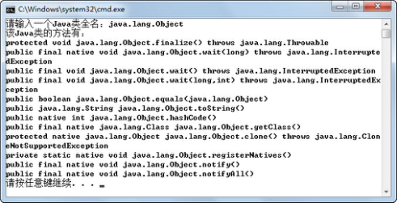
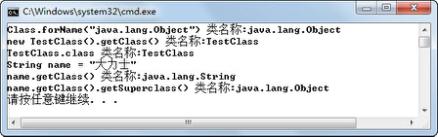
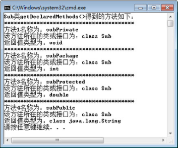
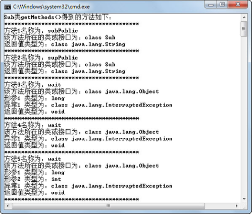
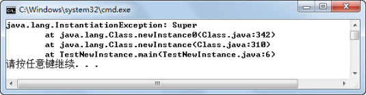
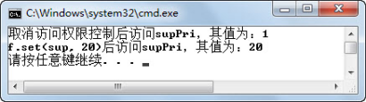
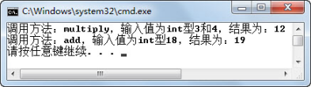
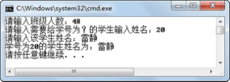

## 本章简介
&emsp;&emsp;本章将会首先介绍什么是Java反射机制，之后会通过Java反射机制在程序运行时动态获取类的信息，并动态创建对象实例、改变属性值和调用方法，最后会介绍使用反射机制动态创建数组并存取数组元素。

 

 

 

## 5.1  Java反射机制

 

&emsp;&emsp;Java反射（Reflection）就是Java程序在运行时，可以加载、探知、使用编译期间完全未知的类。也就是说，Java程序可以加载一个运行时才得知类名的类，获得类的完整构造方法，并实例化出对象，给对象属性设定值或者调用对象的方法。这种在运行时动态获取类的信息以及动态调用对象的方法的功能称为Java的反射机制。

### 5.1.1  反射引入  


&emsp;&emsp;在“租车系统”中，编写过一个驾驶员（租车者）Driver类，这个类有一个callShow(Vehicle v)方法，输入参数类型为Vehicle，通过这个方法显示指定车辆的信息。改造一下之前的代码，将Driver类作为程序入口类，具体代码如下：


```
import com.bd.zuche.*;

public class Driver 

{       

    String name = "驾驶员";

    public Driver(String name)

    {

        this.name = name;

    }

    public static void main(String[] args) 

    {

        Car car = new Car("战神","长城");

        Driver d1 = new Driver("柳海龙");

        d1.callShow(car);

    }

    //编译时知道需要传入的参数是Vehicle类型

    public void callShow(Vehicle v)

    {

        v.show();//调用Vehicle类的相关方法

    }

}
```


&emsp;&emsp;很显然，程序员在编码时就已经确定Driver类的callShow(Vehicle v)方法，输入参数类型为Vehicle，在该方法内部，调用Vehicle类的show()方法，显示车辆信息。但是，如果在编译的时候并不知道传入参数的类型是什么，这时候就需要使用反射机制。

&emsp;&emsp;假设有这样的需求，程序在运行时要求用户输入一个Java类全名，然后需要程序列出这个Java类的所有方法，该如何办呢？请看下面的代码：


```
import java.util.Scanner;

import java.lang.reflect.*; 

import com.bd.zuche.*;

class TestRef

{

public static void main(String[] args) 

{

Scanner input = new Scanner(System.in);

System.out.print("请输入一个Java类全名：");

String cName = input.next();

showMethods(cName);

}

public static void showMethods(String name)

{

try{

Class c = Class.forName(name);

Method m[] = c.getDeclaredMethods(); 

System.out.print("该Java类的方法有：");

for (int i = 0; i < m.length; i++)

{

System.out.println(m[i].toString()); 

}

}catch (Exception e){

e.printStackTrace();

}

}

}
```


&emsp;&emsp;编译、运行程序，在运行时分别输入java.lang.Object和com.bd.zuche.Car，运行结果如图5.1和图5.2所示，图中列出了Object类和Car类的所有方法。


<p align="center"></p>  
<p align="center">图5.1  Object类的所有方法</p>  


<p align="center"></p>  
<p align="center">图5.2  Car类的所有方法</p>  


&emsp;&emsp;这是个很有意思的案例，当用户输入类名的时候，程序能自动给用户列出这个类的所有方法。用过Eclipse这种集成开发环境的开发者可能会觉得似曾相识，比如程序员使用Eclipse定义了一个类Car，里面写了一些方法，再创建Car类对象car并输入car.时，Eclipse会弹出car对象可用的方法给程序员选择，这就是反射机制最常见的例子。

&emsp;&emsp;作为程序员，编写简单的Java程序时，使用反射机制的机会不多。反射机制一般在框架中使用较多，因为框架要适用更多的情况，对灵活性要求较高，而反射机制正好能解决这种灵活性要求。

 

## 5.2  Class类

 

&emsp;&emsp;在JDK中，java.lang.reflect包提供了类和接口，以获得关于类和对象的反射信息。反射机制允许通过编程，访问关于加载类的属性、方法和构造方法的信息，并允许使用反射对属性、方法和构造方法进行操作。java.lang包中的Class类和java.lang.reflect包中的Method类、Field类、Constructor类、Array类将是本章重点介绍的内容。

### 5.2.1  Class类概述  

&emsp;&emsp;与多数反射机制用到的类不同，Class类在java.lang包中，不在java.lang.reflect包中。Class类继承自Object类，是Java反射机制的入口，封装了一个类或接口的运行时信息，通过调用Class类的方法可以获取这些信息。例如刚才的例子，通过getDeclaredMethods()方法获取类所有方法。下面列举了获取Class类的几种方法。

-  Class.forName()

 

Class c = Class.forName("java.lang.Object");

 

- 类名.class


```
Class c = Car.class;
```


- 包装类.TYPE


```
Class c = Integer.TYPE;
```

- 对象名.getClass()


```
String name="大力士";

Class c = name.getClass();

```

- Class类.getSuperClass()


```
Class c = String.TYPE. getSuperClass();
```


&emsp;&emsp;这里务必要注意，只有通过Class类. getSuperClass()方法才能获得Class类的父类的Class对象，不能通过name.getSuperClass()获取name对象父类的Class对象。

&emsp;&emsp;下面通过一个案例来演示如何通过以上几种方式获取Class类对象。程序运行结果如图5.3所示。


```
import java.lang.reflect.*;

public class TestClass{

public static void main(String[] args) {

//如果将被建模的类类型未知，用Class<?>表示

Class<?> c1 = null;

Class<?> c2 = null;

Class<?> c3 = null;

Class<?> c4 = null;

Class<?> c5 = null;

try{

//建议采用这种形式

c1 = Class.forName("java.lang.Object");

}catch(Exception e){

​         e.printStackTrace();

}

c2 = new TestClass().getClass();

c3 = TestClass.class;

String name = new String("大力士");

c4 = name.getClass();

c5 = name.getClass().getSuperclass();

System.out.println("Class.forName(\"java.lang.Object\") 类名称:" + c1.getName());

System.out.println("new TestClass().getClass() 类名称:" + c2.getName());

System.out.println("TestClass.class 类名称:" + c3.getName());

System.out.println("String name = \"大力士\"");

System.out.println("name.getClass() 类名称:" + c4.getName());

System.out.println("name.getClass().getSuperclass() 类名称:" + c5.getName());

}

}
```


<p align="center"></p>  
<p align="center">图5.3  获取Class类对象</p>  


### 5.2.2  Class类常用方法  

&emsp;&emsp;下面列举了Class类的一些常用方法，在本章的案例中，这些方法将会被频繁地使用。

- Field[] getFields()  

&emsp;&emsp;返回一个包含Field对象的数组，存放该类或接口的所有可访问公共属性（含继承的公共属性）。  

- Field[] getDeclaredFields()  

&emsp;&emsp;返回一个包含Field对象的数组，存放该类或接口的所有属性（不含继承的属性）。  

- Field getField(String name)  

&emsp;&emsp;返回一个指定公共属性名的Field对象。  

- Method[] getMethods()  

&emsp;&emsp;返回一个包含Method对象的数组，存放该类或接口的所有可访问公共方法（含继承的公共方法）。  

- Method[] getDeclaredMethods()  

&emsp;&emsp;返回一个包含Method对象的数组，存放该类或接口的所有方法（不含继承的方法）。  

- Constructor[] getConstructors()  

&emsp;&emsp;返回一个包含Constructor对象的数组，存放该类的所有公共构造方法。  

- Constructor getConstructor(Class[] args)  

&emsp;&emsp;返回一个指定参数列表的Constructor对象。  

- Class[] getInterfaces()   

&emsp;&emsp;返回一个包含Class对象的数组，存放该类或接口实现的接口。  

- T newInstance()  

&emsp;&emsp;使用无参构造方法创建该类的一个新实例。  

- String getName()  

&emsp;&emsp;以String的形式返回该类（类、接口、数组类、基本类型或void）的完整名。  


## 5.3  上机任务


#### 目标：完成本章5.1节和5.2节中的所有程序。

 


时间：20分钟。

 


形式：每个学员独立完成，小组组长检查。

 


工具：EditPlus。

 


## 5.4  获取类信息

 

&emsp;&emsp;通过介绍Class类的常用方法，可以已经发现，Class类的一些方法会返回Method、Field、Constructor这些类的对象，接下来将使用这些对象获取Class类的方法、属性、构造方法方面的信息。

### 5.4.1  获取方法  

&emsp;&emsp;通过Class类的getMethods()方法、getDeclaredMethods()方法、getMethod(String name, Class[] args)方法和getDeclaredMethod(String name, Class[] args)等方法，程序员可以获得对应类的特定方法组或方法，返回值为Method对象数组或Method对象。接下来，通过一个案例来演示如何详细获取一个类的所有方法的信息（方法名、参数列表和异常列表）。


```
import java.lang.reflect.*;

public class TestMethod{

public static void main(String args[]) {

try {

Class c = Class.forName("org.w3c.dom.NodeList");

//返回Method对象数组，存放该类或接口的所有方法（不含继承的）

Method mlist[] = c.getDeclaredMethods();

System.out.println("NodeList类getDeclaredMethods()得到的方法如下：");

//遍历所有方法

for (int i = 0; i < mlist.length; i++){

System.out.println("****************************************");

Method m = mlist[i]; 

System.out.println("方法" + (i+1) + "名称为：" + m.getName());//得到方法名

System.out.println("该方法所在的类或接口为：" + m.getDeclaringClass());

//返回Class对象数组，表示Method对象所表示的方法的形参类型

Class ptl[] = m.getParameterTypes();

for (int j = 0; j < ptl.length; j++)

System.out.println("形参" + (j+1) + " 类型为：" + ptl[j]);

//返回Class对象数组，表示Method对象所表示的方法的异常列表

Class etl[] = m.getExceptionTypes();

for (int j = 0; j < etl.length; j++)

System.out.println("异常" + (j+1) + " 类型为：" + etl[j]);

System.out.println("返回值类型为：" + m.getReturnType());

}

} catch (Exception e) {

e.printStackTrace();

}       

}

}
```


&emsp;&emsp;为了使程序输出的内容不要太多，所以选择了仅有两个方法的org.w3c.dom.NodeList接口，演示如何获取方法信息。案例中使用了Method类的getName()、getDeclaringClass()、getParameterTypes()、getExceptionTypes()、getReturnType()方法，作用分别为获得方法名称、方法所在的类或接口名，方法的参数列表，方法的异常列表以及方法的返回值类型。

&emsp;&emsp;程序运行结果如图5.4所示，因为NodeList接口的两个方法都没有必须要捕获的异常，所以程序运行结果中没有显示出异常列表的内容。


<p align="center"></p>  
<p align="center">图5.4  获取类方法详细信息</p>  


&emsp;&emsp;接下来在上面案例的基础上，说明Class类的getDeclaredMethods()方法和getMethods()方法的区别。先创建Sub和Super两个类，其中Sub是继承自Super的子类，每个类中都有四种不同访问权限的方法，具体代码如下：


```
public class Sub extends Super

{

private int subPri = 11;

int subPac = 12;

protected double subPro = 13;

public String subPub = "14";

private void subPrivate(){}

int subPackage(){return subPac;}

protected double subProtected(){return subPro;}

public String subPublic(){return subPub;}       

}

class Super

{

private int supPri = 1;

int supPac = 2;

protected double supPro = 3;

public String supPub = "4";

private void supPrivate(){}

int supPackage(){return supPac;}

protected double supProtected(){return supPro;}

public String supPublic(){return supPub;}

}
```


&emsp;&emsp;修改TestMethod类代码，将装入类从org.w3c.dom.NodeList改为Sub，运行程序，观察Sub类的Class对象调用getDeclaredMethods()方法，获得了Sub类的哪些方法。程序运行结果如图5.5所示。


<p align="center"></p>  
<p align="center">图5.5  getDeclaredMethods()方法获得的方法</p>  


&emsp;&emsp;从运行结果可以看出，Class类的getDeclaredMethods()方法获得了Class所表示的Sub类的全部私有、默认、受保护和公有的方法，但不包括继承的方法（如果Super类和Sub类在同一个Java源文件中进行编译，显示的结果会包括父类公有的方法）。若将TestMethod代码中的getDeclaredMethods()方法再改为getMethods()，则程序运行结果如图5.6所示。


<p align="center"></p>  
<p align="center">图5.6  getMethods()方法获得的方法</p>  


&emsp;&emsp;从运行结果（输出内容较多，仅截选了部分内容）可以看出，Class类的getMethods()方法获得了Class所表示的Sub类及其父类所有的公共方法。

### 5.4.2  获取属性  

&emsp;&emsp;通过上一小节的学习，已经获得Class类的方法数组，并通过操作这些方法数组里的Method对象，获取方法的详细信息。一个类除了有方法外，剩下最重要的部分应该就是属性了。接下来通过一个案例来演示如何获取Sub类的相关属性。

```

import java.lang.reflect.*;

import java.util.Scanner;

public class TestField{

public static void main(String args[]) {

try {

Class c = Class.forName("Sub");

Scanner input = new Scanner(System.in);

System.out.print("请输入你想获取Sub类的哪个属性的类型：");

String name = input.next();

//通过指定属性名获取属性对象

Field sf = c.getDeclaredField(name);

//得到属性类型

System.out.println("Sub类" + name + "属性的类型为：" + sf.getType());

System.out.println("****************************************");

//返回Field对象数组，存放该类或接口的所有属性（不含继承的）

Field flist[] = c.getDeclaredFields();

System.out.println("Sub类getDeclaredFields()得到的属性如下：");

//遍历所有属性

for (int i = 0; i < flist.length; i++){

System.out.println("****************************************");

Field f = flist[i]; 

System.out.println("属性" + (i+1) + "名称为：" + f.getName());        //得到属性名

System.out.println("该属性所在的类或接口为：" + f.getDeclaringClass());

System.out.println("该属性的类型为：" + f.getType());            //得到属性类型

//以整数形式返回由此Field对象表示的属性的Java访问权限修饰符

int m = f.getModifiers();

//使用Modifier类对表示访问权限修饰符的整数进行解码显示

System.out.println("该属性的修饰符为：" + Modifier.toString(m));

}

} catch (Exception e) {

e.printStackTrace();

}

}

}
```


&emsp;&emsp;案例中使用了Field类的getType()方法获取属性的类型，getName()方法获取属性名、getDeclaringClass()方法获取属性所在的类或接口名称，getModifiers()方法获取以整数形式返回由此Field对象表示的属性的Java访问权限修饰符（值为m），并通过Modifier.toString(m)获取Java访问权限修饰符字符串结果。

&emsp;&emsp;程序运行结果如图5.7所示。注意程序中首先使用了getDeclaredField(name)方法获取了指定属性名的属性对象。获取Sub类属性的方法是getDeclaredFields()，返回的是Sub类的全部属性（不含继承的属性）。如果想获得Sub类所有公共属性，则需要调用getFields()方法。将程序中getDeclaredFields()方法改为getFields()，再次编译运行。程序运行结果如图5.8所示。


<p align="center"></p>  
<p align="center">图5.7  getDeclaredFields()方法获得的属性</p>  


<p align="center"></p>  
<p align="center">图5.8  getFields()方法获得的属性</p>  


### 5.4.3  获取构造方法  

&emsp;&emsp;通过Class类，可以获得属性和方法，但是getDeclaredMethods()和getMethods()等获取方法的方法只能获得普通方法，不能获得类的构造方法。接下来，通过Class类的getConstructors()方法和 getDeclaredConstructors()方法，可以获得对应类的构造方法，返回值为Constructor对象数组。下面首先改造Sub类，具体代码如下：


```
public class Sub extends Super

{

public Sub(){}

public Sub(int pri,int pac,double pro,String pub)

{

this.subPri = pri;

this.subPac = pac;

this.subPro = pro;

this.subPub = pub;

}                

protected Sub(int pri,int pac,double pro){this(pri,pac,pro,"14");}

Sub(int pri,int pac)throws Exception{this(pri,pac,13.0,"14");}    

private Sub(int pri){this(pri,12,13.0,"14");}

private int subPri = 11;

int subPac = 12;

protected double subPro = 13;

public String subPub = "14";

}

class Super

{       

public Super(){}

public Super(int pri,int pac,double pro,String pub)

{

this.supPri = pri;

this.supPac = pac;

this.supPro = pro;

this.supPub = pub;

}

protected Super(int pri,int pac,double pro){this(pri,pac,pro,"4");}

Super(int pri,int pac)throws Exception{this(pri,pac,3.0,"4");}     

private Super(int pri){this(pri,2,3.0,"4");}

private int supPri = 1;

int supPac = 2;

protected double supPro = 3;

public String supPub = "4";

}
```


&emsp;&emsp;Sub类仍然继承Super类，每个类中都有一个无参构造方法和四个具有不同访问权限的有参构造方法。通过Class类获取构造方法的代码如下：


```
import java.lang.reflect.*;

public class TestConstructor{

public static void main(String args[]) {

try {

Class c = Class.forName("Sub");

//返回Constructor对象数组，存放该类或接口的所有构造方法

Constructor clist[] = c.getDeclaredConstructors();

//返回Constructor对象数组，存放该类或接口的所有公共构造方法

//Constructor clist[] = c.getConstructors();

System.out.println("Sub类getDeclaredConstructors()得到的构造方法如下：");

int i = 0;

//遍历所有构造方法

for(Constructor con:clist){

System.out.println("****************************************");

System.out.println("构造方法" + (i+1) + "名称为：" + con.getName());//得到方法名

System.out.println("该构造方法所在的类或接口为：" + con.getDeclaringClass());

//返回Class对象数组，表示Constructor对象所表示的构造方法的形参类型

Class ptl[] = con.getParameterTypes();

for (int j = 0; j < ptl.length; j++)

System.out.println("形参" + (j+1) + " 类型为：" + ptl[j]);

//返回Class对象数组，表示Constructor对象所表示的方法的异常列表

Class etl[] = con.getExceptionTypes();

for (int j = 0; j < etl.length; j++)

System.out.println("异常" + (j+1) + " 类型为：" + etl[j]);

i++;

}

} catch (Exception e) {

e.printStackTrace();

}

}

}
```


&emsp;&emsp;分别调用Sub类所属Class的getDeclaredConstructors()和getConstructors()方法，运行结果如图5.9和图5.10所示。其中getDeclaredConstructors()方法得到了Sub类里声明的全部五个构造方法，而getConstructors()方法得到了Sub类里声明的两个公有的构造方法。


<p align="center"></p>  
<p align="center">图5.9  getDeclaredConstructors()方法获得的构造方法    </p>  


<p align="center"></p>  
<p align="center">图5.10  getConstructors()方法获得的构造方法</p>  

​        


## 5.5  上机任务


#### 目标：完成本章5.4节中的所有程序。

 

时间：30分钟。

 


形式：每个学员独立完成，小组组长检查。

 

工具：EditPlus。

 


## 5.6  动态调用


&emsp;&emsp;到目前为止，都是通过Class类的方法获取了对应类的属性、方法和构造方法的详细信息，如果只是获取类的相关信息，那么 Java 反射机制的意义就体现不出来了。接下来，将通过之前获取的属性、方法和构造方法的详细信息，来动态创建对象、修改属性和动态调用方法。

### 5.6.1  创建对象  

&emsp;&emsp;前面已经通过Class类获得对应类的构造方法，一旦获取了对应类的构造方法，很自然地就会想到通过这些构造方法创建出这些对应类的实例对象，之后再通过这些对象完成程序需要实现的目标。接下来继续通过案例来演示如何实例化对象。

&emsp;&emsp;为了方便演示，用来测试的对应类Super的代码调整如下：


```
class Super

{       

private int supPri = 1;

int supPac = 2;

protected double supPro = 3;

public String supPub = "4";

 

public Super(){}

public Super(int pri,int pac,double pro,String pub)

{

this.supPri = pri;

this.supPac = pac;

this.supPro = pro;

this.supPub = pub;

}

protected Super(int pri,int pac,double pro){this(pri,pac,pro,"4");}

Super(int pri,int pac)throws Exception{this(pri,pac,3.0,"4");}

private Super(int pri){this(pri,2,3.0,"4");}

 

private void supPrivate(){}

int supPackage(){return supPac;}

protected double supProtected(){return supPro;}

public String supPublic(){return supPub;}

}

 

l 通过Class类的newInstance()方法创建对象

 

public class TestNewInstance{

public static void main(String args[]) {

try {

Class c = Class.forName("Super");

//通过Class类的newInstance()方法创建对象

Super sup = (Super)c.newInstance();

System.out.println(sup.supPublic());

} catch (Exception e) {

e.printStackTrace();

}

}

}
```


&emsp;&emsp;编译、运行程序，通过Class类的newInstance()方法创建Super对象（需要强制类型转换），然后调用这个对象的supPublic()方法，输出结果为4。

&emsp;&emsp;到目前为止，似乎可以看出点反射机制的端倪—可以根据用户运行时输入的信息，动态创建不同的对象，再调用对象的方法执行相关的功能。

&emsp;&emsp;通过Class类的newInstance()方法创建对象，该方法要求该Class对应类有无参构造方法。执行newInstance()方法实际上就是使用对应类的无参构造方法来创建该类的实例，其代码等价于：


```
Super sup = new Super();
```


&emsp;&emsp;如果Super类没有无参构造方法，运行程序时则会出现如图5.11所示的问题，抛出一个InstantiationException实例化异常。


<p align="center"></p>  
<p align="center">图5.11  newInstance()方法产生实例化异常</p>  


- 过Constructor的newInstance(Object[] args)方法创建对象

&emsp;&emsp;如果要想使用有参构造方法创建对象，则需要先通过Class对象获取指定的Constructor对象，再调用Constructor对象的newInstance(Object[] args)方法来创建该Class对象对应类的实例。具体代码如下：


```
import java.lang.reflect.*;

public class TestNewInstance1{

public static void main(String args[]) {

try {

Class c = Class.forName("Super");

//返回一个指定参数列表(int.class,int.class)的Constructor对象

Constructor con = c.getDeclaredConstructor(new Class[]{int.class,int.class});

//通过Constructor的newInstance(Object[] args)方法创建对象，参数为对象列表

//参数列表对基本数据类型支持自动装箱拆箱，所以也可以写成newInstance(21, 22)

Super sup = (Super)con.newInstance(new Object[]{21, 22});

System.out.println(sup.supPackage());

 

//返回一个无参的Constructor对象

Constructor con2 = c.getDeclaredConstructor();

//通过Constructor的newInstance()方法创建无参对象

Super sup2 = (Super)con2.newInstance();                           

System.out.println(sup2.supProtected());

} catch (Exception e) {

e.printStackTrace();

}

}

}
```


&emsp;&emsp;编译、运行程序，输出结果为22和3.0。需要注意的是，通过Class对象获得指定Constructor对象的方法getDeclaredConstructor((Class[] args))中，参数列表为Class类数组。本例中直接使用new Class[]{int.class,int.class}语句创建了这个Class类数组，表示需要获取的构造方法内含有两个int型的形参。之后调用Constructor的newInstance(Object[] args)方法创建对象时，输入参数为Object对象数组，本例中直接使用new Object[]{21, 22}创建了此对象数组。

&emsp;&emsp;通过 Constructor 的 newInstance()方法，也可以创建无参对象，这样在调用getDeclaredConstructor((Class[] args))和newInstance(Object[] args)方法时，参数列表为空即可。

### 5.6.2  修改属性  

&emsp;&emsp;还是上面的Super类，其中有一个整型的私有属性supPri，初始值为1。因为Super类并没有提供针对supPri这个属性的公有的getter和setter方法，所以在这个类外，以现有的知识是无法获得并修改这个属性值的。接下来通过Java反射机制提供的Field类，实现在程序运行时修改类中私有属性值的功能。具体代码如下：


```
import java.lang.reflect.*;

public class TestChangeField{

public static void main(String args[]) {

try {

Class c = Class.forName("Super");

Super sup = (Super)c.newInstance();

//通过属性名获得Field对象

Field f = c.getDeclaredField("supPri");//supPri为私有属性

//取消属性的访问权限控制，即使private属性也可以进行访问     

f.setAccessible(true);

//调用get(Object o)方法取得对象o对应属性值

System.out.println("取消访问权限控制后访问supPri，其值为：" + f.get(sup));

//调用set(Object o,Object v)方法设置对象o对应属性值

f.set(sup, 20); 

System.out.println("f.set(sup, 20)后访问supPri，其值为：" + f.get(sup));          

} catch (Exception e) {

e.printStackTrace();

}

}

}
```


&emsp;&emsp;代码中，首先通过Class对象的getDeclaredField("supPri")方法获得了Field对象f，然后通过f.setAccessible(true)方法取消了supPri属性的访问控制权限（只是取消Field对象f对应属性supPri的访问控制权限，在Field对象内部起作用，仍不可以通过sup.supPri直接进行访问），之后再通过set(Object o,Object v)、get(Object o)，修改、获取该属性的值。编译、运行程序，运行结果如图5.12所示。


<p align="center"></p>  
<p align="center">图5.12  通过Field对象修改私有属性</p>  


### 5.6.3  调用方法  

&emsp;&emsp;通过反射机制，运行时可以根据用户的输入创建不同的对象，并且可以修改属性的访问控制权限及属性值。接下来将介绍使用反射机制，通过调用Method类的一些方法，动态执行Class对应类的方法。

&emsp;&emsp;前面介绍使用反射机制创建对象时，程序可以根据用户的输入动态创建一个对象。假设现在有这样的需求，需要在程序运行时，根据用户提供的方法名称、参数个数、参数类型，动态调用不同的方法完成不同的功能。

&emsp;&emsp;例如TestInvokeMethod类中有四个方法，public int add(int x, int y)、public int add(int x)、public int multiply(int x, int y)、public int multiply(int x)，分别实现的功能是求和、加一、求乘积、求平方四个功能。程序运行时，用户输入方法和实参列表，程序动态调用对应的方法，将结果反馈给用户。具体代码如下（因为篇幅原因，程序中直接给出了方法和实参列表，没有要求用户输入）：


```
import java.lang.reflect.*;

public class TestInvokeMethod{              

public int add(int x, int y) {

return x + y;

}                

public int add(int x) {

return x + 1;

}

public int multiply(int x, int y) {

return x * y;

}                

public int multiply(int x) {

return x * x;

}

public static void main(String args[]) {

try {

Class c = TestInvokeMethod.class;

Object obj = c.newInstance();

//通过方法名、参数类型列表，获得Method对象

Method m = c.getDeclaredMethod("multiply",new Class[]{int.class, int.class});

//invoke(Object o,Object[] args)方法调用对象o对应方法

System.out.println("调用方法：multiply，输入值为int型3和4，结果为："

\+ m.invoke(obj,new Object[]{3,4}));

Method m2 = c.getDeclaredMethod("add",new Class[]{int.class});

System.out.println("调用方法：add，输入值为int型18，结果为："

\+ m2.invoke(obj,new Object[]{18}));

} catch (Exception e) {

e.printStackTrace();

}

}

}
```


&emsp;&emsp;程序运行时获得方法名multiply以及实参列表3和4，通过getDeclaredMethod ("multiply",new Class[]{int.class, int.class})方法获得Method对象m，再通过m.invoke(obj, newObject[]{3,4})方法调用对象obj（可能也是通过反射机制动态创建的）对应方法public int multiply(int x, int y)取得需要的结果。程序如果获得的方法名为add，参数列表为18，则反射机制的动态方法调用会执行对象的public int add(int x)方法。程序运行结果如图5.13所示。


<p align="center"></p>  
<p align="center">图5.13  通过Method对象动态调用方法</p>  


&emsp;&emsp;至此，反射机制的核心内容已介绍完毕。其中根据用户的输入，使用反射机制动态创建对象，动态调用方法是Java反射机制的精髓，学习它对后期框架课程的深入理解很有帮助。

 

 


## 5.7  上机任务


#### 目标：完成本章5.6节中的所有程序。

 


时间：40分钟。

 


形式：每个学员独立完成，小组组长检查。

 


工具：EditPlus。

 


## 5.8  操作动态数组

 

&emsp;&emsp;Java在创建数组的时候，需要指定数组长度，且数组长度不可变。而java.lang.reflect包下提供了一个Array类，这个类中包括一系列static方法，通过这些方法可以创建动态数组，对数组元素进行赋值、取值操作。

&emsp;&emsp;Array类提供的主要方法（均为静态方法）如下。


- Object newInstance(Class componentType, int length)  

&emsp;&emsp;创建一个具有指定元素类型和长度的新数组。  

- Object newInstance(Class componentType, int... dimensions)  

&emsp;&emsp;创建一个具有指定元素类型和维度的多维数组。  

- void setXxx(Object array, int index,xxx val)  

&emsp;&emsp;将指定数组对象中索引元素的值设置为指定的xxx类型的val值。  

- xxx getXxx(Object array, int index)  

&emsp;&emsp;获取数组对象中指定索引元素的xxx类型的值。  


### 5.8.1  操作一维动态数组  

&emsp;&emsp;假设有这样的需求，每个班需要用一个字符串数组来存该班所有学生的姓名，但每个班的学生人数不一样，需要每个班的班主任在开学前统计该班班级人数后填入系统中，才能确定这个数组的长度，这就需要使用动态数组，并且需要根据指定学号输入学生姓名，添入数组中，具体代码如下：


```
import java.util.Scanner;

import java.lang.reflect.*;

public class TestArray{

public static void main(String args[]) {

try {

Scanner input = new Scanner(System.in);

Class c = Class.forName("java.lang.String");

System.out.print("请输入班级人数：");

int stuNum = input.nextInt();

//创建长度为stuNum的字符串数组              

Object arr = Array.newInstance(c,stuNum);     

System.out.print("请输入需要给学号为？的学生输入姓名：");

int stuNo = input.nextInt();    

System.out.print("请输入该学生姓名：");

String stuName = input.next();

//使用Array类的set方法给数组赋值

Array.set(arr, (stuNo-1), stuName);

//使用Array类get方法获取元素的值

System.out.println("学号为" + stuNo + "的学生姓名为：" + Array.get(arr,(stuNo-1)));

} catch (Exception e) {

e.printStackTrace();

}

}

}
```


&emsp;&emsp;编译、运行程序，运行结果如图5.14所示。


<p align="center"></p>  
<p align="center">图5.14  使用Array类创建动态数组</p>  


### 5.8.2  操作多维动态数组  

&emsp;&emsp;使用Array类创建一个多维动态数组的方法为newInstance(Class componentType, int... dimensions)，其中dimensions参数是表示新建数组维度的int数组。例如，想创建一个三维数组，维度分别为8、10、12，则需要定义一个长度为3的整型数组（int[] d = {8,10,12}），再通过这个整型数组创建三维数组。

&emsp;&emsp;下面的代码创建了一个8×10二维整型动态数组，并给数组下标为[4][6]的数组元素赋值为20，具体代码如下：


```
import java.lang.reflect.*;

public class TestArray2{

public static void main(String args[]) {

try {

Class c = Integer.TYPE;

//创建一个8×10二维整型数组

int dim[] = {8,10};

Object arr = Array.newInstance(c,dim);

//arr4为一维数组

Object arr4 = Array.get(arr,4);

//给arr[4][6]赋值为20

Array.set(arr4, 6, 20);

//获取arr[4][6]的值

System.out.println("arr[4][6]的值为：" + Array.get(arr4,6));

} catch (Exception e) {

e.printStackTrace();

}

}

}
```


&emsp;&emsp;在介绍数组的时候提到过，二维数组可以先理解为一个一维数组，这个一维的每个数组元素又是一个一维数组。代码中Array.get(arr,4)语句获取下标为4的数组元素arr4，这个数组元素就是一个一维数组，再通过Array.set(arr4, 6, 20)语句设置arr4这个一维数组下标为6的数组元素的值为20，即完成了设置arr[4][6]的值为20的目的。编译、运行程序，输出结果为20。

 

## 5.9  上机任务


#### 目标：完成本章5.8节中的所有程序。

 


时间：30分钟。

 


形式：每个学员独立完成，小组组长检查。

 


工具：EditPlus。

 

 

 


## 5.10  本章练习

 

1  下列关于Class类getDeclaredFields()和getFields()两种方法的区别，描述错误的是（    ）。（选择一项） 

&emsp;&emsp;A．getDeclaredFields()方法返回一个包含Field 对象的数组，存放该类或接口的所有属性（不含继承的属性）

&emsp;&emsp;B．getFields()方法返回一个包含Field对象的数组，存放该类或接口的所有可访问公共属性（含继承的公共属性）

&emsp;&emsp;C．getFields()方法返回一个包含Field对象的数组，存放该类或接口的所有可访问公共属性（含继承的公共属性，不含该类私有的属性）

&emsp;&emsp;D．getDeclaredFields()方法返回一个包含 Field 对象的数组，存放该类或接口的属性（不含该类私有的属性）

2  请描述什么是Java反射机制。

 

 

3  请介绍获取Class类有哪几种方法。

 

 

4  请描述使用反射机制创建对象有哪两种方法。

 

 

5  请简要介绍Java如何实现动态数组的功能。

 

 

 