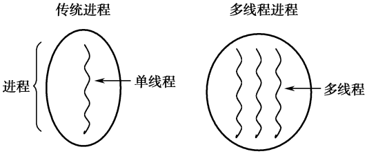
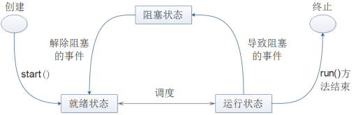

# 本章简介
&emsp;&emsp;多线程是这样一种机制，它允许在程序（进程）中并发执行多个指令流，每个指令流就称为一个线程，线程彼此间互相独立却又有着一定的联系。本章首先会介绍多线程的概念，接着会通过案例创建、使用线程，最后会介绍线程控制和共享数据。

 

 

 

## 6.1  多线程

 

&emsp;&emsp;打开计算机，可以同时运行很多的程序，比如一边挂着QQ，一边放着音乐，同时还可以收发电子邮件……能够做到这样是因为一个操作系统可以同时运行多个程序。一个正在运行的程序对于操作系统而言称为进程。

&emsp;&emsp;程序和进程的关系可以理解为，程序是一段静态的代码，是应用程序执行的蓝本，而进程是指一个正在运行的程序，在内存中运行，有独立的地址空间。

&emsp;&emsp;线程可以称为轻量级进程，它和进程一样拥有独立的执行路径。线程和进程的区别在于，线程存在于进程中，拥有独立的执行堆栈和程序计数器，没有独立的存储空间，而是和所属进程中的其他线程共享存储空间。

&emsp;&emsp;传统的程序，一个进程里只有一个线程，所以也称为单线程程序，而多线程程序是一个进程里拥有多个线程，两者间的结构区别如图6.1所示。


<p align="center"></p>  
<p align="center">图6.1  多线程进程示意图</p>  


### 6.1.1  线程引入  


&emsp;&emsp;在操作系统中，使用进程是为了使多个程序能并发执行，以提高资源的利用率和系统吞吐量。在操作系统中再引入线程，则是为了减少采用多进程方式并发执行时所付出的系统开销，使计算机操作系统具有更好的并发性。

&emsp;&emsp;操作系统操作进程，付出的系统开销是比较大的。例如创建进程，系统在创建一个进程时，必须为它分配其所必须的资源（CPU 资源除外），如内存空间、I/O 设备以及建立相应的进程控制块。再如撤销进程，系统在撤销进程时又必须先对其所占用的资源执行回收操作，然后再撤销进程控制块。如果要进行进程间切换，要保留当前进程的进程控制块环境和设置新选中的进程的CPU环境。

&emsp;&emsp;也就是说，由于进程是一个资源的拥有者，因而在创建、撤销和切换中，系统必须为之付出较大的系统开销。所以，系统中的进程，其数目不宜过多，进程切换的频率也不宜过高，这也就限制了系统并发性的进一步提高。

&emsp;&emsp;线程是进程内一个相对独立的、可调度的执行单元。进程是资源分配的基本单位，所有与该进程有关的资源，例如打印机，输入的缓冲队列等都被记录在进程控制块中，以表示该进程拥有这些资源或正在使用它们。与进程相对应，线程与资源分配无关，它属于某一个进程，并与进程内的其他线程一起共享进程的资源。另外，进程拥有一个完整的虚拟地址空间，而同一进程内的不同线程共享进程的同一地址空间。

&emsp;&emsp;线程是操作系统中的基本调度单元，进程不是调度的单元，所以每个进程在创建时，至少需要同时为该进程创建一个线程，线程也可以创建其他线程。进程是被分配并拥有资源的基本单元，同一进程内的多个线程共享该进程的资源，但线程并不拥有资源，只是使用它们。由于共享资源，所以线程间需要通信和同步机制。

### 6.1.2  多线程优势  

&emsp;&emsp;接下来，将介绍采用线程比采用进程的好处，只有理解了采用线程比采用进程的好处才能更好地理解多线程的优势。

&emsp;&emsp;（1）系统开销小。用于创建和撤销线程的系统开销比创建和撤销进程的系统开销要少得多，同时线程之间切换时的开销也远比进程之间切换的开销小。

&emsp;&emsp;（2）方便通信和资源共享。如果是在进程之间通信，往往要求系统内核的参与，以提供通信机制和保护机制。而线程间通信是在同一进程的地址空间内，共享主存和文件，操作简单，无须系统内核参与。

&emsp;&emsp;（3）简化程序结构。用户在实现多任务的程序时，采用多线程机制实现，程序结构清晰，独立性强。

&emsp;&emsp;上面提到的是采用多线程的好处，在介绍多线程优势之前，可以先尝试回答这样一个问题—如何提高多任务程序在计算机上的执行效率？提高多任务程序的执行效率，主要有以下三种方法。

&emsp;&emsp;第一种做法是提高硬件设备的性能，尤其是增加计算机CPU的个数或提高单个CPU的性能，以提高系统的整体性能。这种做法的问题在于，需要购置新设备，代价昂贵。

&emsp;&emsp;第二种做法是为这个程序启动多个进程，让多个进程去完成一个程序的多个任务，共享系统资源，也能达到提高系统性能的目的。但因为需要在这多个任务之间共享、交换数据，系统会比较复杂，而且正如之前所说，创建、撤销和切换进程需要较大的系统开销，会消耗大量的资源。

&emsp;&emsp;第三种做法是在程序中使用多线程机制，让每个线程完成独立的任务，因为线程的系统开销小，所以对系统资源的影响小。

&emsp;&emsp;通过回答这个问题可以看到，在一个操作系统中，多进程也可以实现多任务的功能，提高系统的执行效率。但是，因为进程本身消耗的资源多，没有采用一个进程中多个线程的方式节约系统资源。

&emsp;&emsp;现总结多线程的优势如下。

&emsp;&emsp;（1）在程序内部充分利用CPU资源。在操作系统中，通常将CPU资源分成若干时间片，然后将这些时间片分配给不同的线程使用。当执行单线程程序时，单线程可能会发生一些事件，使这个线程不能使用CPU资源，对于CPU而言，该程序处于不能使用CPU资源的状态。而如果使用多线程机制，当一个线程不能使用CPU资源时，其他线程仍可以申请使用CPU资源，使得程序的其他线程继续运行。如果是多CPU计算机，则多个CPU可以分别执行一个程序里的多个线程，程序的并发性得到进一步提升。

&emsp;&emsp;（2）简化多任务程序结构。如果不采用多线程机制，那么要完成一个多任务的程序，则有两种解决方法。一种是采用多个进程，每个进程完成一个任务，多个进程共同完成程序的功能，当然这其中的缺点前面已经详细介绍过。另一种解决办法还是单线程，在程序中判断每项任务是否应该执行以及什么时候执行。这就让程序变得复杂，不易理解，而且程序内部不能实现多任务，执行速度慢。采用了多线程机制，可以让每个线程完成独立的任务，保持线程间通信，从而保证多任务程序功能的完成，也使程序结构更加清晰。

&emsp;&emsp;（3）方便处理异步请求。例如当用户访问服务器程序时，最简单的处理方法就是，服务器程序的监听线程为每个客户端连接建立一个线程进行处理，然后监听线程仍然负责监听来自客户端的请求。使用多线程机制，可以很好地处理监听客户端请求和处理请求之间的矛盾，方便异步请求的处理。

&emsp;&emsp;（4）方便处理用户界面请求。如今所见即所得的用户界面程序，都会有一个独立的线程来扫描用户的界面操作事件。例如当用户单击一个按钮时，按钮单击事件被触发，而这个线程会扫描出用户界面操作事件。如果使用单线程处理用户界面事件，则需要通过循环来对随时发生的事件进行扫描，在循环的内部还需要执行其他的代码。

### 6.1.3  线程状态  

&emsp;&emsp;线程是相对独立的、可调度的执行单元，因此在线程的运行过程中，会分别处于不同的状态。通常而言，线程主要有下列几种状态。

&emsp;&emsp;（1）就绪状态：线程已经具备运行的条件，等待调度程序分配CPU资源给这个线程运行。

&emsp;&emsp;（2）运行状态：调度程序分配CPU资源给该线程 ，该线程正在执行。

&emsp;&emsp;（3）阻塞状态：线程正等待某个条件符合或某个事件发生，才会具备运行的条件。

&emsp;&emsp;下面是线程的状态转换图，通过该图，会给大家介绍线程的执行过程和状态转换。


<p align="center"></p>  
<p align="center">图6.2  线程状态转换图</p>  


&emsp;&emsp;对线程的基本操作主要有以下5种，通过这五种操作，使线程在各个状态之间转换。

- 派生

&emsp;&emsp;线程属于进程，可以由进程派生出线程，线程所拥有的资源将会被创建。一个线程即可以有进程派生，也可以由线程派生。在Java中，可以创建一个线程并通过调用该线程的start()方法使该线程进入就绪状态。

- 调度

&emsp;&emsp;调度程序分配CPU资源给就绪状态的线程，使线程获得CPU资源进行运行，即执行Java线程类中run()方法里的内容。

- 阻塞

&emsp;&emsp;正在运行状态的线程，在执行过程中需要等待某个条件符合或某个事件发生，此时线程进入阻塞状态。阻塞时，寄存器上下文、程序计数器以及堆栈指针都会得到保存。

- 激活

&emsp;&emsp;在阻塞状态下的线程，如果需要等待的条件符合或事件发生，则该线程被激活并进入就绪状态。

- 结束

&emsp;&emsp;在运行状态的线程，线程执行结束，它的寄存器上下文以及堆栈内容等将被释放。

 

## 6.2  创建和使用线程

 

&emsp;&emsp;创建和使用线程，就是要让这个线程完成一些特定的功能。在 Java 中，提供了java.lang. Thread类来完成多线程的编程，这个类也提供了大量的方法方便操作线程。在编写一个线程类时，可以继承自这个Thread类，完成线程的相关工作。

&emsp;&emsp;如果编写的线程类要继承其他类，但Java又不支持多继承，所以Java还提供了另外一种创建线程的方式，即实现Runnable接口。

### 6.2.1  创建线程类  

&emsp;&emsp;如果线程类直接继承Thread类，其代码结构大致如下：


```
class 类名 extends Thread{

    //属性

    //其他方法

    public void run(){

    //线程需要执行的核心代码

    }

}
```


&emsp;&emsp;从线程类的代码结构可以看出，一个线程的核心代码需要写在run()方法里。也就是说，当线程从就绪状态，通过调度程序分配CPU资源，进入运行状态后，执行的代码即run()方法里面的代码。

&emsp;&emsp;如果线程类是实现Runnable接口的，其代码结构大致如下：


```
class 类名 implements Runnable{

    //属性

    //其他方法

    public void run(){

    //线程需要执行的核心代码 

    }

}
```


&emsp;&emsp;和继承Thread类非常类似，实现Runnable接口的线程类也需要编写run()方法，将线程的核心代码置于该方法中。但是 Runnable 接口并没有任何对线程的支持，因此还必须创建 Thread 类的实例，通过Thread 类的构造函数来创建线程类。


```
类名 对象名 = new 类名();

Thread 线程对象名 = new Thread(对象名);
```


### 6.2.2  多线程使用  

&emsp;&emsp;下面的例子，分别使用继承Thread类和实现Runnable接口两种方式创建了两个线程类，并通过调用start()方法启动线程。具体程序代码如下：


```
public class TestThread {

public static void main(String[] args) throws InterruptedException {

Thread t1 = new MyThread1();

MyThread2 mt2 = new MyThread2();

Thread t2 = new Thread(mt2);

t1.start();

t2.start();

}

}

//继承自Thread类创建线程类

class MyThread1 extends Thread {

private int i = 0;

//无参构造方法，调用父类构造方法设置线程名称

public MyThread1(){

super("我的线程1");

}

//通过循环判断，输出10次，每次间隔0.5秒

public void run(){

try{

while(i < 10){

System.out.println(this.getName() + "运行第" + (i+1) + "次");

i++;

//在指定的毫秒数内让当前正在执行的线程休眠（暂停执行）

sleep(500);

}

}catch(Exception e){

e.printStackTrace();

}

}

}

//实现Runnable接口创建线程类

class MyThread2 implements Runnable{

String name = "我的线程2";

public void run() {

System.out.println(this.name);

}

}
```


&emsp;&emsp;编译、运行程序，运行结果如图6.3所示。因为程序中的注释已对程序进行了详细的描述，这里不再展开解释。


<p align="center"></p>  
<p align="center">图6.3  多线程程序</p>  


&emsp;&emsp;程序中，要想启动一个线程，都是通过调用start()方法来启动的，使线程进入就绪状态，等待调度程序分配CPU资源后进入运行状态，执行run()方法里的内容。作为程序员，是不是可以直接调用run()方法，使这个线程运行起来呢？答案是：可以，但也不可以。所谓可以是指的确能直接调用run()方法执行run()方法里的代码，但这只是串行执行run()方法，并没有启动一个线程，让该线程与其他线程并行执行。

&emsp;&emsp;在main()方法里的t2.start();代码后增加一句t2.run();，再次编译、运行程序，会发现“我的线程2”输出2次，其中一次是通过t2.start()方法启动线程，执行run()方法输出的，另外一次是直接调用t2.run()方法输出的。

&emsp;&emsp;如果在t2.start();和t2.run();两行代码之间增加一句Thread.sleep(2000);，其含义为在2秒内让当前正在执行的线程休眠，再次编译、运行程序，其结果又如何呢？为什么会出现这样的结果呢？ 

 


## 6.3  上机任务


#### 目标：完成本章6.2节中的所有程序。

 

时间：30分钟。

 


形式：每个学员独立完成，小组组长检查。

 


工具：EditPlus。

 

 


## 6.4  线程控制


&emsp;&emsp;对于6.2.2小节的TestThread案例，多运行几次，也许会发现，有时候出现图6.3的运行结果，也有时候出现图6.4的运行结果。比较两次输出的差异在于，图6.3的显示结果表明线程类对象t1的run()方法先开始被执行，然后才开始执行线程类对象t2的run()方法，而图6.4的显示结果却正好相反。通过这样的显示结果说明，作为程序员无法控制线程什么时候从就绪状态调度进入运行状态，即无法控制什么时候run()方法被执行。程序员可以做的就是通过start()方法保证线程进入就绪状态，等待系统调度程序决定什么时候该线程调度进入运行状态。


<p align="center"></p>  
<p align="center">图6.4  多线程程序</p>  


### 6.4.1  线程控制方法  

&emsp;&emsp;下面列举了Thread类的一些线程控制的方法。

- void start()

&emsp;&emsp;使该线程开始执行，Java虚拟机负责调用该线程的run()方法。

- void sleep(long millis) 

&emsp;&emsp;静态方法，线程进入阻塞状态，在指定时间（单位为毫秒）到达之后进入就绪状态。 

- void yield()

&emsp;&emsp;静态方法，当前线程放弃占用CPU资源，回到就绪状态，使其他优先级不低于此线程的线程有机会被执行。

- void join() 

&emsp;&emsp;只有当前线程等待加入的（join）线程完成，才能继续往下执行。 

- void interrupt()

&emsp;&emsp;中断线程的阻塞状态（而非中断线程），例如一个线程sleep(1000000000)，为了中断这个过长的阻塞过程，则可以调用该线程的interrupt()方法，中断阻塞。需要注意的是，此时sleep()方法会抛出InterruptedException异常。

- void isAlive()

&emsp;&emsp;判定该线程是否处于活动状态，处于就绪、运行和阻塞状态的都属于活动状态。

- void setPriority(int newPriority)

&emsp;&emsp;设置当前线程的优先级。

- int getPriority()

&emsp;&emsp;获得当前线程的优先级。

### 6.4.2  终止线程  

&emsp;&emsp;线程通常在三种情况下会终止，最普遍的情况是线程中的run()方法执行完毕后线程终止，或者线程抛出了Exception或Error且未被捕获，另外还有一种方法是调用当前线程的stop()方法终止线程（该方法已被废弃）。接下来，通过案例来演示如何通过调用线程类内部方法实现终止线程的功能。

&emsp;&emsp;有这样一个程序，程序内部有一个计数功能，每间隔2秒输出1、2、3……一直到100结束。现在有这样的需求，当用户想终止这个计数功能时，只要在控制台输入s即可，具体程序代码如下：


```
import java.util.Scanner;

public class EndingThread{

public static void main(String[] args) {

CountThread t = new CountThread();

t.start();

Scanner scanner = new Scanner(System.in);

System.out.println("如果想终止输出计数线程，请输入s");

while(true){

String s = scanner.nextLine();

if(s.equals("s")){

t.stopIt();

break;

}

}

}

}

//计数功能线程

class CountThread extends Thread {

private int i = 0;

public CountThread(){

super("计数线程");

}

//通过设置i=100，让线程终止

public void stopIt(){

i = 100;

}

public void run(){

try{

while(i < 100){

System.out.println(this.getName() + "计数：" + (i+1));

i++;

sleep(2000);

}

}catch(Exception e){

e.printStackTrace();

}

}

}
```


&emsp;&emsp;程序中，CountThread线程类实现了计数功能。当主程序调用t.start()方法启动线程时，执行CountThread线程类里run()方法的输出计数功能。主程序中通过while循环，在控制台获取用户输入，当用户输入为s时，调用CountThread线程类的stopIt()方法，改变run()方法中运行的条件，即可终止该线程的执行。

&emsp;&emsp;编译、运行程序，在程序运行时输入s。程序运行结果如图6.5所示。


<p align="center"></p>  
<p align="center">图6.5  终止线程</p>  


### 6.4.3  线程等待和中断等待  

&emsp;&emsp;Thread类的静态方法sleep()，可以让当前线程进入等待（阻塞状态），直到指定的时间流逝，或直到别的线程调用当前线程对象上的interrupt()方法。下面的案例演示了调用线程对象的interrupt()方法，中断线程所处的阻塞状态，使线程恢复进入就绪状态，具体代码如下：


```
public class InterruptThread{

public static void main(String[] args) {

CountThread t = new CountThread();

t.start();               

try{

Thread.sleep(6000);

}catch(InterruptedException e){

e.printStackTrace();

}       

//中断线程的阻塞状态（而非中断线程）

t.interrupt();

}

}

class CountThread extends Thread {

private int i = 0;

public CountThread(){

super("计数线程");

}

public void run(){

while(i < 100){

try{

System.out.println(this.getName() + "计数：" + (i+1));

i++;

Thread.sleep(5000);

}catch(InterruptedException e){

System.out.println("程序捕获了InterruptedException异常!");

}

System.out.println("计数线程运行1次！");

}

}

}
```


&emsp;&emsp;请注意计数线程的变化，计数线程的异常处理代码放在了while循环以内，也就是说如果主程序调用interrupt()方法中断了计数线程的阻塞状态（由sleep(5000)引起的），并处理了由计数线程抛出的InterruptedException异常之后，计数线程将会进入就绪状态和运行状态，执行sleep(5000)之后的程序，继续循环输出。

&emsp;&emsp;主程序通过start()方法启动了计数线程以后，调用sleep(6000)方法让主程序等待6秒，此时计数线程已执行到第2次循环，“计数线程计数：1”、“计数线程运行1次！”和“计数线程计数：2”已经输出，正在执行sleep(5000)的代码。因为计数线程的interrupt()方法被调用，则中断了 sleep(5000)代码的执行，捕获了 InterruptedException 异常，输出“程序捕获了InterruptedException异常!”，之后计数线程立即恢复，继续执行。程序运行结果如图6.6所示。


<p align="center"></p>  
<p align="center">图6.6  线程等待和中断等待</p>  


&emsp;&emsp;接下来介绍另外一个让线程放弃CPU资源的方法：yield()方法。

&emsp;&emsp;yield()方法和sleep()方法都是Thread类的静态方法，都会使当前处于运行状态的线程放弃CPU资源，把运行机会让给别的线程。但两者的区别在于：

&emsp;&emsp;（1）sleep()方法会给其他线程运行的机会，不考虑其他线程的优先级，因此会给较低优先级线程一个运行的机会；yield()方法只会给相同优先级或者更高优先级的线程一个运行的机会。

&emsp;&emsp;（2）当线程执行了sleep(long millis)方法，将转到阻塞状态，参数millis指定了睡眠时间；当线程执行了yield()方法，将转到就绪状态。

&emsp;&emsp;（3）sleep()方法声明抛出InterruptedException异常，而yield()方法没有声明抛出任何异常。

&emsp;&emsp;yield()方法只会给相同优先级或者更高优先级的线程一个运行的机会，这是一种不可靠的提高程序并发性的方法，只是让系统的调度程序再重新调度一次，在实际编程过程中很少使用。

### 6.4.4  等待其他线程完成  

&emsp;&emsp;Thread类的join()方法，可以让当前线程等待加入的线程完成，才能继续往下执行。下面通过一个案例来演示join()方法的使用。


```
public class JoinThread{

public static void main(String[] args)throws InterruptedException{              

SThread st = new SThread();

QThread qt = new QThread(st);

qt.start();

st.start();

}

}

class QThread extends Thread{

int i = 0;

Thread t = null;

//构造方法，传入一个线程对象

public QThread(Thread t){

super("QThread线程");

this.t = t;

}

public void run(){

try{

while(i < 100){

//当i=5，调用传入线程对象的join()方法，等传入线程执行完毕再执行本线程

if(i != 5){

Thread.sleep(500);

System.out.println("QThread正在每隔0.5秒输出数字：" + i++);

}else{

t.join();

}

}

}catch(InterruptedException e){

e.printStackTrace();

}

}

}

class SThread extends Thread{

int i = 0;

//从0输出到99

public void run(){

try{

while(i < 100){

Thread.sleep(1000);

System.out.println("SThread正在每隔1秒输出数字：" + i++);

}

}catch(InterruptedException e){

e.printStackTrace();

}

}

}
```


&emsp;&emsp;案例中有两个线程类QThread类和SThread类，其中，QThread线程类的run()方法中每隔0.5秒从0到99依次输出数字，SThread线程类的run()方法中每隔1秒从0到99依次输出数字。QThread线程类有一个带参的构造方法，传入一个线程对象。在QThread线程类的run()方法中，当输出数值等于5时，调用构造方法中传入的线程对象的join()方法，让传入的线程对象全部执行完毕以后，再继续执行本线程的代码。程序运行结果如图6.7所示。


<p align="center"></p>  
<p align="center">图6.7  线程join()方法使用</p>  


&emsp;&emsp;从图6.7可以看出，当QThread线程类执行到i=5时，开始等待SThread线程类执行完毕，才会继续执行自身的代码。

### 6.4.5  设置线程优先级  

&emsp;&emsp;在介绍线程的优先级前，先介绍一下线程的调度模型。同一时刻如果有多个线程处于就绪状态，则它们需要排队等待调度程序分配CPU资源。此时每个线程自动获得一个线程的优先级，优先级的高低反映线程的重要或紧急程度。就绪状态的线程按优先级排队，线程调度依据的是优先级基础上的“先到先服务”原则。

&emsp;&emsp;调度程序负责线程排队和CPU资源在线程间的分配，并根据线程调度算法进行调度。当线调度程序选中某个线程时，该线程获得CPU资源从而进入运行状态。

&emsp;&emsp;线程调度是抢占式调度，即如果在当前线程执行过程中一个更高优先级的线程进入就绪状态，则这个线程立即被调度执行。抢占式调度又分为独占式和分时方式。独占方式下，当前执行线程将一直执行下去，直到执行完毕或由于某种原因主动放弃CPU资源，或CPU资源被一个更高优先级的线程抢占。分时方式下，当前运行线程获得一个CPU时间片，时间到时即使没有执行完也要让出CPU资源，进入就绪状态，等待下一个时间片的调度。

&emsp;&emsp;线程的优先级由数字1～10表示，其中1表示优先级最高，默认值为5。尽管JDK给线程优先级设置了10个级别，但仍然建议只使用MAX_PRIORITY（级别为1）、NORM_PRIORITY（级别为5）和MIN_PRIORITY（级别为10）三个常量来设置线程优先级，让程序具有更好的可移植性。接下来看看下面的案例：


```
public class SetPriority{

public static void main(String[] args)throws InterruptedException{

QThread qt = new QThread();                 

SThread st = new SThread();

//给qt设置低优先级，给st设置高优先级

qt.setPriority(Thread.MIN_PRIORITY);

st.setPriority(Thread.MAX_PRIORITY);

qt.start();

st.start();

}

}

class QThread extends Thread{

int i = 0;

public void run(){

while(i < 100){

System.out.println("QThread正在输出数字：" + i++);

}

}

}

class SThread extends Thread{

int i = 0;

public void run(){

while(i < 100){

System.out.println("SThread正在输出数字：" + i++);

}

}

}
```


&emsp;&emsp;编译、运行程序，运行结果如图6.8所示。


<p align="center"></p>  
<p align="center">图6.8  线程优先级设置</p>  


&emsp;&emsp;看到这样的运行结果大家就开始疑惑了，明明将SThread线程类对象st的优先级设置成最高，将QThread线程类对象qt的优先级设置成最低，启动两个线程，结果并不是优先级高的一直先执行，优先级低的一直后执行。

&emsp;&emsp;原因是设置线程优先级，并不能保证优先级高的先运行，也不保证优先级高的可以获得更多的CPU资源，只是给操作系统调度程序提供一个建议而已，到底运行哪个线程，是由操作系统决定的。

### 6.4.6  守护线程  

&emsp;&emsp;守护线程是为其他线程的运行提供便利的线程。Java的垃圾收集机制的某些实现就使用了守护线程。

&emsp;&emsp;程序可以包含守护线程和非守护线程，当程序只有守护线程时，该程序便可以结束运行。

&emsp;&emsp;如果要使一个线程成为守护线程，则必须在调用它的start()方法之前进行设置（通过以true作为参数调用线程的setDaemon()方法，可以将该线程设置为一个守护线程）。如果线程是守护线程，则isDaemon()方法返回为true。

&emsp;&emsp;接下来看一个简单的案例：


```
public class DaemonThread{

public static void main(String[] args) {

DThread t = new DThread();

t.start();               

System.out.println("让一切都结束吧");

}

private static class DThread extends Thread{

//在无参构造方法中设置本线程为守护线程

public DThread() {

setDaemon(true);

}

public void run() {

while(true){

System.out.println("我是后台线程");

}

}

}

}
```


&emsp;&emsp;编译、运行程序，程序输出“让一切都结束吧”后立刻退出。从程序运行结果可以看出，虽然程序中创建并启动了一个线程，并且这个线程的run()方法在无条件循环输出。但是因为程序启动的是一个守护进程，所以当程序只有守护线程时，该程序结束运行。

 


## 6.5  上机任务


#### 目标：完成本章6.4节中的所有程序。

 


时间：40分钟。

 


形式：每个学员独立完成，小组组长检查。

 


工具：EditPlus。

 

 


## 6.6  共享数据


&emsp;&emsp;前面看到的多线程程序中各个线程大多都是独立运行的，但在真正的应用中，程序中的多个线程通常以某种方式进行通信或共享数据。在这种情况下，必须使用同步机制来确保数值被正确地传递，并防止数据不一致。

### 6.6.1  数据不一致  

&emsp;&emsp;首先来看这样一个案例：


```
public class ShareData{

static int data = 0;

public static void main(String[] args){

ShareThread1 st1 = new ShareThread1();

ShareThread2 st2 = new ShareThread2();

new Thread(st1).start();

new Thread(st2).start();

}

//内部类，访问类中静态成员变量data

private static class ShareThread1 implements Runnable{

public void run() {

while(data < 10){

try {

Thread.sleep(1000);

System.out.println("这个小于10的数据是：" + data++);

} catch (InterruptedException e) {

e.printStackTrace();

}

}

}

}

//内部类，访问类中静态成员变量data

private static class ShareThread2 implements Runnable{

public void run() {

while(data < 100){

data++;

}

}

}

}
```


&emsp;&emsp;ShareData类中有两个内部类ShareThread1和ShareThread2，这两个内部类都共享并访问ShareData类中静态成员变量data。其中ShareThread1类的run()方法判断当data小于10时进行输出，不过在输出前通过调用sleep()方法等待1秒。而ShareThread2类的run()方法让data循环执行自加的操作，直到data不小于100时停止。

&emsp;&emsp;编译、运行程序，输出结果显示这个小于10的数据是：100，很明显，这并不是程序希望的结果。出现这样结果的原因是，当ShareThread1类的对象在判断data<10时，data的值小于10，所以能进入run()方法的while循环内。但是当进入while循环后，在输出前需要等待1秒，在这个过程中，ShareThread2类的对象通过run()方法不停地进行data自加操作，直到data=100为止。这时ShareThread1类对象再输出，其结果自然是这个小于10的数据是：100。

&emsp;&emsp;该案例说明，当一个数据被多个线程存取的时候，通过检查这个数据的值来进行判断并执行之后的操作是极不安全的。因为在判断之后，这个数据的值很可能被其他线程修改了，判断条件也可能已经不成立了，但此时已经经过了判断，之后的操作还需要继续进行。

### 6.6.2  控制共享数据  

&emsp;&emsp;上面的案例中，共享数据data被不同的线程存取，出现了数据不一致的情况。针对这种情况，Java提供了同步机制，来解决控制共享数据的问题，Java可以使用synchronized关键字确保数据在各个线程间正确共享。修改上面的案例，注意synchronized关键字的使用。


```
public class ShareData2{

static int data = 0;

//定义了一个锁对象lock

static final Object lock = new Object();

public static void main(String[] args){

ShareThread1 st1 = new ShareThread1();

ShareThread2 st2 = new ShareThread2();

new Thread(st1).start();

new Thread(st2).start();

}

private static class ShareThread1 implements Runnable{

public void run() {

//对lock对象上锁

synchronized(lock){

while(data < 10){

try {

Thread.sleep(1000);

System.out.println("这个小于10的数据是：" + data++);

} catch (InterruptedException e) {

e.printStackTrace();

}

}

}

}

}

private static class ShareThread2 implements Runnable{

public void run() {       

//对lock对象上锁

synchronized(lock){

while(data < 100){

data++;

}

System.out.println("ShareThread2执行完后data的值为：" + data);

}

}

}

}
```


&emsp;&emsp;程序中，首先定义了一个静态的成员变量lock，然后在ShareThread1和ShareThread2类的run()方法里，使用synchronized(lock){…}代码对lock对象上锁，其含义为一旦一个线程执行到synchronized(lock){…}代码块，则锁住lock对象，其他针对lock对象上锁的synchronized (lock){…}代码块将不允许被执行，直到之前运行的代码块运行结束，释放lock对象锁后其他代码块才允许执行。

&emsp;&emsp;编译、运行程序，运行结果如图6.9所示。


<p align="center"></p>  
<p align="center">图6.9  控制共享数据</p>  


### 6.6.3  多线程同步  

&emsp;&emsp;多线程同步依靠的是对象锁机制，synchronized关键字就是利用锁来实现对共享资源的互斥访问。

&emsp;&emsp;实现多线程同步的方法之一就是同步代码块，其语法形式如下：


```
synchronized(obj){

//同步代码块

}
```


&emsp;&emsp;要想实现线程的同步，则这些线程必须去竞争一个唯一的共享的对象锁。

&emsp;&emsp;先来看一个案例，这个案例的主程序通过一个for循环，创建、启动5个线程对象（传入一个参数作为线程id），而每个线程对象run()方法里，再通过一个for循环输出1～10。


```
public class TestSyncThread

{

public static void main(String[] args)

{

for (int i = 0; i < 5; i++)

{

new Thread(new SyncThread(i)).start();

}

}

}

class SyncThread implements java.lang.Runnable

{

private int tid;

public SyncThread(int id)

{

this.tid = id;

}

public void run() 

{

for (int i = 0; i < 10; i++)

{

System.out.println("线程ID名为: " + this.tid + "正在输出：" + i);

}

}

}
```


&emsp;&emsp;编译、运行上面的程序，五个线程各自输出。如果希望五个线程之间不出现交叉输出的情况，而是顺序地输出，即一个线程输出完再允许另一个线程输出时，则可通过不同的形式，完成上面的线程同步的要求。

&emsp;&emsp;修改TestSyncThread类，在创建、启动线程之前，先创建一个线程之间竞争使用的对象，然后将这个对象的引用传递给每个线程对象的lock成员变量。这样一来，每个线程的lock成员变量都指向同一个对象，在线程的run()方法中，对lock对象使用synchronzied关键字对同步代码块进行局部封锁，从而实现同步，具体代码如下：


```
public class TestSyncThread2

{

public static void main(String[] args)

{

//创建一个线程之间竞争使用的对象

Object obj = new Object();

for (int i = 0; i < 5; i++)

{

new Thread(new SyncThread(i,obj)).start();

}

}

}

class SyncThread implements java.lang.Runnable

{

private int tid;

private Object lock;

//构造方法引入竞争对象

public SyncThread(int id, Object obj)

{

this.tid = id;

this.lock = obj;

}

public void run() 

{

synchronized(lock){

for (int i = 0; i < 10; i++)

{

System.out.println("线程ID名为: " + this.tid + "正在输出：" + i);

}

}

}

}
```


&emsp;&emsp;编译、运行程序，其运行结果如图6.10所示。


<p align="center"></p>  
<p align="center">图6.10  线程同步</p>  


&emsp;&emsp;线程同步的关键在于，多个线程竞争同一个共享资源，TestSyncThread2的代码中是通过创建外部共享资源，采用引用传递这个外部共享资源的方式来实现竞争同一资源的目的的。其实这个外部共享资源没有任何意义，只是起了一个共享资源标识的作用。

&emsp;&emsp;通过上面的方式实现线程同步还是比较麻烦的，可以利用类变量被所有类的实例所共享这一特性，在线程类内部定义一个静态共享资源，通过对这个共享资源的竞争起到线程同步的目的。具体代码如下：


```
public class TestSyncThread3

{

public static void main(String[] args)

{

for (int i = 0; i < 5; i++)

{

new Thread(new SyncThread(i)).start();

}

}

}

class SyncThread implements java.lang.Runnable

{

private int tid;

//在线程类内部定义一个静态共享资源lock

private static Object lock = new Object();

public SyncThread(int id)

{

this.tid = id;

}

public void run() 

{

synchronized(lock){

for (int i = 0; i < 10; i++)

{

System.out.println("线程ID名为: " + this.tid + "正在输出：" + i);

}

}

}

}
```


&emsp;&emsp;比较TestSyncThread3和TestSyncThread2的区别，程序运行结果一样，但代码还是简化了不少。

&emsp;&emsp;实现多线程同步的方法之二就是同步方法，其语法形式如下：

```

访问修饰符 synchronized 返回类型 方法名{

//同步方法体内代码块

}
```


&emsp;&emsp;每个类实例都对应一把锁，每个synchronized方法[[张彬4\]](#_msocom_4) 都必须获得调用该方法的类实例的锁方能执行，否则所属线程阻塞。synchronized方法[[张彬5\]](#_msocom_5) 一旦执行，就独占该锁，直到该方法返回时才将锁释放，此后被阻塞的线程方能获得该锁，重新进入就绪状态。这种机制确保了同一时刻对于每个类实例，其所有声明为 synchronized 的方法中至多只有一个处于就绪状态，从而有效避免了类成员变量的访问冲突。

&emsp;&emsp;针对上面的案例，可以在线程类中定义一个静态方法，并在线程run()方法里调用这个静态方法。静态方法是所有类实例对象所共享的，所以所有线程对象在访问此静态方法时是互斥访问的，从而实现线程的同步。具体代码如下：


```
public class TestSyncThread4

{

public static void main(String[] args)

{

for (int i = 0; i < 5; i++)

{

new Thread(new SyncThread(i)).start();

}

}

}

class SyncThread implements java.lang.Runnable

{

private int tid;

public SyncThread(int id)

{

this.tid = id;

}

public void run() 

{

doTask(this.tid);

}

//通过类的静态方法实现互斥访问

private static synchronized void doTask(int tid)

{

for (int i = 0; i < 10; i++)

{

System.out.println("线程ID名为: " + tid + "正在输出：" + i);

}

}

}

```


## 6.7  上机任务


#### 目标：完成本章6.6节中的所有程序。

 


时间：40分钟。

 

形式：每个学员独立完成，小组组长检查。

 


工具：EditPlus。

 

 

 


## 6.8  本章练习

 

1  下列（    ）方法起的作用是“唤醒在此对象锁上等待的所有线程”。（选择一项）

&emsp;&emsp;A．notifyAll()

&emsp;&emsp;B．notify()

&emsp;&emsp;C．sleep()

&emsp;&emsp;D．wait()

2  请简要介绍多线程的优势。

 

 

3  请描述一个线程从启动到结束的状态变化过程。

 

 

4  请描述sleep()和wait()的区别。

 

 

 


 