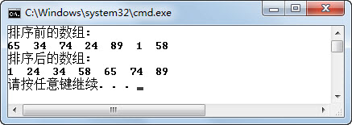
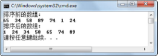
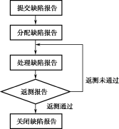
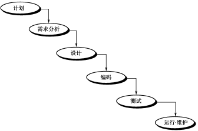
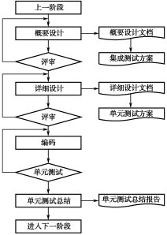
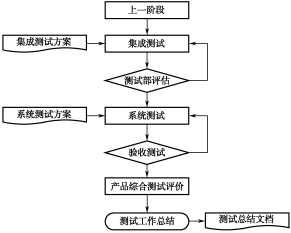
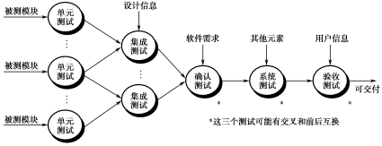
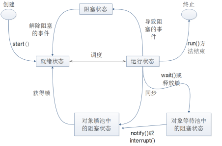

## 本章简介
&emsp;&emsp;本章作为选学章节，将会讲解排序算法、常见比较、软件测试以及线程死锁和协作等相关的知识。对于实际开发而言，本章的使用频率较低，因此建议读者在掌握了前面的章节后再来学习；但对于面试来讲，本章的一些知识点经常会作为面试题来进行考查。

&emsp;&emsp;本章的最后，还会向大家介绍一下Java 8的一些新特性。

 

 

 

## 10.1  排序算法

 

&emsp;&emsp;在学习《Java语言基础与面向对象编程实践》时，介绍了两种排序算法，一种是冒泡排序，另一种是直接插入排序，现在先回顾一下冒泡排序和直接插入排序。

- 冒泡排序

&emsp;&emsp;[冒泡](http://baike.baidu.com/view/94651.htm)排序就是依次比较相邻的两个数，将小数放在前面，大数放在后面。

&emsp;&emsp;第一轮：首先比较第1个和第2个数，将小数放前，大数放后。然后比较第2个数和第3个数，将小数放前，大数放后，依次类推，直至比较最后两个数，将小数放前，大数放后。至此第一轮结束，将最大的数放到了最后。

&emsp;&emsp;第二轮：仍从第1对数开始比较，将小数放前，大数放后，一直比较到倒数第2个数（倒数第一的位置上已经是最大的数），第二轮结束，在倒数第二的位置上得到一个新的最大数（其实在整个数列中是第二大的数）。

&emsp;&emsp;第三轮：…

&emsp;&emsp;按此规律操作，直至最终完成排序。由于在排序过程中总是小数往前放，大数往后放，类似于小的气泡往上升，所以称作冒泡排序。

- 直接插入排序

&emsp;&emsp;直接插入排序存在两个表，一个是有序表，另一个是无序表。每次从无序表中取出第一个元素，把它插入到有序表的合适位置，使有序表仍然有序。

&emsp;&emsp;第一轮：比较前两个数，然后按顺序插入到有序表中，剩下的数仍在无序表中。

&emsp;&emsp;第二轮：把无序表中剩下的第一个数据与有序表的有序数列进行比较，然后把这个数插入到合适位置。

&emsp;&emsp;第三轮：……

&emsp;&emsp;按此规律操作，直至无序表中的数全部插入到有序表，完成排序。

&emsp;&emsp;接下来，将再学习两种排序算法，一种是选择排序，另一种是快速排序。

### 10.1.1  选择排序  

&emsp;&emsp;选择排序是常用的一种排序方式，接下来以直接选择排序算法为例介绍选择排序。直接选择排序算法思路的核心是：*N*（*N*为需要排列的元素个数）从1开始，每一轮从待排数列中选择第*N*小（或大）的数放到排序列表的第*N*个位置。

&emsp;&emsp;第一轮：从全部待排序数列中选出最小的数，然后与第1个位置的数进行交换。

&emsp;&emsp;每二轮：从第2个位置到最后一个位置中（待排序数列）选出最小的数，然后与第二个位置的数进行交换。

&emsp;&emsp;第三轮：…

&emsp;&emsp;按此规律操作，*N*-1轮以后，待排序数列就变成从小到大进行排序的数列了。

&emsp;&emsp;使用直接选择排序算法进行排序，具体代码如下：


```
public class TestSelect{

public static void main(String[] args) {

int[] array = {65,34,74,24,89,1,58};

System.out.println("排序前的数组:");

for (int i = 0; i < array.length; i++) {

System.out.print(array[i]+"  ");

}

System.out.println();

selectSort(array);//使用直接选择排序

System.out.println("排序后的数组:");

for (int i = 0; i < array.length; i++) {

System.out.print(array[i]+"  ");

}

System.out.println();

}

//直接选择排序

public static void selectSort(int[] a) {

for(int i = 0; i < a.length-1; i++){

int k = i;

//选择待排序数列中最小数的下标

for(int j = i; j < a.length; j++){

if(a[k] > a[j]){

k = j;

}

}

if(k != i){

int temp = a[i];

a[i] = a[k];

a[k] = temp;

}

}

}

}
```


&emsp;&emsp;编译、运行程序，运行结果如图10.1所示。


<p align="center"></p>  
<p align="center">图10.1  直接选择排序</p>  


### 10.1.2  快速排序  

&emsp;&emsp;快速排序是对冒泡排序的一种改进，它的基本思想是通过一轮排序将要排序的数据分割成独立的两部分，其中一部分的所有数据比另外一部分的所有数据都要小，然后再按此方法对这两部分数据分别进行一轮排序，整个排序轮次递归进行，使整个数据变成一个有序序列。
每轮排序的具体算法如下：  

&emsp;&emsp;（1）设置两个变量i、j（均为下标变量），排序开始的时候i=0，j=N-1。  

&emsp;&emsp;（2）以第一个据元素作为关键数据，赋值给key，即key=a[0]。  


&emsp;&emsp;（3）从*j*开始向前搜索*j*--，即由后开始向前搜索，找到第一个小于key的值a[j]，a[i]与a[j]交换。

&emsp;&emsp;（4）从*i*开始向后搜索*i*++，即由前开始向后搜索，找到第一个大于key的a[i]，a[i]与a[j]交换。

&emsp;&emsp;重复步骤（3）和步骤（4），直到*i*=*j*，则将小于key的数全部都放在key前，将大于key的数都放在了key后。

&emsp;&emsp;快速排序的算法在理解上还是有一定难度的，接下来通过执行一轮快速排序算法来对array{58,34,65,89,74,1,24}数组进行排序。

&emsp;&emsp;array数组排序前的序列如下：


<table align="center">
	<tr>
		<td>58</td>
		<td>34</td>
		<td>65</td>
		<td>89</td>
		<td>74</td>
		<td>1</td>
		<td>24</td>
	</tr>
</table>


&emsp;&emsp;选择初始关键数据key=58（注意关键key保持不变，总是和key进行比较，最后的目的就是把key放在中间，小的放前面，大的放后面）。

&emsp;&emsp;第一次交换：从最后的数24开始搜索，找到第一个小于58的数24（此时*j*=6），将58和24进行交换，交换后结果如下：


<table align="center">
	<tr>
		<td>24</td>
		<td>34</td>
		<td>65</td>
		<td>89</td>
		<td>74</td>
		<td>1</td>
		<td>58</td>
	</tr>
</table>


&emsp;&emsp;第二次交换：从第一个数24开始搜索，找到第一个大于58的数65（此时*i*=2），将58和65进行交换，交换后结果如下：


<table align="center">
	<tr>
		<td>24</td>
		<td>34</td>
		<td>58</td>
		<td>89</td>
		<td>74</td>
		<td>1</td>
		<td>65</td>
	</tr>
</table>


&emsp;&emsp;第三次交换：从最后的数65开始搜索，找到第一个小于58的数1（此时*j*=5），将58和1进行交换，交换后结果如下：


<table align="center">
	<tr>
		<td>24</td>
		<td>34</td>
		<td>1</td>
		<td>89</td>
		<td>74</td>
		<td>58</td>
		<td>65</td>
	</tr>
</table>


&emsp;&emsp;第四次交换：从第一个数24开始搜索，找到第一个大于58的数89（此时*i*=3），将58和89进行交换，交换后结果如下：


<table align="center">
	<tr>
		<td>24</td>
		<td>34</td>
		<td>1</td>
		<td>58</td>
		<td>74</td>
		<td>89</td>
		<td>65</td>
	</tr>
</table>


&emsp;&emsp;再往下执行，在没有交换数据前即出现了*i*和*j*的数值都为4的情况，满足第一轮退出条件。观察排序后的数序，发现小于58的数都排到了58的前面，大于58的数都排到了58的后面。再按此方法对前后两部分数据分别进行一轮排序，这样递归下去，达到排序的目的。

&emsp;&emsp;使用快速排序的代码如下（请大家认真阅读注释，理解代码的含义）：


```
public class TestQuick

{

public static void main(String[] ary)

{

int[] array = {65,34,58,89,74,1,24};

System.out.println("排序前的数组:");

for (int i = 0; i < array.length; i++) {

System.out.print(array[i]+"  ");

}

System.out.println();

sort(array, 0, array.length - 1);//使用快速排序

System.out.println("排序后的数组:");

for (int i = 0; i < array.length; i++) {

System.out.print(array[i]+"  ");

}

System.out.println();

}

//进行一轮排序，array为排序数组，i，j为排序起始和结束位置，返回关键数据排序后索引

private static int sortUnit(int[] array, int i, int j)

{

int key = array[i];

while (i < j)

{

//从后向前搜索比key小的值，比key小的放左边

while(array[j] >= key && j > i)

j--;

//交换

array[i] = array[j];

//从前向后搜索比key大的值，比key大的放右边

while (array[i] <= key && j > i)

i++;

//交换

array[j] = array[i];

}

//当i=j时，一轮排序结束

array[j] = key;

//返回关键数据排序后索引

return j;

}

//快速排序，递归调用

public static void sort(int[] array, int low, int high)

{

if (low >= high)

{

return;

}

//完成一轮排序

int index = sortUnit(array, low, high);

//对左边部分进行排序

sort(array, low, index - 1);

//对右边部分进行排序

sort(array, index + 1, high);

}

}
```


&emsp;&emsp;编译、运行程序，运行结果如图10.2所示。


<p align="center"></p>  
<p align="center">图10.2  快速排序</p>  


 

 


## 10.2  上机任务


#### 目标：完成本章10.1节中的所有程序。

 


时间：40分钟。

 


形式：每个学员独立完成，小组组长检查。

 


工具：EditPlus。

 

 

 

 

 


## 10.3  常见比较


&emsp;&emsp;在面试时，经常会涉及相似知识点之间的比较。在平时的学习过程中，留意并区分相似技术的不同之处，可以加深对知识的掌握。本小节，将会通过几个知识的对比，抛砖引玉，希望引起大家的重视。

### 10.3.1  HashMap与Hashtable  

&emsp;&emsp;HashMap是Hashtable的轻量级实现，二者均实现了Map借口，主要有以下三点区别。

&emsp;&emsp;（1）Hashtable直接继承自Dictionary抽象类，其实现原理也是基于Dictionary类的；而HashMap则是JDK1.2引进的Map接口的一个具体实现类。

&emsp;&emsp;（2）Hashtable是线程安全的（同步），因此效率较低；而HashMap是线程不安全的（异步），因此效率较高。

&emsp;&emsp;（3）Hashtable不允许将null作为一个entry的key或value，但HashMap允许。

### 10.3.2  ArrayList与LinkedList  

&emsp;&emsp;ArrayList是基于动态数组的数据结构，而LinkedList基于链表。

&emsp;&emsp;因此，对于随机访问(get和set)，ArrayList的效率高于LinkedList；而对于增加和删除操作（add和remove），LinedList的效率高于ArrayList。

&emsp;&emsp;此外，ArrayList和LinkedList都是线程不安全的。

### 10.3.3  List、Map与Set  

&emsp;&emsp;List接口和Set接口有共同的父类：Collection接口；而Map本身就是一个顶级接口。

&emsp;&emsp;Collection接口用于存储一组不唯一、无序的对象，List接口存储一组不唯一、有序的对象，Set接口存储一组唯一、无序的对象；而Map接口存储的是一组键值对象（entry对象），并提高从key到value的映射。

 

 

## 10.4  软件测试

 

&emsp;&emsp;软件测试是最近数十年软件企业一直比较关心的话题之一，是软件开发过程中不可缺少的一部分，对于发现软件缺陷、保证软件产品质量具有不可替代的作用。本小节将介绍软件测试的概念以及测试与调试的区别，使大家对软件测试有个初步的了解。


### 10.4.1  软件测试概述  

#### 1．软件测试的概念

&emsp;&emsp;《软件测试的艺术》是关于软件测试的一本经典著作，其作者Glenford J. Myers曾经对软件测试进行了这样的定义：软件测试就是为了发现错误而执行程序或者系统的过程。这一定义明确了软件测试的根本目的是发现程序中的错误。

&emsp;&emsp;Myers撰写该著作的时期是在20世纪70年代末期，软件测试通常在软件产品开发的后期开始，主要目的就是寻找软件产品运行过程中的缺陷。因此，他对软件测试所下的这一定义被人们广泛接受，反映了人们在当时对软件测试所持的观点。

&emsp;&emsp;随着时间的推移以及行业的发展，人们逐渐发现了其定义中的不足。于是，在20世纪80年代中期，在IEEE提出的软件工程标准术语中，调整了对软件测试的定义，即使用人工或自动手段来运行或测试某个系统的过程，其目的在于检验它是否满足规定的需求或弄清预期结果与实际结果之间的差别。

&emsp;&emsp;更新后的定义除吸收了之前人们对软件测试定义中的精华外，还明确指出，软件测试作为保证软件质量的一个重要手段，其主要任务是在已设计测试用例的基础上检验软件各个部分，以及整个系统是否正确、完整地实现了预定的功能，以确保软件质量。

&emsp;&emsp;今天，人们对软件测试有了更进一步的认识，从广义上讲，测试是指软件产品生存周期内所有的检查、评审和确认活动。例如设计评审、单元测试、系统测试等。从狭义上讲，测试是对软件产品质量的检验和评价。

&emsp;&emsp;如今，软件行业的人员对软件测试有如下直观的认识。

- 保证程序和需求规格说明书等其他文档一致。

- 发现软件中的缺陷，确保系统能正常运行。

- 做软件应该做的事，不做软件不应该做的事。

&emsp;&emsp;现代软件测试活动一般包含以下内容：

&emsp;&emsp;（1）编写测试计划。

&emsp;&emsp;（2）设计测试用例。

&emsp;&emsp;（3）实施测试，提交缺陷报告。

&emsp;&emsp;（4）测试评估和总结。

&emsp;&emsp;从另一个角度看，软件测试与软件开发过程中其他工作在性质上存在很大的差异。其他工作往往是“建设性”的，而测试工作却有着很大的“破坏性”，努力证明程序中有错误，不能按照用户的要求正确工作。软件测试的根本目的是尽可能多地发现问题并排除潜在的错误，最终把一个高质量的软件系统交给用户使用。

#### 2．测试与调试

&emsp;&emsp;有不少对软件测试不了解的人会认为测试和调试是一回事，而实际上测试与调试有本质的区别。简单地说，测试的主要工作是找缺陷，而调试的目的是解决缺陷。软件调试与软件测试不同，软件测试的目标是尽可能多地发现软件中的错误，而进一步诊断和改正程序中的错误才是调试的任务。

&emsp;&emsp;通常，调试是一个具有很强技巧性的工作，一个开发人员在分析程序错误时会发现，软件出现问题往往只是潜在错误的外部表现，而外部表现与内在原因之间常常缺乏明显的联系。要找出真正的原因，排除潜在的错误，不是一件容易的事情。因此可以说，调试是通过现象找出原因的一个思维分析的过程。

&emsp;&emsp;另外还有两点也是测试和调试的区别，一是测试是贯穿在整个软件生命周期中的，包括需求分析、概要设计、详细设计、编码、测试和运行维护的全过程，而调试主要在开发阶段，尤其在开发的中后期。二是测试的执行者是测试人员和开发人员，而调试仅由开发人员完成，一般测试人员不参与。

### 10.4.2  软件缺陷及处理流程  

&emsp;&emsp;在软件测试过程中，软件测试工程师发现的问题、错误，就是软件缺陷，通常也称为Bug。本节将介绍如何确定软件缺陷以及作为一名软件测试工程师如何有效地记录缺陷。

#### 1．确定软件缺陷

&emsp;&emsp;通常人们在谈到软件缺陷时，总会把它和程序的错误联系在一起。比如说软件使用过程中出现的各种异常现象，例如软件产生了错误的输出结果，系统崩溃，网站慢得无法使用等，这些显然是软件缺陷。

&emsp;&emsp;对于这些软件缺陷而言，它们通常会在测试过程中，成为软件测试工程师关注的重点，也会被尽可能多地发现并且得到及时修改。然而，值得注意的是，软件缺陷并不仅仅是这些明显的程序错误，还包括所有未能满足目标群体（即用户）需求的问题。

&emsp;&emsp;任何一个软件产品都需要最大限度地满足用户的使用需求，但实际情况是任何软件产品都很难百分之百地满足用户的实际需求，软件产品只能通过不断地优化和改进而持续接近用户的需求。

&emsp;&emsp;通过上面的描述可以得知，在软件使用过程中所出现的任何问题，或者导致软件不能符合设计要求或满足用户需求的问题都可以说是软件缺陷，或称为Bug。

&emsp;&emsp;正确理解了软件缺陷的含义，可以帮助软件测试工程师比较容易地确定自己发现的一个问题是不是缺陷，可以说用户的需求是判断缺陷的关键。因此在确定缺陷的过程中，软件测试工程师可以从以下几个方面入手。

&emsp;&emsp;首先，可以将软件需求规格说明书、用户手册及联机帮助作为确定缺陷的主要工具，这些文档较为准确地反映了用户需求，所以被大多数软件测试工程师在实际测试过程中广泛使用。

&emsp;&emsp;其次，通过增加自己对所测试软件产品的行业背景知识的了解来发现被忽视的问题。这些问题中往往隐藏着软件的致命缺陷，而且作为用户方往往会认为知道这些是应该的，不需要明确写在需求里。

&emsp;&emsp;最后，通过沟通的方式来确定发现的问题是否是缺陷。主要是和研发人员沟通，和测试负责人沟通，当分歧很大时，可以交给项目负责人确认或者通过小型会议的形式讨论确认。

#### 2．有效记录缺陷

&emsp;&emsp;当软件测试工程师发现一个缺陷以后，就需要记录这个缺陷，并提交给开发人员。下面举一个非常简单的记录软件缺陷的案例。

&emsp;&emsp;缺陷描述：记事本中保存“联通”，再次打开后出现乱码！


&emsp;&emsp;缺陷步骤：

&emsp;&emsp;（1）打开记事本，输入“联通”（不带引号）。

&emsp;&emsp;（2）保存该文件到任意位置，文件名任意设置。


&emsp;&emsp;（3）再次打开这个文件，显示乱码，如图10.3所示。


<p align="center"></p>  
<p align="center">图10.3  缺陷报告</p>  


&emsp;&emsp;缺陷报告是大多数软件测试工程师的主要工作结果之一。缺陷报告的读者在通过这些文档重现缺陷的同时，也通过文档了解了软件测试工程师。报告写得越好，软件测试工程师的声誉越高，以后的工作交流就会更容易。开发人员通过软件测试工程师的报告得知缺陷信息，对重要问题的准确报告会为软件测试工程师带来良好声誉，差的报告会为开发人员带来额外的工作。如果软件测试工程师浪费了开发人员太多的时间，开发人员就会对软件测试工程师的工作抱有怨言。因此为编写出高质量的缺陷报告，软件测试工程师需要牢记以下书写缺陷报告的准则。

- 保证重现缺陷

&emsp;&emsp;缺陷报告的作用是为了让软件开发人员能够及时准确地了解软件存在的缺陷，它是软件测试工程师与开发人员沟通的重要手段。因此必须保证软件缺陷报告能够清晰描述缺陷，保证开发人员可以根据缺陷报告描述步骤的引导百分之百地重现缺陷。

- 使用最少步骤记录缺陷

&emsp;&emsp;虽然说软件测试工程师只需要发现缺陷，不需要修复缺陷，但作为一个优秀的软件测试工程师，应该会分析问题，尽量使用最少的步骤记录缺陷。

&emsp;&emsp;用过于复杂的步骤描述软件缺陷会降低软件缺陷被修复的可能性。一方面，复杂的步骤和大量的文字可能没有真正提炼出出现缺陷的关键，却占用开发人员很多宝贵的时间，久而久之会引起开发人员的反感，从而降低提交这类缺陷报告人员的受信度。另一方面，如果记录缺陷的过程过于复杂，则会给开发人员重现缺陷的过程带来很大的困难，而且也会让开发人员不能将问题集中在主要的步骤上。

- 包含重现缺陷的必要步骤

&emsp;&emsp;之所以要求缺陷报告必须包含所有重现缺陷的必要步骤，是为了提高缺陷报告的易用性。在软件开发和测试过程中，软件测试工程师对软件各种功能是最熟悉的，因此在编写缺陷报告的过程中，一些常用的操作步骤很容易被软件测试工程师认为是想当然的而忽视记录，从而为开发人员重现缺陷埋下隐患。一方面，这些在报告中被忽视的步骤可能给开发人员重现缺陷带来困难；另一方面，当这类报告经过长时间之后再被打开，可能连提交者自己也无法立刻依据报告重现缺陷的产生过程。

- 客观、方便阅读

&emsp;&emsp;缺陷报告是描述性短文，在编写时要注意客观、方便阅读。

&emsp;&emsp;一是报告的核心部分是重现缺陷的步骤，那么应当分步骤描述。因此，要对操作过程进行编号，在书写格式上要求每个步骤独占一行。

&emsp;&emsp;二是在报告软件缺陷时不做评价，既然是软件缺陷报告，就应该针对的是产品。因此，在缺陷报告中，软件测试工程师既没有必要对缺陷本身的成因进行没有根据的猜测，也没有必要对编写代码的开发人员的水平在报告中进行评价。

&emsp;&emsp;三是报告的标题部分要简洁明了，并且能够突出报告的主要内容。标题是缺陷报告中最重要的部分，是人们认知所报缺陷的第一步。过于简单的标题会影响开发人员前期筛选报告的准确性，因为开发人员一般会花更多的时间在那些标题中带有重要信息的缺陷上。

&emsp;&emsp;标题通常应该包括：简要的描述，能够让开发人员想象出缺陷的步骤；简要指出程序出错的特定条件，如在哪个平台下出现等；简要指出程序错误的影响或后果。当然，也不能把这些信息都放入标题部分，仅需要在标题中说明对于报告最重要的信息，其他的内容可以放到报告的描述部分进行说明。

&emsp;&emsp;四是在报告的详细内容部分，如果用语言不易说清楚问题，可以运用截图或保存错误文件等辅助方法，使问题描述得更加简单。

- 一个缺陷一个报告

&emsp;&emsp;缺陷报告应尽可能简单，不要在一个报告中合并多个缺陷。当缺陷报告中包含一个以上的缺陷时，通常只有第一个缺陷会受到注意和修复，而其他软件缺陷则会被遗忘或忽视。此外，如果开发人员看到一个缺陷报告中有多个缺陷，但开发人员在当时的情况下，只能修复这些缺陷中的一部分而不是全部，这样的话就无法对每个缺陷进行独立的跟踪。

- 报告不可重现的缺陷

&emsp;&emsp;永远都要报告不可重现的缺陷，这样的缺陷对公司产品的影响往往是致命的。有时缺陷表现出没有办法重现的情况，即看到程序出错一次，但不知道如何使其再次出现。但如果产品交付客户后还出现这种情况，会影响客户对产品的信心。所以软件测试工程师一旦发现这种不可重现的缺陷，需要及时报告，当类似的缺陷报告多了，开发人员常常就能总结出缺陷出现的规律，发现产生缺陷的原因。

### 10.4.3  缺陷报告处理  

&emsp;&emsp;前面已经学习了怎样编写缺陷报告，那么编写完一个合格的缺陷报告之后，具体的处理流程是怎样的呢？

#### 1．缺陷报告处理流程


&emsp;&emsp;一个缺陷报告的处理流程如图10.4所示。


<p align="center"></p>  
<p align="center">图10.4  缺陷报告处理流程</p>  


&emsp;&emsp;从图10.4可以看出，对软件缺陷报告的处理要经过这样一个过程。软件测试工程师提交缺陷报告，测试负责人（或开发负责人）审核后将缺陷报告分配给相关的开发人员修改，缺陷被修改后由软件测试工程师根据缺陷报告中的修改记录进行返测，返测通过的缺陷报告由软件测试工程师或测试负责人关闭，返测未通过的缺陷报告直接返回开发人员重新修改，直到缺陷被修复以后才关闭。

&emsp;&emsp;大多数情况下，缺陷报告的处理只经过提交、分配、解决、返测、关闭这样一个比较简单的流程，而且有些情况下连分配的过程都不需要，直接由测试工程师提交给开发人员进行解决，之后返测、关闭。但是在一些情况下，这个过程会变得比较复杂。比如说，开发人员打开提交的缺陷报告后，并没有对报告中的缺陷进行修改，因为开发人员可能认为此问题不是一个缺陷或者认为这个缺陷可以在以后的版本中解决。因此，开发人员在缺陷报告处理意见中会填入“不是问题”或“以后版本解决”。软件测试工程师在看到这一处理意见后，可能会不同意开发人员的看法，并将有说服力的理由填写在报告中，并将这一报告再次提交给开发人员。开发人员看到此意见后，如果同意软件测试工程师的看法，就会修复这一缺陷，开发人员如果不同意软件测试工程师的意见，那么他们会再次调整缺陷报告的处理意见。这里需要注意的是，这种关于缺陷是否修改的讨论过程有时会往复多次，最终得到大家都能认可的结论或者由项目负责人决定。

#### 2．缺陷报告详细内容

&emsp;&emsp;在10.4.2节的内容中，学习了为了促进沟通如何有效记录缺陷。当时提供的一个案例可以起的作用是记录缺陷，使开发人员能够重现这个缺陷。通过本节的学习，发现仅仅记录缺陷是不够的，还需要跟踪缺陷报告处理的全过程，最终目的是修复缺陷或者让缺陷有一个可以接收的处理办法。综合这些要求，并在之前缺陷报告的基础上，增加了一些内容，现将一个缺陷报告可能包含的内容逐个介绍给大家。

- 缺陷标题：简要的描述，能够让开发人员想象出缺陷，指出程序错误的特定条件和程序错误的影响或后果。

- 所属产品：表示该缺陷所属的产品。

- 产品版本：表示测试时该缺陷所属的产品版本。

- 所属模块：表示该缺陷在所属产品中的模块。

- 此时状态：表示该缺陷报告的状态，例如新提交、待解决、已解决、已关闭等。

- 优先级：表示修复缺陷的重要程度和优先级别。

- 硬件平台：测试环境的硬件平台，例如选择PC。

- 操作系统：测试环境使用的操作系统，例如选择Windows。

- 跟踪信息：记录这个缺陷报告经过哪些人做了哪些处理。

- 缺陷报告者：表示提交这个缺陷的软件测试工程师，通常有邮件地址。

- 缺陷处理者：表示处理这个缺陷的开发人员，通常也有邮件地址。

- 缺陷抄送人：表示这个缺陷抄送的人员，可能是测试、开发负责人或者相关模块的开发人员。

- 缺陷步骤描述：对缺陷的详细步骤描述，保证开发人员能够重现缺陷。

- 附件：该缺陷可能需要的相关附件，例如图片或错误文件。

### 10.4.4  软件测试流程  

&emsp;&emsp;一个软件的生命周期，以简单的瀑布模型来说，包括需求分析、概要设计、详细设计、编码、测试和运行维护，图10.5显示了软件生命周期的瀑布模型。

#### 1．需求分析阶段

&emsp;&emsp;软件项目的前期工作主要是需求分析，事实上一个软件项目或产品的成败与需求分析有着非常重要的联系。因此在没有明确用户需求的情况下，盲目地进行开发和测试都不能够取得理想的效果。若具备条件，测试人员应从客户需求调研阶段就介入到项目中。软件产品需求调研阶段工作流程如图10.6所示。


<p align="center"></p>  
<p align="center">图10.5  软件生命周期瀑布模型</p>  


&emsp;&emsp;在这一阶段，不需要投入太多的测试人员进入到项目中，通常会挑选一个测试组长进入项目，参与到需求分析阶段的需求评审过程，并根据最终确定的需求规格说明书设计系统测试的方案。

#### 2．设计和编码阶段

&emsp;&emsp;需求分析结束以后，开发团队会根据需求规格说明书的要求开始设计软件。首先是概要设计，之后是详细设计，最后开发人员根据产品的详细设计进行编码，这一过程叫做软件设计和编码阶段，其工作流程如图10.7所示。


<p align="center"></p>  
<p align="center">图10.6  软件需求分析阶段工作流程  </p>  


<p align="center"></p>  
<p align="center">图10.7  软件设计和编码阶段工作流程 </p>  


​                                     

&emsp;&emsp;在这一阶段，投入的测试人员也不需要太多，通常还是之前进入项目组的测试组长继续跟进项目，参与到概要设计和详细设计的评审过程中，根据概要设计文档编写集成测试方案，根据详细设计文档编写单元测试方案。

&emsp;&emsp;开发人员编码之后，要进行单元测试，单元测试的依据是根据详细设计产生的单元测试方案。根据国内的实际情况，除了航天、医疗、军工等对软件要求非常高的行业，其他行业的项目往往都是由开发人员进行单元测试，而不是由专业的软件测试工程师实施单元测试的。

#### 4．单元、集成、系统和验收测试 

&emsp;&emsp;单元测试结束以后，要形成单元测试报告，接下来进入到集成、系统、验收测试阶段，其工作流程如图10.8所示。


<p align="center"></p>  
<p align="center">图10.8  集成、系统和验收阶段工作流程</p>  


&emsp;&emsp;进入这一阶段，投入的测试人员数量将会迅速增加，因为从集成测试开始，测试工作基本上都是由软件测试工程师完成的。集成测试的依据是根据概要设计产生的集成测试方案，系统测试的依据是根据需求分析产生的系统测试方案。经过集成测试和系统测试之后，将进入由用户实施的验收测试，最后进行测试工作总结和文档整理工作。

&emsp;&emsp;通过以上的分析，可以得出这样一个结论：软件测试工作贯穿了整个软件生命周期，渗透到从分析、设计、编程以及测试的各个阶段中。

&emsp;&emsp;从软件测试的阶段上分析，可将软件测试分为同等重要的3个阶段，即单元测试、集成测试和系统测试（含确认测试）。测试工作中的第四个阶段是验收测试阶段，验收测试在性质上和系统测试很相似，它们的根本区别在于，前者是公司内部的，而后者则是受用户控制的，具体内容如图10.9所示。

- 单元测试

&emsp;&emsp;单元测试又称模块测试，是最小单位的测试，单元测试是在系统开发过程中进行的测试活动。在单元测试活动中，各独立单元模块将在与系统的其他部分相隔离的情况下进行测试。单元测试针对每个程序模块进行正确性检验，检查每个程序模块是否正确地实现了规定的功能。例如，一个类、接口、方法、报表或一个存储过程都可以作为一个单元进行测试。单元测试是测试的第一步，其依据是详细设计，单元测试应对模块内所有重要的控制路径设计测试用例，以便发现模块内部的错误。


<p align="center"></p>  
<p align="center">图10.9  软件测试过程</p>  


- 集成测试

&emsp;&emsp;集成测试是在单元测试的基础上，将已经通过测试的单元模块按照设计要求组装成系统或子系统再进行的测试。很多实际例子表明，软件的一些模块虽然能够单独工作，但并不保证连接之后也肯定能正常工作。例如，一个模块可能对另一个模块产生不利的影响，将子功能合成时不一定产生所期望的主功能，独立可接受的误差在组装后可能会超过可接受的误差限度等。

- 系统测试

&emsp;&emsp;系统测试是将经过集成测试的软件，作为整个基于计算机系统的一个元素，与计算机硬件、外设、某些支持软件、数据和人员等其他系统元素结合在一起，在实际运行环境下，对计算机系统进行全面的功能覆盖测试。

&emsp;&emsp;系统测试通过实施预定的测试计划和测试步骤，确定软件的特性是否与需求相符，确保所有的软件功能需求都能得到满足，所有的软件性能需求都能达到，所有的文档都是正确且便于使用的。同时，对其他软件需求，如可移植性、兼容性、出错自动恢复、可维护性等，也都要进行测试，确认是否满足。

- 验收测试

&emsp;&emsp;验收测试是软件产品交付用户正式使用前的最后一道工序。它是以用户为主的测试，软件开发和测试人员也应参加。由用户参加设计测试用例，使用用户界面输入测试数据，并分析测试的输出结果，一般使用生产中的实际数据进行测试。

&emsp;&emsp;验收测试的目的是向用户证明产品是可靠的。为了做到这点，验收测试必须满足的条件是集中进行用户需求的测试，且必须由用户或用户代表参加，并在正常的条件下进行测试。验收测试一般由用户执行，如果测试用例均执行通过，则说明系统是可以接受和能够发行的。验收标准必须在原始的需求规范中或在与客户签订的合同中规定。

### 10.4.5  软件测试分类  

&emsp;&emsp;根据软件测试所属的阶段和被测对象的规模大小，可以将软件测试分为单元测试、集成测试、系统测试和验收测试。从其他的角度看，又可以将软件测试分为黑盒测试和白盒测试，手工测试和自动测试，接下来将简要介绍这些内容。

#### 1．黑盒测试和白盒测试

&emsp;&emsp;黑盒测试又称功能测试，它注重于测试软件的功能性需求。采用这种测试方法，软件测试工程师会把被测程序看成一个黑盒，完全不考虑程序的内部结构和特性，只需知道该程序输入和输出之间的关系或程序功能，来确定测试用例和推断测试结果的正确性。

&emsp;&emsp;例如要测试一个程序，需求规格说明书规定，当输入值为16时，单击“计算”，输出结果为4；当输入值为4时，单击“计算”，输出结果为2。作为软件测试工程师，根据需求设计测试用例如下。

&emsp;&emsp;① 输入值：16，单击“计算”，预期结果：4。

&emsp;&emsp;② 输入值：4，单击“计算”，预期结果：2。

&emsp;&emsp;执行测试用例，看程序实际运行结果和预期结果的差异，如果一致则该测试用例执行通过，如果不一致，则发现一个缺陷，要提交缺陷报告给开发人员，这样的测试就是典型的黑盒测试。

&emsp;&emsp;白盒测试又称结构测试、逻辑驱动测试。软件测试工程师把被测试程序看成一个打开的盒子，能够看到程序的内部结构，根据程序的内容来设计测试用例。采用这种测试方法，软件测试工程师需要对被测试程序非常清楚，从程序的内部逻辑结构入手，按照一定的原则设计测试用例，测试软件的代码和逻辑路径，以判定程序运行情况是否和预期结果一致。

&emsp;&emsp;白盒测试要尽量提高对程序结构的覆盖，具体的方法包括语句覆盖、分支覆盖或判断覆盖、条件覆盖、判断/条件覆盖、路径覆盖，有兴趣的读者可以查阅相关资料。

#### 2．手工测试和自动测试

&emsp;&emsp;手工测试是传统的测试方法，也是现在大多数公司都使用的测试形式。它由软件测试工程师来执行测试用例，然后将实际结果和预期结果相比较，发现软件缺陷。

&emsp;&emsp;提到自动测试，很多人都会直接想到使用自动测试工具，认为只要购置一种流行的自动测试工具，执行记录手工测试的过程，然后在需要时回放录制过程就完成了自动测试。然而，通过实践发现，事实并非如此简单。

&emsp;&emsp;软件测试工程师在手工执行测试用例的过程中，会发现很多测试用例的执行步骤是相同的，但输入数据和预期结果不同。软件测试工程师需要反复执行这些步骤，输入不同的数据，判断实际结果和预期结果的差异。这样会让测试人员觉得比较枯燥，软件测试的效率比较低。

&emsp;&emsp;自动测试采用录制、回放的模式，将多组测试用例的数据 、预期结果数量输入到自动测试工具（例如QTP）中，让测试工具使用不同的输入数据反复执行测试步骤，判断预期结果和实际结果的差异。有些情况下自动测试可以在较短的时间内完成手工测试几小时的工作量。

&emsp;&emsp;从某种角度来说，自动测试可以为软件测试工作节省大量时间开销。成熟的自动测试机制，可以在软件测试工程师休息的时候，执行“夜间测试”，提高效率。然而，需要提醒大家的是，这种说法是相对的，并不具有普遍性。因为如果被测软件的用户界面是不稳定的，则之前录制的脚本在新的界面下就不能回访，也就无法提高工作效率。另外，针对有些被测软件，自动测试工具的支持可能不是很好，会出现不识别对象的情况，导致不能录制、回访。最后，录制、维护这些测试脚本也需要很大的工作量。所以如果只是针对项目的测试，而不是针对产品的测试，不建议使用自动测试工具。

&emsp;&emsp;自动测试的引入，对软件系统的性能测试可以说非常有必要。例如，我们要测试一个考试系统，希望这个考试系统能在同一时间点，允许100个用户同时登录，且每个用户登录的平均响应时间低于5秒。如果不用自动测试工具，那就只找100个人，让软件测试工程师一声令下，这100个人同时登录这个考试系统，每个人还需用秒表记录用户的响应时间。当然，这只是一个玩笑！但使用自动测试工具中的性能测试工具，例如LoadRunner，就能非常容易地做到刚才的需求。

 

## 10.5  线程死锁和协作

 

&emsp;&emsp;多线程同步，解决的是多线程安全性的问题，避免获取错误的数据，但同步也同时会带来性能损耗和线程死锁的问题。本节通过案例演示什么是线程死锁，并简单介绍解决线程死锁的方法。解决了多线程之间的问题后，本节还会介绍线程之间相互协作，通过多线程间的协作完成系统的功能。

### 10.5.1  线程死锁  

&emsp;&emsp;多线程同步的好处是避免了线程获取错误数据，但多线程同步也带来了性能问题。多线程同步采用了同步代码块和同步方法的方式，依靠的是锁机制实现了互斥访问。因为是互斥的访问，所以不能并行处理，存在性能问题。

&emsp;&emsp;多线程同步的性能问题还只是快和慢的问题，但如果出现了线程死锁，那可能直接导致程序众多的线程都处于阻塞状态，无法继续运行。

&emsp;&emsp;如果线程A只有等待另一个线程B的完成才能继续，而在线程B中又要等待线程A的资源，那么这两个线程相互等待对方释放锁时就会发生死锁。出现死锁后，不会出现异常，不会出现提示，只是相关线程都处于阻塞状态，无法继续运行。

&emsp;&emsp;下面仍然通过一个案例来演示线程的死锁，具体代码如下：


```
public class DeadLockThread{

//创建两个线程之间竞争使用的对象

private static Object lock1 = new Object();

private static Object lock2 = new Object();

public static void main(String[] args){

new Thread(new ShareThread1()).start();

new Thread(new ShareThread2()).start();

}

private static class ShareThread1 implements Runnable

{

public void run(){

synchronized(lock1){

try{

Thread.sleep(50);

}catch(InterruptedException e)

{

e.printStackTrace();

}

synchronized(lock2){

System.out.println("ShareThread1");

}

}

}

}

private static class ShareThread2 implements Runnable

{

public void run(){

synchronized(lock2){

try{

Thread.sleep(50);

}catch(InterruptedException e)

{

e.printStackTrace();

}

synchronized(lock1){

System.out.println("ShareThread2");

}

}

}

}

}
```


&emsp;&emsp;上面的代码中，创建了两个线程之间竞争使用的对象lock1和lock2，内部类ShareThread1在run()方法中先对lock1上锁，然后对lock2上锁，并且只有lock2代码块运行结束解锁之后，lock1才能运行结束解锁。类似的内部类ShareThread2在run()方法中先对lock2上锁，然后对lock1上锁，并且只有lock1代码块运行结束解锁之后，lock2才能运行结束解锁。当这两个线程启动以后，分别都握着第一个锁，等待第二个锁，程序死锁！

&emsp;&emsp;当多个线程竞争多个排他性锁的时候，可能出现死锁。解决的方式为多个线程以同样的顺序获取锁，不出现交叉也就不会出现死锁的问题。

### 10.5.2  产生死锁的原因及条件  

&emsp;&emsp;为什么会产生死锁？什么情况下可能会导致死锁？下面，我们就一起来探讨死锁产生的原因及必要条件。

&emsp;&emsp;死锁产生的原因有以下三个方面。

&emsp;&emsp;（1）系统资源不足。如果系统的资源充足，所有进程的资源请求都能够得到满足，自然就不会发生死锁。

&emsp;&emsp;（2）进程运行推进的顺序不合适。

&emsp;&emsp;（3）资源分配不当等。

&emsp;&emsp;产生死锁的必要条件有以下四个。

&emsp;&emsp;（1）互斥条件：一个资源每次只能被一个进程使用。

&emsp;&emsp;（2）请求与保持条件：一个进程因请求资源而阻塞时，对已获得的资源保持不放。

&emsp;&emsp;（3）不剥夺条件：进程已获得的资源，在未使用完之前，不能强行剥夺。

&emsp;&emsp;（4）循环等待条件：若干进程之间形成一种头尾相接的循环等待资源关系。

&emsp;&emsp;只要系统发生死锁，这四个条件就必然成立；反之，只要破坏四个条件中的任意一个，就可以避免死锁的产生。

### 10.5.3  线程协作  

&emsp;&emsp;通过之前的学习，已经了解并初步解决了多线程之间可能出现的问题，下一步学习的重点是如何让线程之间进行有效协作。线程协作的一个典型案例就是生产者和消费者问题，生产者和消费者的这种协作是通过线程之间的握手来实现的，而这种握手又是通过Object类的wait()和notify()方法来实现的。下面具体来了解生产者和消费者问题。

&emsp;&emsp;有一家餐厅举办吃热狗活动，活动时有5个顾客来吃，3个厨师来做。为了避免浪费，制作好的热狗被放进一个能装10个热狗的长条状容器中，并且按照先进先出的原则取热狗。如果长条容器被装满，则厨师已经做完的热狗不再往长条容器里放，同时停止做热狗；如果顾客发现长条容器内的热狗吃完了，则提醒厨师再做热狗。这里的厨师就是生产者，顾客就是消费者。

&emsp;&emsp;这是一个线程同步问题，生产者和消费者共享同一个资源，并且生产者和消费者之间相互依赖，互为条件。对于生产者，当生产的产品装满了仓库，则需要停止生产，等待消费者消费后提醒生产者继续生产。对于消费者，当发现仓库中已没有产品时，则不能消费，等待生产者生产出产品以后通知消费者可以消费。

&emsp;&emsp;之前学习的synchronized关键字可实现对共享资源的互斥操作，但无法实现不同线程之间消息的传递。Java提供了wait()、notify()、notifyAll()三个方法，解决线程之间协作的问题。这三个方法均是java.lang.Object类的方法，但都只能在同步方法或者同步代码块中使用，否则会抛出异常。下面是这三个方法的简单介绍。

- void wait()

&emsp;&emsp;当前线程等待，等待其他线程调用此对象的notify()方法或notifyAll()方法将其唤醒。

- void notify()

&emsp;&emsp;唤醒在此对象锁上等待的单个线程。

- void notifyAll()

&emsp;&emsp;唤醒在此对象锁上等待的所有线程。

&emsp;&emsp;图10.10所示的是线程等待与唤醒的示意图。

&emsp;&emsp;完成吃热狗活动的需求有一定的难度，现整理思路如下。

&emsp;&emsp;（1）定义一个集合模拟长条容器存放热狗，集合里实际存放Integer对象，其数值代表热狗的编号（热狗编号规则举例：300002代表编号为3的厨师做的第2个热狗），这样能通过集合添加和删除操作实现长条容器内热狗的先进先出。

&emsp;&emsp;（2）以热狗集合作为对象锁，所有对热狗集合的操作（在长条容器中添加或取走热狗）互斥，这样保证不会出现多个顾客同时取最后剩下的一个热狗的情况，也不会出现多个厨师同时添加热狗造成长条容器里热狗数大于10个的情况。

 


<p align="center"></p>  
<p align="center">图10.10  线程等待与唤醒</p>  


&emsp;&emsp;（3）当厨师希望往长条容器中添加热狗时，如果发现长条容器中已有10个热狗，则停止做热狗，等待顾客从长条容器中取走热狗的事件发生，以唤醒厨师可以重新进行判断，是否需要做热狗。

&emsp;&emsp;（4）当顾客希望从长条容器中取走热狗时，如果发现长条容器中已没有热狗，则停止吃热狗，等待厨师往长条容器中添加热狗的事件发生，以唤醒顾客可以重新进行判断，是否可以取走热狗吃。

&emsp;&emsp;实现此功能的代码如下：


```
import java.util.*;

public class TestProdCons {

//定义一个存放热狗的集合，里面存放的是整数，代表热狗编号

private static final List<Integer> hotDogs = new ArrayList<Integer>();

public static void main(String[] args){

for(int i = 1;i <= 3;i++){

new Producer(i).start();

}

for(int i = 1;i <= 5;i++){

new Consumer(i).start();

}

try{

Thread.sleep(2000);

}catch(InterruptedException e){

e.printStackTrace();

}

System.exit(0);

}

//生产者线程，以热狗集合作为对象锁，所有对热狗集合的操作互斥

private static class Producer extends Thread{

int i = 1;

int pid = -1;

public Producer(int id){

this.pid = id;

}

public void run(){

while(true){

try{

//模拟消耗的时间

Thread.sleep(100);

} catch (InterruptedException e) {

e.printStackTrace();

}

synchronized(hotDogs){

if(hotDogs.size() < 10){

//热狗编号，300002代表编号为3的生产者生产的第2个热狗

hotDogs.add(pid*10000 + i);

System.out.println("生产者" + pid + "生产热狗，编号为：" + pid*10000 + i);

i++;

//唤醒hotDogs对象锁上所有调用wait()方法的线程

hotDogs.notifyAll();

}else{

try{

System.out.println("热狗数已到10个，等待消费！");

hotDogs.wait();

}catch(InterruptedException e) {

e.printStackTrace();

}

}

}

}

}

}

//消费者线程，以热狗集合作为对象锁，所有对热狗集合的操作互斥

private static class Consumer extends Thread {

int cid = -1;

public Consumer(int id){

this.cid = id;

}

public void run(){

while(true){

synchronized (hotDogs) {

try{

//模拟消耗的时间

Thread.sleep(200);

}catch(InterruptedException e) {

e.printStackTrace();

}

if(hotDogs.size() > 0) {

System.out.println("消费者" + this.cid + "正在消费一个热狗，其编号为：

" + hotDogs.remove(0));

hotDogs.notifyAll();

}else{

try{

System.out.println("已没有热狗，等待生产！");

hotDogs.wait();

}catch(InterruptedException e) {

e.printStackTrace();

}

}

}

}

}

}

}
```


&emsp;&emsp;编译、运行程序，运行结果如图10.11所示。通过调整生产者和消费者模拟消耗的时间，重新编译、运行程序，程序运行结果会显示出符合需求的不同情况，大家可以尝试一下。


<p align="center"></p>  
<p align="center">图10.11  生产者消费者问题</p>  


## 10.6  上机任务


#### 目标：完成本章10.5节中的所有程序。

 


时间：40分钟。

 


形式：每个学员独立完成，小组组长检查。

 


工具：EditPlus。

 

 

 

 


## 10.7  Java 8新特性简介

 

&emsp;&emsp;Java 8是Java语言历史上变化最大的版本之一，是一个里程碑式的版本。

&emsp;&emsp;Java 8承诺要调整Java编程向着函数式风格迈进，并且在语法、编译器、类库以及Java虚拟机等方面都带来了许多新特性。本节将介绍Java 8的部分新特性。

### 10.7.1  Lambda表达式  

&emsp;&emsp;Java 8的一个最大亮点就是Lambda表达式，它将函数式编程引入到Java语言中。一个Lambda表达式由以下三部分组成。

&emsp;&emsp;（1）用逗号分隔的参数列表；

&emsp;&emsp;（2）箭头符号（–>）；

&emsp;&emsp;（3）函数体（表达式或代码块）。

&emsp;&emsp;Lambda表达式本质上是一个匿名方法，例如以下代码：


```
 public int add(int num1, int num2) {

​        return num1 + num2;

 }
```


&emsp;&emsp;可以转为等价的Lambda表达式：


```
 (int x, int y) -> x + y;
```

### 10.7.2  接口的默认方法与静态方法  

&emsp;&emsp;在Java 8中，可以使用default关键字在接口中定义默认方法，并提供默认的实现。之后，该接口的所有实现类都会默认地使用该实现方法。当然，实现类也可以对该默认方法进行重写。例如：


```
public interface MyInterface {

​     default String myFunction() {

​         return "hello world";

​     }

}
```


&emsp;&emsp;此外，还可以在接口中定义静态方法，并提供默认实现。例如：


```
public interface MyInterface {

​     static String myFunction() {

​         return "hello world";

​     }

}
```


### 10.7.3  方法引用  

&emsp;&emsp;Java 8还允许使用::来引用一个已经存在的方法，其语法如下：


```
类名::方法名
```


&emsp;&emsp;注意：只写方法名即可，不需要写括号。

&emsp;&emsp;具体地讲，共有如表10.1所示的四种类型的引用。

表10.1  引用的类型
|类    型	|示    例|
| ---- | ---- |
|引用静态方法	|ContainingClass::staticMethodName|
|引用某个对象的实例方法	|ContainingObject::instanceMethodName|
|引用某个类型的任意对象的实例方法	|ContainingType::methodName|
|引用构造方法	|ClassName::new|


### 10.7.4  重复注解  

&emsp;&emsp;自从Java 5引入了注解以后，注解就被广泛应用于各个框架之中。但Java 5引入的注解存在一个问题：在同一个地方不能多次使用同一个注解。而Java 8就打破了这个限制，引入了重复注解的概念，允许在同一个地方多次使用同一个注解。

&emsp;&emsp;在Java 8中使用@Repeatable注解定义重复注解，代码示例如下：

 
```
@Repeatable(Authorities.class)

public @interface Authority {

​     String role();

}

public @interface Authorities {

​    Authority[] value();

}

public class RepeatAnnotationUseNewVersion {

​    @Authority(role="Admin")

​    @Authority(role="Manager")

​    public void doSomeThing(){ }

}

``` 

&emsp;&emsp;在创建重复注解Authority时，加上@Repeatable并指向用于存储的注解Authorities。之后，在使用的时候，就可以重复使用Authority注解。

### 10.7.5  其他特性  

&emsp;&emsp;Java 8还提供了Function、Supplier、Optional、Predicate、Consumer 等接口用于简化代码，提供了Nashorn引擎便于在JVM上运行JavaScript代码，提供了新的Date API，提供了对高并发的新支持，提供了更好的类型推测机制，提供了类依赖分析器jdeps……

&emsp;&emsp;不难看出，Java 8的升级必然会对日后的开发带来重大影响。因此，建议大家在课后一定要多浏览技术文章，多上机实践，时刻坚持学习，不断提高自己的技术水平。

 

## 10.8  本章练习

 

1  “*N*从1开始，每一轮从待排数列中选择第*N*小（或大）的数放到排序列表的第*N*个位置。”这是描述（    ）算法。（选择一项） 

&emsp;&emsp;A．冒泡排序

&emsp;&emsp;B．直接插入排序

&emsp;&emsp;C．直接选择排序

&emsp;&emsp;D．快速排序

 

 

2  请描述ArrayList和LinkedList的区别。

 

 

3  请描述HashMap和Hashtable的异同（自己查阅资料）。

 

 

4  根据软件测试所属的阶段和被测对象的规模大小，可以将软件测试分为________、________、________和________。

 

 

5  什么是软件测试？请用自己的语言加以描述。

 

 

6  请介绍一个缺陷报告的处理流程。

 

 

7  请列出一个缺陷报告通常包括哪些内容。

 
8  请描述关于一个项目的软件测试活动通常包括哪些内容。

 

 

9  什么是线程死锁？应如何解决？

 

 

 

 

 

 

 

