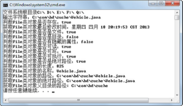
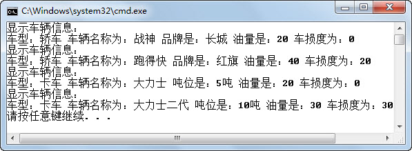

## 本章简介
&emsp;&emsp;在编写“蓝桥系统”和“租车系统”时，都存在这样一个问题，程序中所有的数据都保存在内存中，一旦程序关闭，这些数据就都丢失了，这样的情况肯定不符合用户的需求。通常在软件开发项目中，解决保存数据的办法主要有两类，其中使用最广泛的一类是使用数据库保存大量数据，相关的内容会在其他课程中详细介绍。另外一类就是把数据保存在文件中，既可以保存在普通文件中，也可以保存在XML文件中。如何存取文件，尤其是如何存取XML文件，将是本章要介绍的重点。

 


## 4.1  File类

 

&emsp;&emsp;Java是面向对象的语言，要想把数据存到文件中，就必须有一个对象表示这个文件。File类的作用是代表一个特定的文件或目录，并提供了若干方法对这些文件或目录进行各种操作。File类在java.io包下，与系统输入/输出相关的类通常都在此包下。

### 4.1.1  File类构造方法  

&emsp;&emsp;构造一个File类的实例，并不是创建这个目录或文件，而创建的是该路径（目录或文件）的一个抽象，它可能真实存在，也可能不存在。

&emsp;&emsp;File类的构造方法有如下四种。

- File(File parent, String child)

&emsp;&emsp;根据parent抽象路径名和child路径名字符串创建一个新File实例。

- File(String pathname)

&emsp;&emsp;通过将给定路径名字符串转换为抽象路径名来创建一个新File实例。

- File(String parent, String child)

&emsp;&emsp;根据parent路径名字符串和child路径名字符串创建一个新File实例。

- File(URI uri)

&emsp;&emsp;通过将给定的URI类对象转换为一个抽象路径名来创建一个新的File实例。

&emsp;&emsp;在创建File类的实例时，有个问题尤其需要注意。Java语言一个显著的特点是，Java是跨平台的，可以做到“一次编译、处处运行”，所以在使用File类创建一个路径的抽象时，需要保证创建的这个File类也是跨平台的。但是不同的操作系统对文件路径的设定各有不同的规则，例如在Windows操作系统下，一个文件的路径可能是“C:\com\bd\zuche\TestZuChe.java”，而在Linux和UNIX操作系统下，文件路径的格式就类似于“/home/bd/zuche/TestZuChe.java”。

&emsp;&emsp;File类提供了一些静态属性，通过这些静态属性，可以获得Java虚拟机所在操作系统的分隔符相关信息。


- File.pathSeparator

&emsp;&emsp;与系统有关的路径分隔符，它被表示为一个字符串。

- File.pathSeparatorChar

&emsp;&emsp;与系统有关的路径分隔符，它被表示为一个字符。

- File.separator

&emsp;&emsp;与系统有关的默认名称分隔符，它被表示为一个字符串。

- File.separatorChar

&emsp;&emsp;与系统有关的默认名称分隔符，它被表示为一个字符。

&emsp;&emsp;在Windows平台下编译、运行下面的程序，运行结果如图4.1所示。如果在Linux平台下运行，则PATH分隔符为“：”，而路径分隔符为“/”。


```
import java.io.File;

public class TestFileSeparator {

​         public static void main(String[] args) {

​                  System.out.println("PATH分隔符：" + File.pathSeparator);

​                  System.out.println("路径分隔符：" + File.separator);

​         }

}
```


<p align="center"></p>  
<p align="center">图4.1  File类分隔符</p>  


### 4.1.2  File类使用  

&emsp;&emsp;下面通过一个具体的例子来演示File类的一些常用方法，不易理解的代码通过注释加以描述。


```
import java.io.*;

public class TestFile{

​         public static void main(String args[]) throws IOException {

​                  System.out.print("文件系统根目录");

​                  for (File root : File.listRoots()) {

​                           //format方法是使用指定格式化字符串输出

​                           System.out.format("%s ", root);

​                  }

​                  System.out.println();

​                  showFile();

​         }

​         public static void showFile() throws IOException{   

​                  //创建File类对象file，注意使用转义字符“\”

​                  File f = new File("C:\\com\\bd\\zuche\\Vehicle.java");      

​                  File f1 = new File("C:\\com\\bd\\zuche\\Vehicle1.java");

​                  //当不存在该文件时，创建一个新的空文件

​                  f1.createNewFile();

​                  System.out.format("输出字符串：%s%n", f);

​                  System.out.format("判断File类对象是否存在：%b%n", f.exists());

​                  //%tc，输出日期和时间

​                  System.out.format("获取File类对象最后修改时间：%tc%n", f.lastModified());

​                  System.out.format("判断File类对象是否是文件：%b%n", f.isFile());

​                  System.out.format("判断File类对象是否是目录：%b%n", f.isDirectory());

​                  System.out.format("判断File类对象是否有隐藏的属性：%b%n", f.isHidden());

​                  System.out.format("判断File类对象是否可读：%b%n", f.canRead());

​                  System.out.format("判断File类对象是否可写：%b%n", f.canWrite());

​                  System.out.format("判断File类对象是否可执行：%b%n", f.canExecute());

​                  System.out.format("判断File类对象是否是绝对路径：%b%n", f.isAbsolute());

​                  System.out.format("获取File类对象的长度：%d%n", f.length());

​                  System.out.format("获取File类对象的名称：%s%n", f.getName());

​                  System.out.format("获取File类对象的路径：%s%n", f.getPath());

​                  System.out.format("获取File类对象的绝对路径：%s%n",f.getAbsolutePath());

​                  System.out.format("获取File类对象父目录的路径: %s%n", f.getParent());

​         }

}
```


&emsp;&emsp;编译、运行程序，运行结果如图4.2所示。


<p align="center"></p>  
<p align="center">图4.2  File类对象的常用方法</p>  


&emsp;&emsp;程序中的代码for(File root:File.listRoots()){…}，通过一个增强for循环，遍历File.listRoots()方法获取的根目录集合（File对象集合）。

&emsp;&emsp;f1.createNewFile();是当不存在该文件时，创建一个新的空文件，所以在C:\com\bd\zuche\目录下创建了一个空文件，文件名为Vehicle1.java。另外，这个方法在执行过程中，如果发生I/O错误，会抛出IOException检查时异常，必须要进行显式的捕获或继续向外抛出该异常。

&emsp;&emsp;System.out.format(format, args)是使用指定格式化字符串输出，其中format参数为格式化转换符。关于转换符的说明如图4.3所示。


<p align="center"></p>  
<p align="center">图4.3  转换符说明</p>  


### 4.1.3  静态导入  

&emsp;&emsp;从JDK1.5开始，增加了静态导入的特性，用来导入指定类的某个静态属性或方法，或全部静态属性或方法，静态导入使用import static语句。

&emsp;&emsp;下面通过静态导入前后的代码进行对比，理解静态导入的使用。


```
//静态导入前的代码

public class TestStatic

{

​         public static void main(String[] args) 

​         {

​                  System.out.println(Integer.MAX_VALUE);

​                  System.out.println(Integer.toHexString(12));

​         }

}

//静态导入后的代码

import static java.lang.System.out;

import static java.lang.Integer.*; 

public class TestStatic2

{

​         public static void main(String[] args) 

​         {

​                  out.println(MAX_VALUE);

​                  out.println(toHexString(12));

​         }

}
```


&emsp;&emsp;通过代码对比可以看出，使用静态导入省略了System和Integer的书写，编写代码相对简单。在使用静态导入的时候，需要注意以下几点：

&emsp;&emsp;（1）虽然在语言表述上说的是静态导入，但在代码中必须写import static。

&emsp;&emsp;（2）提防静态导入冲突。例如，同时对 Integer 类和 Long 类执行了静态导入，引用MAX_VALUE属性将导致一个编译器错误，因为Integer类和Long类都有一个MAX_VALUE常量，编译器不知道使用哪个MAX_VALUE。

&emsp;&emsp;（3）虽然静态导入让代码编写相对简单，但毕竟没有完整地写出静态成员所属的类名，程序的可读性有所降低。 

&emsp;&emsp;在上一小节TestFile代码中，System.out被书写了多次。对于这种情况，建议程序员编写代码时静态导入System类下的out静态变量，这样在之后代码内直接书写out即可代表此静态变量。

### 4.1.4  获取目录和文件  

&emsp;&emsp;File类提供了一些方法，用来返回指定路径下的目录和文件。

- String[] list()

&emsp;&emsp;返回一个字符串数组，这些字符串指定此抽象路径名表示的目录中的文件和目录。

- String[] list(FilenameFilter filter)

&emsp;&emsp;返回一个字符串数组，这些字符串指定此抽象路径名表示的目录中满足指定过滤器的文件和目录。

- File[] listFiles()

&emsp;&emsp;返回一个抽象路径名数组，这些路径名表示此抽象路径名表示的目录中的文件和目录。

- File[] listFiles(FilenameFilter filter)

&emsp;&emsp;返回一个抽象路径名数组，这些路径名表示此抽象路径名表示的目录中满足指定过滤器的文件和目录。

&emsp;&emsp;接下来通过一个案例，演示File类的方法的使用，其中FilenameFilter过滤器只需要简单了解即可。


```
import java.io.*;

public class TestListFile{

​         public static void main(String args[]) throws IOException {

​                  File f = new File("C:\\com\\bd\\zuche");   

​                  System.out.println("***使用list()方法获取String数组***");

​                  //返回一个字符串数组，由文件名组成

​                  String[] fNameList = f.list();

​                  for(String fName:fNameList){

​                           System.out.println(fName);

​                  }

​                  System.out.println("***使用listFiles()方法获取File数组***");

​                  //返回一个File数组，由File实例组成

​                  File[] fList = f.listFiles();

​                  for(File f1:fList){

​                           System.out.println(f1.getName());

​                  }

​                  //使用匿名内部类创建过滤器，过滤出.java结尾的文件        

​                  System.out.println("***使用listFiles(filter)方法过滤出.java文件***");

​                  File[] fileList = f.listFiles(new FileFilter() {

​                           public boolean accept(File pathname) {

​                                    if(pathname.getName().endsWith(".java"))

​                                             return true;

​                                    return false;

​                           }

​                  });

​                  for(File f1:fileList){

​                           System.out.println(f1.getName());

​                  }

​         }

}
```


&emsp;&emsp;编译、运行程序，其运行结果如图4.4所示。


<p align="center"></p>  
<p align="center">图4.4  获取目录和文件</p>  


## 4.2  上机任务

 


目标：完成本章4.1节的所有程序。

 


时间：30分钟。

 


形式：每个学员独立完成，小组组长检查。

 


工具：EditPlus。

 


## 4.3  字节流和字符流

 

&emsp;&emsp;在正式学习字节流及字符流以前，有必要先来了解一下I/O流。

### 4.3.1  I/O流 

 

&emsp;&emsp;在Java中，文件的输入和输出是通过流（Stream）来实现的，流的概念源于UNIX中管道（pipe）的概念。在 UNIX 系统中，管道是一条不间断的字节流，用来实现程序或进程间的通信，或读写外围设备、外部文件等。

&emsp;&emsp;一个流，必有源端和目的端，它们可以是计算机内存的某些区域，也可以是磁盘文件，甚至可以是Internet上的某个URL。对于流而言，不用关心数据是如何传输的，只需要向源端输入数据，从目的端获取数据即可。

&emsp;&emsp;输入流和输出流的示意图分别如图4.5和图4.6所示。


<p align="center"></p>  
<p align="center">图4.5  输入流示意图   </p>  


<p align="center"></p>  
<p align="center">图4.6  输出流示意图</p>  


​                                         

&emsp;&emsp;如何理解输入和输出呢？简单地说，你听别人唠叨就是输入，你向别人发牢骚就是输出。在计算机的世界中，输入Input和输出Output都是针对计算机的内存而言的。比如读取一个硬盘上的文件，对于内存就是输入；向控制台打印输出一句话，就是输出。Java中对于此类输入/输出的操作统称为I/O，即Input/Output。

&emsp;&emsp;流是对I/O操作的形象描述，水从一个地方转移到另一个地方就形成了水流，而信息从一处转移到另一处就叫做I/O流。

&emsp;&emsp;输入流的抽象表示形式是接口InputStream；输出流的抽象表示形式是接口OutputStream。

&emsp;&emsp;JDK中InputStream和OutputStream的实现就抽象了各种方式向内存读取信息和向外部输出信息的过程。我们之前常用的System.out.println();就是一个典型的输出流，目的是向控制台输出信息。而new Scanner(System.in);就是一个典型的输入流，读取控制台输入的信息。System.in和System.out两个变量就是InputStream和OutputStream的实例对象。

&emsp;&emsp;流按照处理数据的单位，可以分为字节流和字符流。字节流的处理单位是字节，通常用来处理二进制文件，例如音乐、图片文件等。而字符流的处理单位是字符，因为Java采用Unicode编码，Java字符流处理的即为Unicode字符，所以在操作汉字、国际化等方面，字符流具有优势。


### 4.3.2  字节流  

&emsp;&emsp;所有的字节流类都继承自InputStream或OutputStream两个抽象类，这两个抽象类拥有的方法可以通过查阅Java API获得。JDK提供了不少字节流，下面列举了5个输入字节流类，输出字节流类和输入字节流类存在对应关系，这里不再一一列举。

- FileInputStream：把一个文件作为输入源，从本地文件系统中读取数据字节，实现对文件的读取操作。

- ByteArrayInputStream：把内存中的一个缓冲区作为输入源，从内存数组中读取数据字节。

- ObjectInputStream：对以前使用ObjectOutputStream写入的基本数据和对象进行反序列化，用于恢复那些以前序列化的对象，注意这个对象所属的类必须实现 Serializable 接口。

- PipedInputStream：实现了管道的概念，从线程管道中读取数据字节。主要在线程中使用，用于两个线程间通信。

- SequenceInputStream：表示其他输入流的逻辑串联。它从输入流的有序集合开始，并从第一个输入流开始读取，直至到达文件末尾，接着从第二个输入流读取，依次类推，直至到达包含的最后一个输入流的文件末尾为止。

- System.in：从用户控制台读取数据字节，在System类中，in是InputStream类的静态对象。

&emsp;&emsp;接下来通过一个案例来说明如何使用FileInputStream和FileOutputStream两个字节流类，实现复制文件内容的目的。


```
import java.io.*;

public class TestByteStream{

​         public static void main(String[] args) throws IOException {

​                  FileInputStream in = null;

​                  FileOutputStream out = null;

​                  try{

​                           File f = new File("C:\\com\bd\\zuche\\Vehicle1.java");

​                           f.createNewFile();

​                           //通过构造方法之一：String构造输入流

​                           in = new FileInputStream("C:\\com\\bd\\zuche\\Vehicle.java");

​                           //通过构造方法之一：File类构造输出流

​                           out = new FileOutputStream(f);

​                           //通过逐个读取、存入字节，实现文件复制

​                           int c;

​                           while ((c = in.read()) != -1) {

​                                    out.write(c);

​                           }

​                  }catch(IOException e){

​                           System.out.println(e.getMessage());

​                  }finally{

​                           if(in != null){

​                                    in.close();

​                           }

​                           if(out != null){

​                                    out.close();

​                           }

​                  }

​         }

}
```


&emsp;&emsp;上面的代码分别通过传入字符串和File类，创建了文件输入流和输出流，然后调用输入流类的read()方法从输入流读取字节，再调用输出流的write()方法写入字节，从而实现了复制文件内容的目的。

&emsp;&emsp;代码中有两个细节需要注意：一是read()方法碰到数据流末尾，返回的是-1；二是在输入、输出流用完之后，要在异常处理的finally块中关闭输入、输出流，以节省资源。

&emsp;&emsp;编译、运行程序，C:\com\bd\zuche目录下新建了一个Vehicle1.java文件，打开该文件和Vehicle.java对比，内容一致。再次运行程序，并再次打开Vehicle1.java文件，Vehicle1.java里面的原内容没有再重复增加一遍，这说明输出流的write()方法是覆盖文件内容，而不是在文件内容后面添加内容。如果想采用添加的方式，则在使用构造方法创建字节输出流时，增加第二个值为true的参数即可，例如new FileOutputStream(f,true)。

&emsp;&emsp;程序中，通过f.createNewFile();代码创建了Vehicle1.java这个文件，然后从Vehicle.java向Vehicle1.java实施内容复制。如果注释掉创建文件的这行代码（删除之前创建的Vehicle1.java文件），编译、运行程序，会自动创建出这个文件吗？请大家自己尝试！

&emsp;&emsp;接下来列举InputStream输入流的可用方法。

- int read()

&emsp;&emsp;从输入流中读取数据的下一个字节，返回0～255范围内的int型字节值。

- int read(byte[] b)

&emsp;&emsp;从输入流中读取一定数量的字节，并将其存储在字节数组b中，以整数形式返回实际读取的字节数。

- int read(byte[] b, int off, int len)

&emsp;&emsp;将输入流中最多len个数据字节读入字节数组b中，以整数形式返回实际读取的字节数，off指数组b中将写入数据的初始偏移量。

- void close()

&emsp;&emsp;关闭此输入流，并释放与该流关联的所有系统资源。

- int available()

&emsp;&emsp;返回此输入流下一个方法调用可以不受阻塞地从此输入流读取（或跳过）的估计字节数。

- void mark(int readlimit)

&emsp;&emsp;在此输入流中标记当前的位置。

- void reset()

&emsp;&emsp;将此输入流重新定位到最后一次对此输入流调用mark()方法时的位置。

- boolean markSupported()

&emsp;&emsp;判断此输入流是否支持mark()和reset()方法。

- long skip(long n)

&emsp;&emsp;跳过和丢弃此输入流中数据的n个字节。

### 4.3.3  字符流  

&emsp;&emsp;所有的字符流类都继承自Reader和Writer这两个抽象类，其中Reader是用于读取字符流的抽象类，子类必须实现的方法只有read(char[], int, int)和close()。但是，多数子类重写了此处定义的一些方法，以提供更高的效率或完成其他功能。Writer是用于写入字符流的抽象类，和Reader类对应。

&emsp;&emsp;Reader和Writer要解决的最主要问题是国际化。原先的I/O类库只支持8位的字节流，因此不能很好地处理16位的Unicode字符。Unicode是国际化的字符集，这样在增加了Reader和Writer之后，就可以自动在本地字符集和Unicode国际化字符集之间进行转换，程序员在应对国际化时不需要做过多额外的处理。

&emsp;&emsp;JDK提供了一些字符流实现类，下面列举了部分输入字符流类，同样，输出字符流类和输入字符流类存在对应关系，这里不再一一列举。

- FileReader：与FileInputStream对应，从文件系统中读取字符序列。

- CharArrayReader：与ByteArrayInputStream对应，从字符数组中读取数据。

- PipedReader：与PipedInputStream对应，从线程管道中读取字符序列。

- StringReader：从字符串中读取字符序列。

&emsp;&emsp;在前面的案例中通过字节流实现了复制文件内容的目的，接下来再使用FileReader和FileWriter这两个字符流类实现相同的效果。和上一个程序不同的是，这个程序，源文件名及目标文件名不是写死在程序里面，也不是在程序运行过程中让用户输入的，而是在执行程序时，作为参数传递给程序源文件名及目标文件名。具体代码如下：


```
import java.io.*;

public class TestCharStream{

public static void main(String[] args) throws IOException {

FileReader in = null;

​                  FileWriter out = null;

​                  try{

​                           //其中args[0]代表程序执行时输入的第一个参数

​                           in = new FileReader(args[0]);

​                           out = new FileWriter(args[1]);

​                           //通过逐个读取、存入字符，实现文件复制

​                           int c;

​                           while ((c = in.read()) != -1) {

​                                    out.write(c);

​                           }

​                  }catch(IOException e){

​                           System.out.println(e.getMessage());

​                  }finally{

​                           if(in != null){

​                                    in.close();

​                           }

​                           if(out != null){

​                                    out.close();

​                           }

​                  }

​         }

}
```


&emsp;&emsp;上面的代码和TestByteStream的代码类似，只是分别使用了字符流类或字节流类，逐个读取和写入的分别是字符或字节。

&emsp;&emsp;编译、运行程序，运行时在命令行输入java TestCharStream C:\com\bd\zuche\Vehicle.java C:\com\bd\zuche\Vehicle2.java，其中C:\com\bd\zuche\Vehicle.java是第一个参数，C:\com\bd\ zuche\Vehicle2.java是第二个参数，运行结束后在C:\com\bd\zuche 目录下新建了一个Vehicle2.java文件，内容和Vehicle.java文件内容一致。

&emsp;&emsp;在程序里，main()方法中有args这个字符串数组参数，通过这个参数，可以获取用户执行程序时输入的多个参数，其中args[0]代表程序执行时用户输入的第一个参数，args[1]代表程序执行时用户输入的第二个参数，依次类推。

&emsp;&emsp;接下来列举Writer输出字符流的可用方法，希望大家有所了解。注意，这些方法操作的数据是char类型，不是byte类型。

- Writer append(char c)

&emsp;&emsp;将指定字符添加到此Writer，此处是添加，不是覆盖。

- Writer append(CharSequence csq)

&emsp;&emsp;将指定字符序列添加到此Writer。

- Writer append(CharSequence csq, int start, int end)

&emsp;&emsp;将指定字符序列的子序列添加到此Writer。

- void write(char[] cbuf)

&emsp;&emsp;写入字符数组。

- void write (char[] cbuf, int off, int len)

&emsp;&emsp;写入字符数组的某一部分。

- void write(int c)

&emsp;&emsp;写入单个字符。

- void write(String str)

&emsp;&emsp;写入字符串。

- void write(String str, int off, int len)

&emsp;&emsp;写入字符串的某一部分。

- void close()

&emsp;&emsp;关闭此流。


## 4.4  上机任务


目标：完成本章4.3节的所有程序。

 


时间：30分钟。

 


形式：每个学员独立完成，小组组长检查。

 


工具：EditPlus。

 


##  4.5  其他流

 

void close()到目前为止，使用的字节流、字符流都是无缓冲的输入、输出流，这就意味着，每次的读、写操作都会交给操作系统来处理。这样的做法可能会对系统的性能造成很大的影响，因为每次操作都可能引发磁盘硬件的读、写或网络的访问，这些磁盘硬件读、写和网络访问会占用大量系统资源，影响效率。

### 4.5.1  缓冲流  

void close()前面介绍的字节流和字符流，因为没有使用缓冲区等其他原因，一般不直接使用。在实际编程过程中，这些对象的引用还要传入到装饰类中去，动态地给这些对象增加额外的功能，形成新的对象，这些新的对象才是实际需要的字节流和字符流对象，这个过程同时也说明了装饰器模式是使用的。装饰类的使用如下所示：


```
FileInputStream fis = new FileInputStream("Car.java");

装饰器类in  = new 装饰器类(fis); 
```


void close()缓冲流是一种装饰器类，目的是让原字节流、字符流新增缓冲的功能。以字符缓冲流为例进行说明，字符缓冲流从字符流中读取、写入字符，不立刻要求系统进行处理，而是缓冲部分字符，从而实现按规定字符数、按行等方式的高效的读取或写入。缓冲流缓冲区的大小可以指定（通过缓冲流构造方法指定），也可以使用默认的大小，多数情况下默认大小已够使用。

void close()通过一个输入字符流和输出字符流创建输入字符缓冲流和输出字符缓冲流的代码如下。


```
BufferedReader in = new BufferedReader(new FileReader("Car.java")); 

BufferedWriter out = new BufferedWriter(new FileWriter("Truck.java "));
```


void close()输入字符缓冲流类和输出字符缓冲流类的方法和输入字符流类和输出字符流类的方法类似，下面通过一个例子来演示缓冲流的使用。


```
import java.io.*;

public class TestBufferStream{

​         public static void main(String[] args) throws IOException {

​                  BufferedReader in = null;

​                  BufferedWriter out = null;

​                  try{

​                           in = new BufferedReader(new FileReader("C:\\com\\bd\\zuche\\Vehicle.java"));

​                           out = new BufferedWriter(new FileWriter("C:\\com\\bd\\zuche\\Vehicle2.java"));

​                           //逐行读取、存入字符串，实现文件复制

​                           String s;

​                           while ((s = in.readLine()) != null) {

​                                    out.write(s);

​                                    //写入一个分行符，否则内容在一行显示

​                                    out.newLine();

​                           }

​                  }catch(IOException e){

​                           System.out.println(e.getMessage());

​                  }finally{

​                           if(in != null){

​                                    in.close();

​                           }

​                           if(out != null){

​                                    out.close();

​                           }

​                  }

​         }

}
```


void close()上面的代码在读取数据时，使用的是BufferedReader缓冲流的readLine()方法，获取该行字符串并存储到String对象s里。在输出的时候，使用的是BufferedWriter缓冲流的write(s)方法，把获取的字符串输出到Vehicle2.java文件。有一个地方需要注意，在每次调用write(s)方法之后，要调用输出缓冲流的newLine()方法写入一个分行符，否则所有内容将在同一行显示。

void close()有些情况下，不是非要等到缓冲区满，才向文件系统写入。例如在处理一些关键数据时，需要立刻将这些关键数据写入文件系统，这时则可以调用flush()方法，手动刷新缓冲流。另外，在关闭流时，也会自动刷新缓冲流中的数据。

void close()flush()方法的作用就是刷新该流的缓冲。如果该流已保存缓冲区中各种write()方法的所有字符，则立即将它们写入预期目标。如果该目标是另一个字符或字节流，也将其刷新。因此，一次flush()调用将刷新Writer和OutputStream链中的所有缓冲区。

### 4.5.2  字节流转换为字符流  

void close()假设有这样的需求：使用一个输入字符缓冲流读取用户在命令行输入的一行数据。

void close()分析这个需求，首先得知需要用输入字符缓冲流读取数据，我们想到了使用刚才学习的BufferedReader这个类。其次，需要获取的是用户在命令行输入的一行数据，通过之前的学习可以知道，System.in是InputStream类（字节输入流）的静态对象，可以从命令行读取数据字节。现在问题出现了，需要把一个字节流转换成一个字符流。在此可以使用InputStreamReader和OutputStreamWriter这两个类来进行转换。

void close()完成上面需求的代码如下（通过该段代码，可以了解如何将字节流转换成字符流）：


```
import java.io.*;

public class TestByteToChar{

​         public static void main(String[] args) throws IOException {

​                  BufferedReader in = null;

​                  try{

​                           //将字节流System.in通过InputStreamReader转换成字符流

​                           in = new BufferedReader(new InputStreamReader(System.in));

​                           System.out.print("请输入你今天最想说的话：");

​                           String s = in.readLine();

​                           System.out.println("你最想表达的是：" + s);

​                  }catch(IOException e){

​                           System.out.println(e.getMessage());

​                  }finally{

​                           if(in != null){

​                                    in.close();

​                           }

​                  }

​         }

}
```


void close()刚才提到的将字节流转换为字符流，实际上使用了一种设计模式——适配器模式。适配器模式的意图是将一个类的接口转换成客户希望的另外一个接口，该模式使得原本由于接口不兼容而不能一起工作的那些类可以一起工作。

### 4.5.3  数据流  

void close()数据流，简单来说就是容许字节流直接操作基本数据类型和字符串。

void close()假设程序员使用整型数组types存储车型信息（1代表轿车、2代表卡车），用数组names、oils、losss和others分别存储车名、油量、车损度和品牌（或吨位）的信息。现要求使用数据流将数组信息存到数据文件data中，并从数据文件中读取数据，用来输出车辆信息。


```
import java.io.*;

public class TestData{

​         static final String dataFile = "C:\\com\\bd\\zuche\\data";//数据存储文件

​         //标识车类型：1代表轿车、2代表卡车

​         static final int[] types = {1,1,2,2};

​         static final String[] names = { "战神","跑得快","大力士","大力士二代"};

​         static final int[] oils = {20,40,20,30};

​         static final int[] losss = {0,20,0,30};

​         static final String[] others = { "长城","红旗","5吨","10吨"};

​         static DataOutputStream out = null;

​         static DataInputStream in = null;

​         

​         public static void main(String[] args) throws IOException {

​                  try {

​                           //输出数据流，向dataFile输出数据

​                           out = new DataOutputStream(new BufferedOutputStream(new FileOutputStream(dataFile)));

​                           for (int i = 0; i < types.length; i++) {

​                                    out.writeInt(types[i]);

​                                    //使用UTF-8编码将一个字符串写入基础输出流

​                                    out.writeUTF(names[i]);        

​                                    out.writeInt(oils[i]);

​                                    out.writeInt(losss[i]);

​                                    out.writeUTF(others[i]);

​                           }

​                  }finally {

​                           out.close();

​                  }

​                  try{

​                           int type,oil,loss;

​                           String name,other;

​                           //输出数据流，从dataFile读出数据

​                           in = new DataInputStream(new BufferedInputStream(new FileInputStream(dataFile)));

​                           while(true)

​                           {

​                                    type = in.readInt();

​                                    name = in.readUTF();

​                                    oil = in.readInt();

​                                    loss = in.readInt();

​                                    other = in.readUTF();

​                                    if(type == 1){

​                                             System.out.println("显示车辆信息：\n车型：轿车 车辆名称为：" + name + 

​                                                      " 品牌是：" + other + " 油量是：" + oil + " 车损度为：" + loss);

​                                    }else{

​                                             System.out.println("显示车辆信息：\n车型：卡车 车辆名称为：" + name +

​                                                      " 吨位是：" + other + " 油量是：" + oil + " 车损度为：" + loss);

​                                    }

​                           }

​                  }catch(EOFException e){ 

​                           //EOFException作为读取结束的标志

​                  }finally {

​                           in.close();

​                  }

​         }

}
```


void close()编译、运行程序，其运行结果如图4.7所示。


<p align="center"></p>  
<p align="center">图4.7  使用数据流存取车辆信息</p>  


## 4.6  上机任务


目标：完成本章4.5节的所有程序。

 


时间：30分钟。

 


形式：每个学员独立完成，小组组长检查。

 


工具：EditPlus。

 


## 4.7  上机任务


目标：优化“租车系统”，将车辆信息保存到数据文件中，并能从数据文件中读取车辆信息（数据文件默认存放在.\com\bd\zuche目录下的data文件中）。


时间：60分钟。

 


形式：讲师讲解思路，小组讨论，每个学生独立编写代码，小组组长检查。

 


工具：EditPlus。

 


实现思路：

 

&emsp;&emsp;（1）提供一个工具类，在工具类中实现从数据文件中一次性读取所有车辆信息的方法，输入值为数据文件位置，返回值是一个有序集合，存放所有车辆（轿车或卡车）的对象。

&emsp;&emsp;（2）在工具类中，实现一次性保存有序集合中所有车辆信息到数据文件的方法（全部覆盖），输入值为有序集合（包含所有车辆的对象）和数据文件位置，返回一个布尔值，表示是否成功。

&emsp;&emsp;（3）“租车系统”系统启动时，调用读取所有车辆信息的方法装载所有车辆信息到有序集合，需要存储车辆信息的时候，调用一次性保存有序集合中所有车辆信息到数据文件的方法。

&emsp;&emsp;（4）“租车系统”暂不提供从数据文件指定位置读取某辆车信息和在指定位置保存某辆车信息的方法，不过可以通过在集合中指定位置进行操作，最后一次性读取或保存的方式解决这个问题。对用户而言这种操作是透明的，只是读取和保存的文件内容多，性能损失大。

 


## 4.8  XML概述

 

&emsp;&emsp;XML是可扩展标记语言（eXtensible Markup Language）的简称。XML一经推出，就得到了IT行业巨头们的响应，如今已被广泛使用。XML独立于计算机平台、操作系统和编程语言用来表示数据，简单、灵活、交互性好和可扩展这几个特点是其能被广泛使用的主要原因。

### 4.8.1  XML应用范围  

&emsp;&emsp;XML的应用范围主要体现在以下几个方面。

- 存储数据

&emsp;&emsp
;内存中数据需要存储到文件中，才能在关闭系统或系统掉电之后，通过文件进行恢复。现如今，用数据库存储数据这种方式使用的最为广泛。因为数据库管理系统不仅能存储数据，而且提供了众多的管理数据的功能，尤其对大数据量的操作，通常都使用数据库。XML 与数据库相比，最大的优势就是简单、通用。

- 系统配置

&emsp;&emsp
;如今，许多系统的配置文件都使用XML文档。使用XML文档进行系统配置，配置修改时不需要重新编译，灵活性强。例如接下来要学习的Servlet，需要在web.xml文件中进行配置。Struts 2.0的配置文件是struts.xml，Hibernate的主配置文件是hibernate.cfg.xml，Spring的默认配置文件是applicationContext.xml。

- 数据交换

&emsp;&emsp
;在各个分散的应用系统里，因为其平台、系统、数据库、编程语言的差异，保存起来的数据往往只能被本系统调用，形成一个个信息孤岛。如果需要整合各个系统的数据信息，或者在两个或多个系统中进行数据交换，往往让IT人员非常烦躁。现在利用XML交互性好的特点，可以将各个信息孤岛的数据转换成标准的XML文件，通过这个标准的XML文件进行导入和导出，以达到交换数据的目的。

### 4.8.2  XML文档结构  

&emsp;&emsp;接下来先看一个XML文档，这个文档存放的是“租车系统”车辆信息。


```
<?xml version = "1.0" encoding="UTF-8"?>

<!DOCTYPE vehicles SYSTEM "zcxt.dtd">

<vehicles>

​         <cars>

​                  <car id="1">

​                           <name>战神</name>

​                           <oil>20</oil>

​                           <loss>0</loss>

​                           <brand>长城</brand>

​                  </car>

​                  <car id="2">

​                           <name>跑得快</name>

​                           <oil>40</oil>

​                           <loss>20</loss>

​                           <brand>红旗</brand>

​                  </car>

​         </cars>       

​         <trucks>

​                  <truck id="3">

​                           <name>大力士</name>

​                           <oil>20</oil>

​                           <loss>0</loss>

​                           <load>5吨</load>

​                  </truck>

​                  <truck id="4">

​                           <name>大力士二代</name>

​                           <oil>30</oil>

​                           <loss>30</loss>

​                           <load>10吨</load>

​                  </truck>

​         </trucks>

</vehicles> 
```


&emsp;&emsp;通过这个文档可以看出，XML文档的标签（例如vehicles、trucks、car、name等）可以是自定义的，具有可扩展性，这和之后将要学的HTML的标签是固定的不同。另外，HTML的主要作用是通过标签和属性，更好地显示数据，而XML是用来存储或交换数据用的，不记录数据的表现形式。

&emsp;&emsp;XML文档总是以XML声明开始，即告知处理程序，本文档是一个XML文档。在XML声明中，通常包括版本、编码等信息，以\“<?”开始，以“?>”结尾。

&emsp;&emsp;XML文档由元素组成，一个元素由一对标签来定义，包括开始和结束标签，以及其中的内容。元素之间可以嵌套（但不能交叉），也就是说元素的内容里还可以包含元素。

&emsp;&emsp;标签可以有属性（属性值要加引号），例如car标签和truck标签都有id这个属性。属性是对标签的进一步描述和说明，一个标签可以有多个属性，每个属性都有自己的名字和数值，属性是标签的一部分。

### 4.8.3  DTD文档类型定义  

&emsp;&emsp;XML文档的优点之一就是它的灵活性，用户可以自定义标签和属性，满足用户存储数据的需求。XML另外一个特点就是交互性好，可以进行数据交换，但如果XML文档的编写人员随心所欲地编写XML文档，那么进行数据交换就无从谈起。为了更好地编写XML文档，保证文档格式的正确性，验证文档是否符合要求，可以使用DTD（Document Type Definition）对XML文档进行约束。

&emsp;&emsp;DTD用来定义XML文档中的元素、属性，元素之间的关系以及元素所能包含内容的类型。

&emsp;&emsp;通过DTD，每个XML文档均可携带一个有关其自身格式的描述。独立的团体可一致使用某个标准的DTD来规范XML文档，从而实现交换数据，而应用程序也可使用某个标准的DTD来验证从外部接收到的数据是否正确。

&emsp;&emsp;DTD可以定义在XML文档中，其作用域仅限于本文档，也可以作为一个外部文件存在，这个DTD文档可以被多个XML共用。例如刚才编写的XML文档，就是引用了外部的DTD文档zcxt.dtd进行的约束。下面是将DTD内容写在XML文档中，具体内容如下：


```
<?xml version = "1.0" encoding="UTF-8"?>

<!DOCTYPE vehicles [

<!ELEMENT vehicles (cars,trucks)>

<!ELEMENT cars (car*)>

<!ELEMENT trucks (truck+)>

<!ELEMENT car (name,oil,loss,brand)>

<!ATTLIST car id CDATA #REQUIRED>

<!ELEMENT truck (name,oil,loss,load)>

<!ATTLIST truck id CDATA #REQUIRED>

<!ELEMENT name (#PCDATA)>

<!ELEMENT oil (#PCDATA)>

<!ELEMENT loss (#PCDATA)>

<!ELEMENT brand (#PCDATA)>

<!ELEMENT load (#PCDATA)>

]>

<vehicles>

​         <cars>

​                  <car id="1">

​                           <name>战神</name>

​                           <oil>20</oil>

​                           <loss>0</loss>

​                           <brand>长城</brand>

​                  </car>

​                  <!--省略部分元素内容-->

</vehicles>
```


&emsp;&emsp;下面选出部分DTD行进行解释：

- <!DOCTYPE vehicles [，根元素是vehicles。

- <!ELEMENT vehicles (cars,trucks)>，vehicles包括cars和trucks子元素，顺序固定，只能出现一次。

- <!ELEMENT cars (car*)>，cars包括car子元素，*表示car可以出现0-*N*次。

- <!ELEMENT trucks (truck+)> ，trucks包括truck子元素，+表示truck至少出现1次。

- <!ELEMENT car (name,oil,loss,brand)>，car包括name、oil、loss、brand子元素。

- <!ATTLIST car id CDATA #REQUIRED>，car元素有id属性，是CDATA类型，必须出现。

- <!ELEMENT truck (name,oil,loss,load?)>，truck包括name、oil、loss、load子元素，?表示可以出现0或1次。

- <!ELEMENT name (#PCDATA)>，name元素是PCDATA类型。

&emsp;&emsp;如果引用的是外部的DTD文档zcxt.dtd进行的约束，则该zcxt.dtd的内容如下：


```
<!ELEMENT vehicles (cars,trucks)>

<!ELEMENT cars (car*)>

<!ELEMENT trucks (truck+)>

<!ELEMENT car (name,oil,loss,brand)>

<!ATTLIST car id CDATA #REQUIRED>

<!ELEMENT truck (name,oil,loss,load?)>

<!ATTLIST truck id CDATA #REQUIRED>

<!ELEMENT name (#PCDATA)>

<!ELEMENT oil (#PCDATA)>

<!ELEMENT loss (#PCDATA)>

<!ELEMENT brand (#PCDATA)>

<!ELEMENT load (#PCDATA)>

```


## 4.9  上机任务


目标：完成本章4.8节中的相关文档。

 


时间：20分钟。

 


形式：每个学员独立完成，小组组长检查。

 


工具：EditPlus。

 


## 4.10  XML解析

 

&emsp;&emsp;在介绍XML概述中提到过，XML文档的应用范围主要有存储数据、系统配置和数据交换。也就是说，作为程序员，需要编写程序读取XML文档中的数据，或将数据写入XML文档。目前最常用的XML解析技术有：DOM和SAX。JDK提供了JAXP来使用DOM和SAX，其中org.w3c.dom是W3C推荐的用于使用DOM解析XML文档的接口，org.xml.sax是使用SAX解析XML文档的接口，javax.xml.parsers是提供允许处理XML文档的类，支持DOM和SAX。本章重点介绍DOM解析，对SAX解析方法仅作简要介绍，不展开讲解。

### 4.10.1  DOM树  

&emsp;&emsp;DOM（Document Object Model）是XML文档的应用程序接口，它定义了对XML文档进行随机访问与操作的方法。DOM是一个与语言无关、与平台无关的标准接口规范。利用DOM，程序开发人员可以动态地创建XML文档，遍历文档结构，添加、修改、删除文档内容，改变文档的显示方式等。可以这样说，文档代表的是数据，而DOM则代表了如何去处理这些数据。

&emsp;&emsp;DOM把一个XML文档映射成一个分层对象模型，而这个层次的结构，是一棵根据XML文档生成的节点树。DOM在对XML文档进行分析之后，不管这个文档有多简单或多复杂，其中的信息都会被转化成一棵对象节点树。在这棵节点树中，有一个根节点，其他所有的节点都是根节点的子节点。节点树生成之后，就可以通过DOM接口访问、修改、添加、删除树中的节点或内容了。

&emsp;&emsp;对DOM树的操作，主要通过以下几个接口。

#### 1．Node接口 

&emsp;&emsp;Node接口在整个DOM树中具有举足轻重的地位，DOM接口中有很大一部分接口是从Node接口继承过来的，例如Document（根节点）、Element（元素）、Attr（属性）、Comment（注释）、Text（元素或属性的文本内容）等接口都是从Node继承过来的。在DOM树中，Node接口代表了树中的一个节点。Node接口的常用方法如下。

- NodeList getChildNodes()

&emsp;&emsp;返回此节点的所有子节点的NodeList。

- Node getFirstChild()

&emsp;&emsp;返回此节点的第一个子节点。

- Node getLastChild()

&emsp;&emsp;返回此节点的最后一个子节点。

- Node getNextSibling()

&emsp;&emsp;返回此节点之后的节点。

- Node getPreviousSibling()

&emsp;&emsp;返回此节点之前的节点。


- Document getOwnerDocument()

&emsp;&emsp;返回与此节点相关的Document对象。

- Node getParentNode(

&emsp;&emsp;返回此节点的父节点。

- short getNodeType()

&emsp;&emsp;返回此节点的类型。

- String getNodeName()

&emsp;&emsp;根据此节点类型，返回节点名称。

- String getNodeValue()

&emsp;&emsp;根据此节点类型，返回节点值。

&emsp;&emsp;前面已经提到，DOM中很多接口都是从Node接口继承的，所以Node接口拥有的方法这些接口都可以使用。但是这些从Node接口继承下来的接口又都各有特性，所以Node接口拥有的方法在各个子接口上的返回值含义不尽相同。例如，对于Element（元素接口）的getNodeType()的返回值为Node.ELEMENT_NODE常量，getNodeName()的返回值为标签名称，getNodeValue()的返回值为null。表4.1列出了nodeName、nodeValue 和 attributes 的值将根据接口类型的不同而不同，这对于XML解析的初学者而言是个难点，请大家务必结合后面的例子，深刻理解。

表4.1  Node子接口属性值

| Interface             | nodeName                           | nodeValue                                  | attributes   |
| --------------------- | ---------------------------------- | ------------------------------------------ | ------------ |
| Attr                  | 与Attr.name相同                    | 与Attr.value相同                           | null         |
| CDATASection          | "#cdata-section"                   | 与CharacterData.data相同，CDATA 节的内容   | null         |
| Comment               | "#comment"                         | 与CharacterData.data相同，该注释的内容     | null         |
| Document              | "#document"                        | null                                       | null         |
| DocumentFragment      | "#document-fragment"               | null                                       | null         |
| DocumentType          | 与DocumentType.name相同            | null                                       | null         |
| Element               | 与Element.tagName相同              | null                                       | NamedNodeMap |
| Entity                | entity name                        | null                                       | null         |
| EntityReference       | 引用的实体名称                     | null                                       | null         |
| Notation              | notation name                      | null                                       | null         |
| ProcessingInstruction | 与ProcessingInstruction.target相同 | 与ProcessingInstruction.data相同           | null         |
| Text                  | "#text"                            | 与CharacterData.data相同，该文本节点的内容 | null         |

 

- String getTextContent()  

&emsp;&emsp;返回此节点的文本内容。  


- void setNodeValue(String nodeValue)  

&emsp;&emsp;根据此节点类型，设置节点值。  

- void setTextContent(String textContent)  

&emsp;&emsp;设置此节点的文本内容。  

- Node appendChild(Node newChild)  

&emsp;&emsp;将节点newChild添加到此节点的子节点列表的末尾。  

- Node insertBefore(Node newChild,Node refChild)  

&emsp;&emsp;在现有子节点refChild之前插入节点newChild。  

- Node removeChild(Node oldChild)  

&emsp;&emsp;从子节点列表中移除oldChild所指示的子节点，并将其返回。  

- Node replaceChild(Node newChild, oldChild)  

&emsp;&emsp;将子节点列表中的子节点oldChild替换为newChild，并返回oldChild节点。  


#### 2．Document接口

&emsp;&emsp;Document接口表示DOM树中的根节点，即对XML文档进行操作的入口节点。通过Document节点，可以访问到文档中的其他节点。Document接口的常用方法如下：

- Element getDocumentElement()

&emsp;&emsp;返回代表这个DOM树根节点的Element对象。

- NodeList getElementsByTagName(String tagname)

&emsp;&emsp;按文档顺序返回包含在文档中且具有给定标记名称的所有Element的NodeList。

#### 3．NodeList接口

&emsp;&emsp;NodeList接口提供了对节点集合的抽象定义，包含了一个或多个节点（Node）的有序集合。NodeList接口的常用方法如下。

- int getLength()

&emsp;&emsp;返回有序集合中的节点数。

- Node item(int index)

&emsp;&emsp;返回有序集合中的第index个项。

### 4.10.2  DOM解析XML  

&emsp;&emsp;使用DOM解析XML文档的步骤如下。

&emsp;&emsp;（1）创建解析器工厂，即DocumentBuilderFactory对象。

&emsp;&emsp;（2）通过解析器工厂获得DOM解析器，即DocumentBuilder对象。

&emsp;&emsp;（3）解析指定XML文档，得到DOM节点树。

&emsp;&emsp;（4）对DOM节点树进行操作，完成对XML文档的增删改查。

&emsp;&emsp;下面使用DOM对之前编写的用于存放“租车系统”车辆信息的vehicles.xml文档进行解析，并输出“租车系统”中有几种类型的车，“租车系统”中有几辆卡车，并详细输出每辆卡车的id属性及详细信息，程序运行结果如图4.8所示。


<p align="center"></p>  
<p align="center">图4.8  使用DOM解析vehicles.xml</p>  


&emsp;&emsp;具体代码如下（需要大家认真阅读代码中的注释，理解含义）：

 
```
import java.io.*;

import javax.xml.parsers.*;

import org.w3c.dom.*;

import org.xml.sax.SAXException;

public class TestDOM {

​         public static void main(String[] args) {

​                  try {

​                           //创建解析器工厂

​                           DocumentBuilderFactory dbf = DocumentBuilderFactory.newInstance();

​                           //通过解析器工厂获得DOM解析器

​                           DocumentBuilder db = dbf.newDocumentBuilder();

​                           //解析指定XML文档，得到DOM节点树

​                           Document doc = db.parse("vehicles.xml");

​                           //得到根节点下的所有子节点

​                           NodeList vehicles = doc.getChildNodes();

​                           System.out.println("“租车系统”中共有" + vehicles.getLength() + "种类型的车！");

​                           //得到所有<truck>节点列表信息

​                           NodeList truckList = doc.getElementsByTagName("truck");                         

​                           System.out.println("“租车系统”中共有" + truckList.getLength() + "辆卡车！");

​                           //遍历所有卡车

​                           for (int i = 0; i < truckList.getLength(); i++) {

​                                    //获取索引为i的卡车

​                                    Node truck = truckList.item(i);

​                                    //获取卡车属性值并显示

​                                    Element element = (Element) truck;

​                                    String idValue = element.getAttribute("id");

​                                    //以下通过属性值获得属性节点，再通过属性节点getNodeValue()获得属性值

​                                    //Node attr = element.getAttributeNode("id");

​                                    //String idValue = attr.getNodeValue();

​                                    System.out.println("id为" + idValue + "的卡车信息为：");

​                                    //获取索引为i的卡车详细信息并输出

​                                    for (Node node = truck.getFirstChild(); node != null; node = node.getNextSibling()) {

​                                             //根据节点类型进行判断，显示元素节点信息，例如 <oil>20</oil>

​                                             if (node.getNodeType() == Node.ELEMENT_NODE){

​                                                      //元素节点的节点名即为标签名，例如oil

​                                                      String name = node.getNodeName();

​                                                      //元素节点<oil>20</oil>下第一个子节点为文本节点20，得到节点值20

​                                                      String value = node.getFirstChild().getNodeValue();

​                                                      System.out.println("  " + name + "：" + value + "；");

​                                             }

​                                    }

​                           }

​                  } catch (ParserConfigurationException e) {

​                           e.printStackTrace();

​                  } catch (SAXException e) {

​                           e.printStackTrace();

​                  } catch (IOException e) {

​                           e.printStackTrace();

​                  }

​         }

}
```
 

&emsp;&emsp;在上面的代码中，用到了根节点、属性节点、元素节点和文本节点，它们的nodeName、nodeValue和attributes 的值含义各不相同，需要注意。

### 4.10.3  SAX解析XML  

&emsp;&emsp;相比于DOM，SAX（Simple API for XML）是一种速度更快、更有效的解析XML文档的方法。它不需要一次性建立一个完整的DOM树，而是读取文档时激活事件进行处理。

&emsp;&emsp;DOM是W3C标准，提供的是标准的解析方式，但其解析效率一直不尽如人意。这是因为DOM解析XML文档时，把所有内容一次性装载入内存，并构建一个驻留在内存中的节点树。如果需要解析的XML文档过大，或者只对该文档中的一部分内容感兴趣，这种做法就会引起性能问题。

&emsp;&emsp;SAX既是一个接口，也是一个软件包。SAX在解析XML时是事件驱动型的，它的工作原理简单地说就是对文档进行顺序扫描，当扫描到文档开始与结束、元素开始与结束等地方时通知事件处理程序，由事件处理程序做相应动作，然后继续同样的扫描，直至文档结束。SAX的缺点也很明显，要用SAX对XML文档进行解析时，就要实现多个事件处理程序用来处理可能触发的事件，对程序员而言操作起来相对复杂。


## .11  上机任务

 


目标：完成本章4.10节的程序。

 


时间：30分钟。

 

形式：每个学员独立完成，小组组长检查。

 


工具：EditPlus。

 


## 4.12  本章练习

 

1  要使编写的Java程序具有跨平台性，则在进行文件操作时，需要注意什么？

 

 

2  请描述字节流和字符流的区别，并说明使用字符流的好处。

 

 

3  请描述什么是静态导入以及静态导入的优缺点。

 

 

4  请描述为什么需要使用缓冲流？

 

 

5  请简单介绍什么是适配器模式和装饰器模式。

 

 

6  请描述使用XML文档表示数据的优点并介绍XML文档的应用范围。

 

 

7  请描述解析XML文档有哪些技术，它们的区别是什么？

 

------


