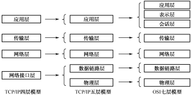
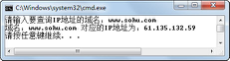
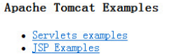
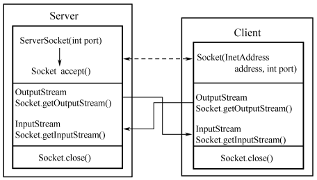
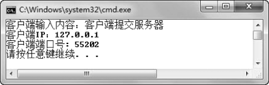
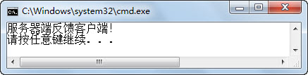
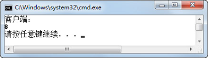

## 本章简介
&emsp;&emsp;网络编程，简单说就是通过网络进行信息的发送和接收，至于中间的传输介质，作为编程人员通常不需要考虑。本章在介绍网络编程前，会先对计算机网络进行概述，并介绍计算机网络的一些基础知识，之后在理解这些概念的基础上介绍如何使用Java进行网络编程。

 

 

 

## 7.1  计算机网络

&emsp;&emsp;计算机网络是指将地理位置不同的具有独立功能的多台计算机及其外部设备，通过通信线路连接起来，在网络操作系统、网络管理软件及网络通信协议的管理和协调下，实现资源共享和信息传递的计算机系统。

### 7.1.1  主要功能和分类  

&emsp;&emsp;从计算机网络的定义来看，其主要功能包括以下四个方面。

&emsp;&emsp;（1）数据通信：计算机网络主要提供内容浏览、电子邮件、数据交换、远程登录等数据通信服务，数据通信是计算机网络需要承担的最主要的功能。

&emsp;&emsp;（2）资源共享：计算机网络中有资源可供下载，有服务可供使用，有数据可被共享，凡是进入计算机网络的用户在经过授权许可的情况下，可以实现对这些资源的共享。

&emsp;&emsp;（3）提高系统的可靠性：由计算机组成的网络，网络中的每台计算机都可通过网络互为后备。一旦某台计算机出现故障，它的任务就可由其他的计算机代为完成，这样可以避免当某一台计算机发生故障而引起整个系统瘫痪，从而提高系统的可靠性。

&emsp;&emsp;（4）提高系统处理能力：要想提高系统的处理能力，一种方法是选择速度更快、性能更优的计算机，这样通常会花费昂贵的费用。另一种办法就是通过计算机网络，将大型的综合性问题交给网络中不同的计算机同时协作处理，也就是说，把原来一台计算机做的事情，让网络中多台计算机一起做，提高系统处理能力。

&emsp;&emsp;了解了计算机网络的主要功能之后，接下来继续了解如何对计算机网络进行分类。要进行分类，首先需要有网络分类的标准。如果按照地理范围划分，可以将计算机网络分为局域网、城域网和广域网三种。

&emsp;&emsp;局域网（Local Area Network，LAN）是在一个局部的地理范围内（如一个企业、一个学校或一个网吧），一般是方圆几千米以内，将各种计算机、服务器、外部设备等互相连接起来组成的计算机通信网。局域网可以实现文件管理、软件共享、打印机共享等功能。从严格意义上来讲，局域网应该是封闭型的，它可以由几台甚至成千上万台计算机组成，但实际上，局域网可以通过广域网或专线与远方的局域网、服务器相连接，拓展网络范围或实现更多的功能。

&emsp;&emsp;城域网（Metropolitan Area Network，MAN）一般来说是在一个城市，连接距离在10～100千米范围内的计算机互联网。MAN与LAN相比扩展的距离更长，连接的计算机数量更多，在地理范围上MAN网络可以说是LAN网络的延伸。在一个大型城市或都市地区，一个MAN网络通常连接着多个LAN，如连接政府机构的LAN、医院的LAN、电信的LAN、公司企业的LAN等。另外，由于光纤连接的引入，使MAN中高速的LAN互联成为可能。

&emsp;&emsp;广域网（Wide Area Network，WAN）也称为远程网，所覆盖的范围比城域网更广，起到LAN或MAN之间的网络互联的作用。广域网能连接多个城市或国家，或横跨几个洲并能提供远距离通信，形成国际性的远程网络，互联网是世界范围内最大的广域网。因为距离较远，信息衰减严重，所以这种网络一般要使用专线，构成网状结构，解决信息安全到达的问题。

&emsp;&emsp;上面按照地理范围将计算机网络划分为局域网、城域网和广域网，在实际工作中，常提到的是局域网和互联网（广域网），城域网较少被提及。

&emsp;&emsp;总体来说，计算机网络是由多台计算机、交换机、路由器等其他网络设备，通过传输介质和软件连接在一起组成的。计算机网络的组成基本上包括硬件方面的计算机、网络设备、传输介质和软件方面的网络操作系统、网络管理软件、通信软件，以及保证这些软硬件设备能够互联互通的协议和标准。

### 7.1.2  网络协议  

&emsp;&emsp;在人类社会中，人与人之间的交流是通过各种语言来实现的。为什么你说的话我可以听明白，原因在于你是按照汉语的规则说话，而我也懂汉语的规则，所以可以听懂你的意思。网络协议就是为计算机网络中进行数据交换而建立的规则、标准或约定的集合。

&emsp;&emsp;网络协议通常由以下三个要素组成。

&emsp;&emsp;（1）语义，规定了通信双方为了完成某种目的，需要发出何种控制信息以及基于这个信息需要做出何种行动。例如：A处民宅发生火灾，需要向B处城市报警台报警，则A发送“119+民宅地址”的信息给B，B获得这个信息后根据119知道是火警，则通知消防队去民宅地址灭火。

&emsp;&emsp;（2）语法，是用户数据与控制信息的结构与格式，以及数据出现的先后顺序。例如，语法可以规定A向B发送的数据前部是“119”，后部是“民宅地址”。

&emsp;&emsp;（3）时序，是对事件发生顺序的详细说明。比如何时进行通信，先讲什么，后讲什么，讲话的速度等。

&emsp;&emsp;这三个要素可以描述为：语义表示要做什么，语法表示要怎么做，时序表示做的顺序。

&emsp;&emsp;在计算机网络中，由于计算机、网络设备之间联系很复杂，在制定协议时为了减少网络设计的复杂性，绝大多数网络采用分层设计方法。所谓分层设计方法，就是按照信息的流动过程将网络的整体功能分解为一个个的功能层，不同机器上的同等功能层之间采用相同的协议，同一机器上的相邻功能层之间通过接口进行信息传递。在不同的网络中，分层数量、各层的名称和功能以及协议都各不相同。然而，在所有的网络中，每层的目的都是向它的上一层提供一定的服务，同时也向下一层获取一定的服务。

&emsp;&emsp;分层设计方法首先确定层次及每层应完成的任务，确定层次时应按逻辑组成功能细化层次，使得每层功能相对单一，易于处理。但同时层次也不能太多，否则会因为层次之间的处理产生过多的开销。将整个网络通信功能划分为垂直的层次后，在通信过程中下层将向上层隐蔽下层的实现细节，而上层也只按接口要求获取信息，这样各层之间既独立同时也能顺利传递信息。

### 7.1.3  网络分层模型  

&emsp;&emsp;为了使不同计算机厂家生产的计算机能够相互通信，以便在更大的范围内建立计算机网络，国际标准化组织（ISO）在1978年提出了“开放式系统互联参考模型”，即著名的OSI/RM模型（Open System Interconnection/Reference Model）。它将计算机网络体系结构的通信协议划分为七层，自下而上依次为物理层（Physics Layer）、数据链路层（Data Link Layer）、网络层（Network Layer）、传输层（Transport Layer）、会话层（Session Layer）、表示层（Presentation Layer）、应用层（Application Layer）。对于每一层，至少制定两项标准：服务定义和协议规范。前者给出了该层所提供的服务的准确定义，后者详细描述了该协议的动作和各种有关规程，以保证服务的提供。

&emsp;&emsp;TCP/IP协议不是TCP和IP这两个协议的合称，而是指整个TCP/IP协议族。TCP/IP协议是互联网的基础协议，没有它根本就不可能上网，任何和互联网有关的操作都离不开TCP/IP协议。TCP/IP协议定义了电子设备如何连入因特网，以及数据如何在它们之间传输的标准。协议采用了四层（另一说法为五层）的层次结构，自下而上依次为网络接口层（Network Interface Layer）、网络层（Network Layer）、传输层（Transport Layer）和应用层（Application Layer）。

&emsp;&emsp;TCP/IP协议并不完全符合OSI的七层参考模型，OSI是传统的开放式系统互联参考模型，是一种通信协议的七层抽象的参考模型，其中每一层执行某一特定任务。该模型的目的是使各种硬件在相同的层次上相互通信。而TCP/IP通信协议采用了四层的层次结构，每一层都要求它的下一层按接口要求提供服务。TCP/IP协议模型与OSI参考模型的对应关系如图7.1所示。


<p align="center"></p>  
<p align="center">图7.1  TCP/IP协议模型与OSI参考模型</p>  


### 7.1.4  TCP/IP[协议](http://baike.baidu.com/view/36190.htm)简介  

- 网络接口层

&emsp;&emsp;TCP/IP协议模型中网络接口层对应于OSI参考模型的物理层和数据链路层。其中物理层规定了物理介质的各种特性，包括机械特性、电子特性、功能特性和规程特性，而数据链路层是负责接收IP数据报并通过网络发送，或从网络上接收物理帧再抽离出IP数据报交给网络层。

&emsp;&emsp;在该层中，大家可能会接触到的两个协议是：

&emsp;&emsp;SLIP（Serial Line Internet Protocol）协议，提供了一种在串行通信线路上封装网络层数据的简单方法，使用户通过电话线和MODEM能方便地接入TCP/IP网络。

&emsp;&emsp;PPP（Point to Point Protocol）协议，是一种有效的点到点通信协议，可以支持多种网络层协议（如IP、IPX等），支持动态分配的IP地址，并且具有差错检验能力。该协议的设计目的主要是用来通过拨号或专线方式建立点对点数据连接，使其成为各种计算机、网络设备之间简单连接的一种解决方案。

- 网络层

&emsp;&emsp;网络层对应于OSI参考模型的网络层，提供源设备和目的设备之间的信息传输服务。它在数据链路层提供的两个相邻端点之间的数据帧的传送功能上，进一步管理网络中的数据通信，将数据设法从源端经过若干个中间节点传送到目的端，从而向传输层提供最基本的端到端的数据传送服务。网络层主要功能包括处理来自传输层的分组请求，收到请求后，检查合法性，并将分组装入IP数据报，填充报头，选择去往目的设备的路径，然后将数据报发往适当的中间节点，最终达到目的端。

&emsp;&emsp;TCP/IP协议族中，网络层的主要协议包括：

&emsp;&emsp;IP（Internet Protocol）协议，是网络层的核心，负责在主机（含网络设备）之间寻址并为数据报设定路由。

&emsp;&emsp;IP协议是无连接的，关于是否有连接，非常类似于打电话（有连接的）和发短信（无连接的）。在打电话的过程中，需要为通话双方建立一个独占的连接，双方可以通过拨电话号码及听到铃声接通电话来建立一个连接会话。在连接建立以后，双方说的话会顺序到达对方那里，对方听到以后会进行回话，确认了信息的到达。而发短信则不需要建立连接，发送出去以后，并不知道对方是否一定收到了，前后发出的短消息，在接受方那里也并不一定还按照原来的发送顺序接收。

&emsp;&emsp;IP协议不仅是无连接的，而且是不可靠的，不能保证传输的正确。它总是尽最大努力传送数据报到目的设备。在传送过程中，可能发生丢失、次序紊乱、重复或者延迟发送，数据报被收到的时候，IP协议不需要进行确认，同样发生错误的时候，也不进行告知。

&emsp;&emsp;IP协议要负责寻找到达目的设备的路由。它首先判断目的设备地址是不是本地地址，如果是，则直接发送到本地地址。如果不是，则需要在本地的路由表中查找到达目的设备地址的路由。如果找到了这个路由，就把数据报发送到这个路由，如果没有找到，就把数据报发送给自己的网关，由网关进行处理。

&emsp;&emsp;ICMP（Internet Control Message Protocol）Internet控制报文协议，它的主要作用在于报告错误，并对消息进行控制。需要强调的是，Internet控制报文协议并不是让IP协议变成一个可靠的协议，它只是在特殊情况下报告错误和提供反馈。

&emsp;&emsp;ARP（Address Resolution Protocol）正向地址解析协议，作用是根据已知的IP地址（网络地址）获取主机（含网络设备）的MAC地址（硬件地址）。

&emsp;&emsp;RARP（Reverse ARP）反向地址解析协议，其作用正好和ARP协议的作用相反，是根据主机的MAC地址获取该设备的IP地址。

- 传输层

&emsp;&emsp;传输层对应于OSI参考模型的传输层，提供进程之间的端到端服务。传输层是TCP/IP协议族中最重要的一层，是负责总体的数据传输和控制的。其主要功能包括分割和重组数据并提供差错控制和流量控制，以到达提供可靠传输的目的。为了实现可靠的传输，传输层协议规定接收端必须发送确认信息以确定数据达到，假如数据丢失，必须重新发送。

&emsp;&emsp;传输层协议主要包括：

&emsp;&emsp;TCP（Transmission Control Protocol）传输控制协议，是一种可靠的面向连接的传输服务协议。在TCP/IP协议族中，TCP协议提供可靠的连接服务，采用“三次握手”建立一个连接。

&emsp;&emsp;第一次握手：建立连接时，源端发送同步序列编号（Synchronize Sequence Numbers，SYN）包（SYN = j）到目的端，等待目的端确认。

&emsp;&emsp;第二次握手：目的端收到SYN包，确认源端的SYN（ACK = j+1），同时自己也发送一个SYN包（SYN = k），即SYN + ACK包。

&emsp;&emsp;第三次握手：源端收到目的端的SYN + ACK包，向目的端发送确认包ACK（ACK = k+1）。此包发送完毕，源端和目的端完成三次握手，源端可以向目的端发送数据。

&emsp;&emsp;在使用TCP协议传输数据之前，双方会通过握手的方式来进行初始化，握手的目的是使数据段的发送和接收同步，建立虚连接。在建立虚连接以后，TCP每次发送的数据段都有顺序号，这样目的端就可以知道是否所有的数据段都已经收到，同时在接收到数据段以后，必须在一个指定的时间内发送一个确认信息。如果发送方没有接收到这个确认信息，它将重新发送数据段。如果收到的数据段有损坏，接收方直接丢弃，因为没有发送确认信息，所以发送方也会重新发送数据段。

&emsp;&emsp;在使用TCP协议通信的过程中，还需要一个协议的端口号来标明自己在主机（含网络设备）中的唯一性，这样才可以在一台主机上建立多个TCP连接，告知具体哪个应用层协议来使用。端口号只能是为0～65535中的任意整数，其中常见的端口号及对应的应用层协议如表7.1所示。

表7.1  端口号及对应的应用层协议

| 端  口    号 | 协    议                 |
| ------------ | ------------------------ |
| 21           | FTP（文件传输协议）      |
| 23           | Telnet（远程登录协议）   |
| 25           | SMTP（简单邮件传输协议） |
| 53           | DNS（域名服务）          |
| 80           | HTTP（超文本传输协议）   |
| 110          | POP3（邮局协议3）        |

 

&emsp;&emsp;UDP（User Datagram Protocol）用户数据报协议，是另外一个重要的协议，它提供的是无连接、面向事务的简单不可靠信息传送服务。UDP 不提供分割、重组数据和对数据进行排序的功能，也就是说，当数据发送之后，无法得知其是否能安全完整地到达。

&emsp;&emsp;在选择使用传输层协议时，选择UDP必须要谨慎。因为在网络环境不好的情况下，UDP协议数据丢失会比较严重。但同时也因为UDP的特性，它是无连接的协议，因而具有资源消耗小、处理速度快的优点，所以在音频和视频的传送时使用UDP较多，因为这样的数据传输即使偶尔丢失一两个数据，也不会对接收结果产生太大影响。

 

- 应用层

&emsp;&emsp;应用层对应于OSI参考模型的会话层、表示层和应用层，该层向用户提供一组常用的应用程序服务，比如电子邮件、文件传输访问、远程登录等。  

&emsp;&emsp;应用层协议主要包括：  

&emsp;&emsp;FTP（File Transfer Protocol）文件传输协议，上传、下载文件可以使用FTP服务。  

&emsp;&emsp;Telnet是提供用户远程登录的服务，使用明码传送，保密性差，但简单方便。  

&emsp;&emsp;DNS（Domain Name Service）域名解析服务，提供域名和IP地址之间的解析转换。  

&emsp;&emsp;SMTP（Simple Mail Transfer Protocol）简单邮件传输协议，用来控制邮件的发送、中转。  

&emsp;&emsp;HTTP（Hypertext Transfer Protocol）超文本传输协议，用于实现互联网中的WWW服务。  

&emsp;&emsp;POP3（Post Office Protocol 3）即邮局协议的第三个版本，它是规定个人计算机如何连接到互联网上的邮件服务器进行收发邮件的协议。  


### 7.1.5  数据封装和解封  

&emsp;&emsp;在TCP/IP层次模型中，每一层负责接收上一层的数据，根据本层的需要进行数据处理，并增加本层的头部信息后转发到下层。当接收方收到数据以后，对应的层负责查看本层的头部信息是否正确，是否需要合并或进行其他处理，然后完成相应的操作，去掉本层添加的头部信息后提交给上一层。TCP/IP协议数据封装和解封的过程如图7.2所示。


<p align="center"></p>  
<p align="center">图7.2  TCP/IP协议数据封装和解封</p>  


## 7.2  IP地址和域名

 

&emsp;&emsp;在前面的内容中已经提到了IP地址，比如ARP协议根据已知的IP地址（网络地址）获取主机的MAC地址（硬件地址），RARP协议根据主机的MAC地址获取该设备的IP地址；DNS域名解析服务，提供域名和IP地址之间的转换。接下来，系统地介绍什么是IP地址，以及IP地址与域名的关系。


### 7.2.1  IP地址  

&emsp;&emsp;在现实生活中，每个地理位置都有一个详细的通信地址，根据这个通信地址，信件、快递物品可以送到指定的位置。在网络上，每台要通信的主机（含网络设备）也必须有一个IP地址，它的作用就是其他主机可以通过这个IP地址找到它。

&emsp;&emsp;每个IP地址都由两部分组成：网络号和主机号。网络号用来标识这个IP地址属于哪一个网络，就像一个通信地址中都有一个城市名一样。在一个网络当中的所有主机，应该有相同的网络号。主机号用来标识这个网络中的唯一一台主机，相当于通信地址中的街道门牌号。

&emsp;&emsp;IP地址有两种表示方式，二进制表示和点分十进制表示，常见的是点分十进制表示的IP地址。IP地址的长度为32位，每8位组成一个部分，这样一个IP地址可以分为4个部分，每个部分如果用十进制表示，其值的范围为0～255。例如用点分十进制表示的IP地址119.186.211.92，其二进制表示为01110111 10111010 11010011 01011100。可以看出，在使用十进制表示的时候，中间用点号隔开。

### 7.2.2  IP地址类型  

&emsp;&emsp;在IP协议提出时，为了划分大小不同的网络，使某种类型的网络中主机的数量在一定范围之内，定义了5种IP地址类型。

- A类地址

&emsp;&emsp;具有A类地址的网络可以拥有很大数量的主机。A类地址的最高位固定总为0，加上之后紧跟着7位，共8位一起表示网络号，剩下的24位表示主机号。这样根据IP协议的约定，整个网络拥有27-2（共计126）个A类网络，而每个A类网络中可以拥有最多224-2（大约1700万）台主机。

&emsp;&emsp;因为A类地址前8位表示网络号，且第1位必须是0，所以A类地址的网络号范围在00000000到01111111之间，十进制表示为0～127。但因为全0的A类网络号不可以使用，127这个网络号有特殊的含义，用来做环路测试（人们常用的127.0.0.1这个IP地址就是用来表示用户自身的机器），所以整个网络共有126个A类网络。

&emsp;&emsp;另外，在一个网络中，不是所有的主机号都可以分配给主机使用，其中有两个主机号是有特殊含义的，一个是全0的主机号，表示网络本身；一个是全1的主机号，表示广播地址，所以才会出现一个网络中可以拥有的主机数是理论计算值减2的情况。

- B类地址

&emsp;&emsp;B类地址一般用来分配到中等或稍大规模的网络中。B类地址的最高两位固定是10，与后面的14位一起构成网络号，剩下的16位表示主机号。这样根据IP协议的约定，整个网络拥有214（共计16384）个B类网络，而每个B类网络中可以拥有最多216-2（大约65000）台主机。

&emsp;&emsp;因为B类地址前16位表示网络号，且前两位必须是10，所以B类地址的网络号范围在10000000 00000000到10111111 11111111之间，其中IP地址第一个部分十进制范围为128～191。

- C类地址

&emsp;&emsp;C类地址分配给主机数量不多的网络。C类地址的最高三位固定是110，和后面跟着的21位一起构成网络号，只有8位表示主机号。整个网络拥有221（共计200多万）个B类网络，但是每个B类网络最多只有28-2（共计254）台主机。

&emsp;&emsp;因为C类地址前24位表示网络号，且前三位必须是110，所以C类地址的网络号范围在11000000 00000000 00000000到11011111 11111111 11111111之间，其中IP地址第一个部分的十进制范围为192～223。

- D类地址

&emsp;&emsp;D类地址不分网络地址和主机地址，前四位必须是1110，它是一个专门保留的地址。它并不指向特定的网络，目前这一类地址被用在多点广播（Multicast）中。多点广播地址用来一次寻址一组计算机，它标识共享同一协议的一组计算机。

- E类地址

&emsp;&emsp;E类地址也不分网络地址和主机地址，前五位必须是11110，为将来使用保留。

&emsp;&emsp;另外需要特别指出的是，A、B、C三类地址中还各有一个网段被应用到内部局域网中，而不能在实际的互联网上出现，即10网段、172.16.x.x到172.31.x.x网段和192.168网段。使用这3个网段中IP地址的主机，不能直接出现在互联网上，需要通过一些其他的手段才能上网。

### 7.2.3  子网掩码  

&emsp;&emsp;根据IP地址类型的划分，出现了网络中提供的IP地址的数量与实际需求相差甚远的情况。虽然看起来IP地址的绝对数量应该能满足人们的需求，但是由于IP地址由网络号和主机号构成，所以网络中A类网络才126个，最多的C类网址也不过200多万个。随着互联网的普及，IP网络越来越不够分，因此，人们提出了很多解决方案，目前使用范围最广的就是使用子网的方式对原网络进行再次划分。

&emsp;&emsp;由上述内容可知，IP地址分为网络号和主机号，子网就是把主机号再分为子网号和主机号，这样，原来的一个A类网络就不再总是拥有1700多万台主机了。原来的网络可以进一步划分，即使是C类网络也可以进一步划分为更小的子网，实现这一技术的就是子网掩码。

&emsp;&emsp;子网掩码是一种用来指明一个IP地址的哪些位标识的是网络号（含子网号）以及哪些位标识的是主机号的位掩码。子网掩码不能单独存在，它必须结合IP地址一起使用。子网掩码只有一个作用，就是将某个IP地址划分成网络地址和主机地址两部分。

&emsp;&emsp;A类地址的默认子网掩码为11111111 00000000 00000000 00000000，点分十进制表示为255.0.0.0，这就表示A类地址的前8位是网络号，后24位是主机号。例如前面用点分十进制表示的IP地址119.186.211.92，其二进制表示为01110111 10111010 11010011 01011100。从点分十进制IP地址的第一部分可以看出，这个IP地址为A类地址，其默认子网掩码即为255.0.0.0。

&emsp;&emsp;如果现在需要将这个IP地址所在的A类网络划分成更小的子网，每个子网可以有26 -2（共计62）台主机，该如何操作呢？可以通过子网掩码，将IP地址的前26位都设置成网络号，后6位设置成主机号，则这个IP地址所在的子网里就只能拥有26-2（共计62）台主机了。针对这个需求，需要将此IP地址的子网掩码设置为11111111 11111111 11111111 11000000，子网掩码十进制表示为255.255.255.192，这个IP地址的网络号为IP地址的前26位01110111 10111010 11010011 01。

&emsp;&emsp;如果需要判断两个IP地址是否在一个子网中，只需要判断它们的网络号是否一致就可以了，具体的算法不是本节需要介绍的内容。

&emsp;&emsp;另外，子网掩码必须由连续的1和连续的0组成，换算成十进制可以看出，最后一个数只能是0、128、192、224、240、248、252、254、255这几个数字。

&emsp;&emsp;除了用划分子网的方式解决IP网络和IP地址资源紧缺的问题外，目前还有一种解决方式就是采用新的IP版本（IPv6），它对现有IP地址进行了大规模的改革，其中IP地址使用128位来表示。从目前看来，这些IP地址足够给每个人的每个设备提供一个独一无二的IP地址，目前已经有一些软硬件开始支持IPv6。

### 7.2.4  域名  

&emsp;&emsp;域名（Domain Name），是由一串用点号分隔的名字组成的Internet上某一台计算机或计算机组的名称，用于在数据传输时标识计算机的电子方位。

&emsp;&emsp;在网络中，要想找到一台主机，是通过IP地址寻找的。但IP地址是数字标识，使用时难以记忆和书写，因此在IP地址的基础上又发展出一种符号化的地址方案，来代替数字型的IP地址。每个符号化的地址都与特定的IP地址对应，这样网络上的资源访问起来就容易得多了。这个与网络上的数字型IP地址相对应的字符型地址就是域名。

&emsp;&emsp;在访问搜狐的时候，在浏览器地址栏输入的www.sohu.com就是域名。通常来说，在域名中，主机名放在前面，域名放在后面，搜狐的域名中www是主机名，sohu.com是域名。

&emsp;&emsp;域名可分为不同级别，包括顶级域名、二级域名等。顶级域名又可分为以下两类。

&emsp;&emsp;一类是国家顶级域名，200多个国家都按照ISO3166国家代码分配了顶级域名，例如中国是cn，美国是us，韩国是kr等。

&emsp;&emsp;另一类是国际顶级域名，例如表示工商企业的com，表示网络提供商的net，表示非营利组织的org等。

&emsp;&emsp;二级域名是指顶级域名之下的域名，例如在国际顶级域名下，由域名注册人申请注册的网上名称，例如sohu、apple、microsoft等。在国家顶级域名下，一般二级域名表示注册企业类别的符号，例如com、edu、gov、net等。

 

## 7.3  网络配置

 

&emsp;&emsp;知道了计算机网络的概念，了解了TCP/IP协议族之后，又学习了IP地址、子网掩码和域名。接下来会带着大家动手操作，实践如何配置和查看计算机网络相关的信息。

### 7.3.1  配置和查看  

&emsp;&emsp;根据Windows操作系统版本的不同，打开“Internet协议版本4（TCP/IPv4）属性”对话框的路径也可能不同，但普通用户一般都是通过打开该对话框来配置和查看IP地址等相关信息的，如图7.3所示。


<p align="center"></p>  
<p align="center">图7.3  配置和查看IP地址等相关信息</p>  


### 7.3.2  常用TCP/IP网络命令  

&emsp;&emsp;在实际使用网络的过程中，也常会使用命令行的方式来进行网络信息的配置和查看，这里介绍几个常用的命令。

- ipconfig

&emsp;&emsp;这是最常使用的一个检查网络配置的命令。Ipconfig命令显示当前所有的TCP/IP网络配置值、动态主机配置协议（DHCP）和域名系统（DNS）设置。使用不带参数的ipconfig命令可以显示所有适配器的IPv4地址或IPv6地址、子网掩码和默认网关。该命令的语法形式如下。


```
ipconfig [/all] [/renew [Adapter]] [/release [Adapter]] [/flushdns] [/displaydns] 
```


&emsp;&emsp;其中各参数的含义如下：

&emsp;&emsp;/all：显示所有适配器的完整TCP/IP配置信息。在没有该参数的情况下，ipconfig命令只显示各个适配器的IPv4地址或IPv6地址、子网掩码和默认网关值。适配器可以是物理接口（例如安装的网卡）或逻辑接口（例如拨号连接）。 

&emsp;&emsp;/renew [Adapter]：更新所有适配器或指定适配器的DHCP配置。该参数仅在具有配置为自动获取IP地址的适配器的计算机上可用，例如ipconfig /renew "Local Area Connection"。要获取适配器名称，可以先输入不带参数的ipconfig命令显示适配器的名称。

&emsp;&emsp;/release [Adapter]：释放所有适配器或指定适配器的当前DHCP配置，并丢弃IP地址配置。该参数可以禁用配置为自动获取IP地址的适配器。

&emsp;&emsp;/flushdns：刷新并重设DNS客户解析缓存的内容。在DNS故障排除期间，可以使用本参数重置DNS缓存内容。

&emsp;&emsp;/displaydns：显示DNS客户解析缓存的内容。包括本机hosts文件中的记录，以及由计算机解析名称过程中最近获得的任何资源记录。

- ping

&emsp;&emsp;ping命令通过发送Internet控制报文协议（ICMP）回响请求消息，来验证与另一台TCP/IP计算机的IP级连接。相应的回响应答消息的接收情况将和往返过程的时间一起显示出来。ping是用于检测网络连接性、可到达性和名称解析等疑难问题的主要 TCP/IP 命令。该命令的语法形式如下：


```
ping [-t] [-a] [-n Count] [-s Count] [-w Timeout] TargetName
```


&emsp;&emsp;其中各参数的含义为：

&emsp;&emsp;-t：指定在中断前ping命令可以向目的地持续不停地发送回响请求信息。要中断并显示统计信息，请按Ctrl+Break快捷键，要中断并退出ping命令，请按Ctrl+C快捷键。

&emsp;&emsp;-a：指定对目的地IP地址进行反向名称解析。如果解析成功，ping命令将显示相应的主机名，例如ping –a 192.168.1.149，解析成功的话会显示这台主机的主机名。

&emsp;&emsp;-n Count：指定发送回响请求消息的次数，默认值是4。

&emsp;&emsp;-w Timeout：指定等待回响应答消息响应的时间（以毫秒计），该回响应答消息响应接收到的指定回响请求消息。如果在超时时间内未接收到回响应答消息，将会显示请求超时的错误信息。默认的超时时间为4000（4秒），例如可以执行命令ping -n 10 -w 8000 192.168.1.149。

&emsp;&emsp;TargetName：指定目标主机的名称或 IP地址。


## 7.4  上机任务


#### 目标：完成本章7.3节中的各项任务。

 


时间：20分钟。

 


形式：每个学员独立完成，小组组长检查。

 

工具：EditPlus。

 

 

 


## 7.5  Java与网络

 

&emsp;&emsp;Java语言从其诞生开始，就和网络紧密联系在一起。在1995年的Sun World大会上，当时占浏览器市场份额绝对领先的网景公司宣布在浏览器中支持Java，从而引起一系列的公司产品对Java提供支持，使得Java很快成为一种流行的语言。之后，Java在面向企业的服务器平台取得了广泛的成功。而如今，在移动互联的世界，随着安卓的异军突起，Java与网络的关系又向前迈进了一步。

### 7.5.1  IP地址类  

&emsp;&emsp;在TCP/IP协议族中，我们是通过IP地址来标识网络上的一台主机（含网络设备）的。如果想获取自己主机的IP地址，可以通过打开“Internet协议版本4（TCP/IPv4）属性”对话框方式查看（必须是设置固定IP地址，而不是自动获取IP地址），还可以通过ipconfig命令查看。假设需要在程序中获取本机的IP地址，该如何编写代码呢？

&emsp;&emsp;通过查阅JDK API文档获悉，在Java中，使用java.net包下的InetAddress类表示互联网协议的IP地址。下面的案例演示了如何获得本地主机的IP地址。具体代码如下：


```
import java.net.*;

public class TestGetIP{

public static void main(String args[]) {

InetAddress myIP = null;

try{

//通过InetAddress类的静态方法，返回本地主机对象

myIP = InetAddress.getLocalHost();

}catch(Exception e){

e.printStackTrace();

}

//通过InetAddress类的getHostAddress()方法获得IP地址字符串

System.out.println(myIP.getHostAddress());

}

}
```


&emsp;&emsp;编译、运行程序，显示出本地主机的IP地址。如果不仅想获得本地主机的IP地址，还想根据用户输入的域名，获取这个域名在互联网上的IP地址，下面的代码演示了此功能：


```
import java.util.Scanner;

import java.net.*;

public class TestGetIP2{

public static void main(String args[]) {

InetAddress sohuIP = null;

Scanner input = new Scanner(System.in);

System.out.print("请输入要查询IP地址的域名：");

String dName = input.next();

try{

//通过InetAddress类的静态方法，返回指定域名的IP地址对象

sohuIP = InetAddress.getByName(dName);

}catch(Exception e){

e.printStackTrace();

}

System.out.println("域名：" + dName + " 对应的IP地址为：" + sohuIP.getHostAddress());

}

}
```


&emsp;&emsp;编译、运行程序，其运行结果如图7.4所示。


<p align="center"></p>  
<p align="center">图7.4  获取指定域名的IP地址</p>  


&emsp;&emsp;上面的两个例子中，创建的InetAddress类对象都不是使用构造方法new出这个对象，而是通过InetAddress类的静态方法获取的。下面列出了通过InetAddress类的静态方法获取InetAddress类对象的方法。

- InetAddress[] getAllByName(String host)  

&emsp;&emsp;在给定主机名的情况下，根据系统上配置的名称服务返回其IP地址所组成的数组。  

- InetAddress getByAddress(byte[] addr)  

&emsp;&emsp;在给定原始IP地址的情况下，返回InetAddress对象。  

- InetAddress getByAddress(String host, byte[] addr)  

&emsp;&emsp;根据提供的主机名和IP地址，创建InetAddress对象。  

- InetAddress getByName(String host)  

&emsp;&emsp;在给定主机名的情况下，返回InetAddress对象。  

- InetAddress getLocalHost()  

&emsp;&emsp;返回本地主机InetAddress对象。  

&emsp;&emsp;InetAddress类的其他常用方法有以下几种。  

- byte[] getAddress()  

&emsp;&emsp;返回此InetAddress对象的原始IP地址。  

- String getCanonicalHostName()  

&emsp;&emsp;返回此 IP 地址的完全限定域名。完全限定域名是指主机名加上全路径，全路径中列出了序列中所有域成员。  

- String getHostAddress()  

&emsp;&emsp;返回 IP 地址字符串。  

- String getHostName()  

&emsp;&emsp;返回此 IP 地址的主机名。  


### 7.5.2  URL类  

&emsp;&emsp;Java提供的网络功能的相关类主要有三个，它们分别是URL、Socket和Datagram，其中URL是这三个类中层次级别最高或者说封装最多的类，通过URL类可以直接发送或读取网络上的数据。

&emsp;&emsp;URL类代表一个统一资源定位符，它是指向互联网资源的指针。资源可以是简单的文件或目录，也可以是对更为复杂的对象的引用，例如对数据库或搜索引擎的查询。 

&emsp;&emsp;通常，URL可分成几个部分。例如http://baike.baidu.com/view/29.htm，指示使用的协议为HTTP（超文本传输协议），并且该信息驻留在一台名为baike.baidu.com的主机上，主机上的信息名称为/view/29.htm。

&emsp;&emsp;URL 可选择指定一个端口号，用于建立到远程主机 TCP 连接的端口号，例如http://127.0.0.1: 8080/examples/index.html。如果未指定该端口号，则使用协议默认的端口，HTTP协议的默认端口为80。


&emsp;&emsp;URL 后面可能还跟有一个片段，也称为引用。该片段由井字符“#”指示，后面跟有更多的字符。例如http://java.sun.com/index.html#chapter1。使用此片段的目的在于表明，在获取到指定的资源后，应用程序需要使用文档中附加有chapter1标记的部分。 


<p align="center"></p>  
<p align="center">图7.5  网络上指定资源页面</p>  


&emsp;&emsp;下面通过一个案例来演示如何获取网络上指定资源（http://127.0.0.1:8080/examples/index.html）的信息。这个页面的具体内容如图7.5所示，其HTML代码如下：

 
```
<!DOCTYPE HTML PUBLIC "-//W3C//DTD HTML 4.0 Transitional//EN">

<HTML>

<HEAD>

<TITLE>Apache Tomcat Examples</TITLE>
<META http-equiv=Content-Type content="text/html">

</HEAD>

<BODY>

<P>

<H3>Apache Tomcat Examples</H3>
</P>[[张彬1\]](#_msocom_1) 

<ul>

<li><a href="servlets">Servlets examples</a></li>

<li><a href="jsp">JSP Examples</a></li>

</ul>

</BODY>

</HTML>
```
 

&emsp;&emsp;这个案例的具体需求为先输入要定位的URL地址，然后再输入要显示哪个页面标签元素的内容，程序显示该标签的具体内容，具体代码如下。

 

 
```
import java.util.Scanner;

import java.net.*;

import java.io.*;

public class TestURL{

public static void main(String args[]){             

URL tURL = null;

BufferedReader in = null;

Scanner input = new Scanner(System.in);

System.out.print("请输入要定位的URL地址：");

String url = input.next();

System.out.print("请输入要显示哪个页面标签元素的内容：");

String iStr = input.next();

try

{

//通过URL字符串创建URL对象

tURL = new URL(url);

in = new BufferedReader(new InputStreamReader(tURL.openStream()));

String s;

while ((s = in.readLine()) != null){

if(s.contains(iStr))        

​         System.out.println(s);

}

}catch(Exception e)

{

e.printStackTrace();

}

​                  

}

}

```

&emsp;&emsp;编译、运行程序，先后输入http://127.0.0.1:8080/examples/index.html和TITLE，其运行结果如图7.6所示。


<p align="center"></p>  
<p align="center">图7.6  URL类使用</p>  


### 7.5.3  URLConnection类  

&emsp;&emsp;前面介绍的URL类代表的是一个网络资源的位置，而接下来要介绍的URLConnection代表的是一种连接。此类的实例可用于读取和写入对应URL 引用的资源。通常，创建一个到URL的连接URLConnection的对象需要以下几个步骤。

&emsp;&emsp;（1）通过在 URL 上调用openConnection()方法创建连接对象。

&emsp;&emsp;（2）设置参数和一般请求属性。 

&emsp;&emsp;（3）使用connect()方法建立到远程对象的实际连接。

&emsp;&emsp;（4）远程对象变为可用，其中远程对象的头字段和内容变为可访问。

&emsp;&emsp;URLConnection类有下列属性作为参数可以设置：

&emsp;&emsp;boolean doInput：将 doInput 标志设置为 true，指示应用程序要从 URL 连接读取数据，此属性的默认值为 true。此属性由 setDoInput()方法设置，其值由getDoInput()方法返回。

&emsp;&emsp;boolean doOutput：将doOutput标志设置为 true，指示应用程序要将数据写入 URL 连接，此属性的默认值为false。此属性由setDoOutput()方法设置，其值由getDoOutput()方法返回。

&emsp;&emsp;long ifModifiedSince：有些网络协议支持跳过对象获取，除非该对象在某个特定时间点之后又进行了修改。其值表示距离格林尼治标准时间1970年 1 月 1 日的毫秒数，只有在该时间之后又进行了修改时，才获取该对象。此属性的默认值为0，表示必须一直进行获取。此属性由setIfModifiedSince()方法设置，其值由getIfModifiedSince()方法返回。 

&emsp;&emsp;boolean useCaches：如果其值为true，则只要有条件就允许协议使用缓存；如果其值为false，则该协议始终必须获得此对象的新副本，其默认值为上一次调用setDefaultUseCaches()方法时给定的值。此属性由setUseCaches()方法设置，其值由getUseCaches()方法返回。 

&emsp;&emsp;boolean allowUserInteraction：如果其值为true，则在允许用户交互（例如弹出一个验证对话框）的上下文中对此URL进行检查；如果其值为false，则不允许有任何用户交互，其默认值为上一次调用setDefaultAllowUserInteraction()方法时所用的参数的值。使用setAllowUserInteraction()方法可对此属性的值进行设置，其值由getAllowUserInteraction()方法返回。

&emsp;&emsp;URLConnection类还有两个属性connected和url，分别表示是否创建到指定 URL 的通信链接和该URLConnection类在互联网上打开的远程对象。

&emsp;&emsp;另外，可以使用setRequestProperty(String key, String value)方法设置一般请求属性，如果已存在具有该关键字的属性，则用新值改写原值。

&emsp;&emsp;下面通过一个案例，简要说明URLConnection类的使用。URLConnection类里涉及的一些知识现在还没有涉及，在阅读下面的代码时如果有不明白的地方，通过后面课程的学习会逐步理解。

 
```
import java.net.*;

import java.io.*;

public class TestURLConnection{

public static void main(String args[]){

try{

//（1）通过在URL上调用openConnection()方法创建连接对象

URL url = new URL("http://127.0.0.1:8080/examples/index.html"); 

//根据URL获取URLConnection对象

URLConnection urlC = url.openConnection();

//请求协议是HTTP协议，故可转换为HttpURLConnection对象 

HttpURLConnection hUrlC = (HttpURLConnection)urlC;

//（2）设置参数和一般请求属性

//请求方法如果是POST，参数要放在请求体里，所以要向hUrlC输出参数 

hUrlC.setDoOutput(true); 

//设置是否从httpUrlConnection读入，默认情况下是true

hUrlC.setDoInput(true); 

//请求如果是POST，不能使用缓存 

hUrlC.setUseCaches(false);

//设置Content-Type属性

hUrlC.setRequestProperty("Content-Type", "text/plain; charset=utf-8"); 

//设定请求的方法为POST，默认是GET 

hUrlC.setRequestMethod("POST"); 

//（3）使用connect方法建立到远程对象的实际连接 

hUrlC.connect(); 

//（4）远程对象变为可用

//通过HttpURLConnection获取输出输入流，可根据需求进一步操作

OutputStream outStrm = hUrlC.getOutputStream(); 

InputStream inStrm = hUrlC.getInputStream();

//省略若干代码

}catch(Exception e){

e.printStackTrace();

}

​                  

}

}
```


## 7.6  上机任务


#### 目标：完成本章7.5节中的所有程序。

 

时间：40分钟。

 

形式：每个学员独立完成，小组组长检查。

 


工具：EditPlus。

 

 

 

 


## 7.7  Socket编程

 

&emsp;&emsp;所谓Socket通常也称作套接字，应用程序通常通过套接字向网络发出请求或者应答网络请求。Java语言中的Socket编程常用到Socket和ServerSocket这两个类，它们位于java.net包中。

### 7.7.1  基于TCP的Socket编程  

&emsp;&emsp;ServerSocket用于服务器端，而Socket是建立网络连接时使用的。在连接成功时，应用程序两端都会产生一个Socket实例，操作这个实例，完成所需的会话。对于一个网络连接来说，套接字是平等的，不因为在服务器端或在客户端而产生不同级别。不管是Socket还是ServerSocket，它们的工作都是通过SocketImpl类及其子类完成的。关于Socket、ServerSocket及SocketImpl类的具体方法，这里不再一一介绍，需要这些类时，请大家自行查阅JDK API文档。

&emsp;&emsp;图7.7展示了基于TCP的Socket编程的示意图。


<p align="center"></p>  
<p align="center">图7.7  基于TCP的Socket编程</p>  


&emsp;&emsp;在服务器端，创建一个ServerSocket对象，并指定一个端口号，使用ServerSocket类的accept()方法使服务器处于阻塞状态，等待用户请求。

&emsp;&emsp;在客户端，通过指定一个InetAddress对象和一个端口号，创建一个Socket对象，通过这个Socket对象，连接到服务器。

&emsp;&emsp;首先来看服务器端程序，具体代码如下：

 
```
import java.net.*;

import java.io.*;

public class TestServer{

public static void main(String args[]) {

try{

//创建一个ServerSocket对象，并指定端口号[[张彬2\]](#_msocom_2) 8888

ServerSocket s = new ServerSocket(8888);

while(true){

//侦听并接受到此套接字的连接

Socket s1 = s.accept();

OutputStream os = s1.getOutputStream();

DataOutputStream dos = new DataOutputStream(os);

dos.writeUTF("客户端IP：" + s1.getInetAddress().getHostAddress() + " 

客户端端口号：" + s1.getPort());

dos.close();

s1.close();

}

}catch (IOException e) {

e.printStackTrace();

System.out.println("程序运行出错！");                   

}

}

}
```
 

&emsp;&emsp;该服务器端程序的作用就是监听8888端口，当有发送到本机8888端口的Socket请求时，建立输出流，将通过accept()方法创建的Socket对象的IP地址和端口号输出到客户端。编译、运行程序，使服务器启动并处于监听状态。

&emsp;&emsp;下面编写客户端程序，具体代码如下：

 
```
import java.net.*;

import java.io.*;

public class TestClient{

public static void main(String args[]){

try{

//通过IP地址和端口号，创建一个Socket对象

Socket s1 = new Socket("127.0.0.1", 8888);

//建立输入数据流

InputStream is = s1.getInputStream();

DataInputStream dis = new DataInputStream(is);

System.out.println(dis.readUTF());

dis.close();

s1.close();

}catch(ConnectException e){

e.printStackTrace();

System.err.println("服务器连接失败！");

}catch(IOException e){

e.printStackTrace();

}

}

}
```
 

&emsp;&emsp;该客户端程序通过IP地址127.0.0.1和端口号8888，创建一个客户端Socket对象，建立输入数据流，通过输入数据流读取指定IP地址和端口号上服务器端程序的输出，并在控制台将服务器的输出显示出来。编译、运行程序，运行结果如图7.8所示。


<p align="center"></p>  
<p align="center">图7.8  使用Java Socket编程</p>  


&emsp;&emsp;在这个通过Java Socket编程实现的客户端、服务器端程序中，客户端没有请求的具体内容，只要有请求，服务器就将指定的内容发送给客户端，客户端将接收的内容显示出来。接下来对上面的案例进行调整，服务器端可以接收客户端请求的内容，并显示在服务器端控制台上。服务器端程序具体代码如下：

 
```
import java.io.*; 

import java.net.*;

public class TestSockServer {

public static void main(String[] args) {

InputStream in = null; 

OutputStream out = null;

try{

ServerSocket s = new ServerSocket(8888);

Socket s1 = s.accept();

in = s1.getInputStream(); 

out = s1.getOutputStream();

DataOutputStream dos = new DataOutputStream(out);

DataInputStream dis = new DataInputStream(in);

String str = null;

if((str = dis.readUTF())!= null) {

System.out.println("客户端输入内容：" + str);

System.out.println("客户端IP：" + s1.getInetAddress().getHostAddress());

System.out.println("客户端端口号：" + s1.getPort());

}

dos.writeUTF("服务器端反馈客户端！"); 

dis.close();

dos.close();

s1.close();

}catch(IOException e){

e.printStackTrace();

}

}

}
```
 

&emsp;&emsp;客户端具体代码如下：

 
```
import java.net.*;

import java.io.*;

public class TestSockClient {

public static void main(String[] args) {

InputStream is = null; 

OutputStream os = null;

String s = null;

try{

Socket socket = new Socket("localhost",8888);

is = socket.getInputStream();

os = socket.getOutputStream();

DataInputStream dis = new DataInputStream(is);

DataOutputStream dos = new DataOutputStream(os);

//客户端向服务器端发送请求的内容

dos.writeUTF("客户端提交服务器"); 

if((s = dis.readUTF()) != null)

System.out.println(s); 

dos.close();

dis.close();

socket.close();

}catch(UnknownHostException e){

e.printStackTrace();

}catch(IOException e){

e.printStackTrace();

}

}

}

``` 

&emsp;&emsp;编译、运行服务器端、客户端程序，运行结果分别如图7.9和图7.10所示。


<p align="center"></p>  
<p align="center">图7.9  Socket编程服务器端</p>  


<p align="center"></p>  
<p align="center">图7.10  Socket编程客户端</p>  


### 7.7.2  基于UDP的Socket编程  

&emsp;&emsp;UDP是用户数据报协议，它提供的是无连接、不可靠信息传送服务。Java 主要提供了两个类来实现基于UDP的Socket编程。

&emsp;&emsp;DatagramSocket：此类表示用来发送和接收数据报包的套接字。数据报套接字是包投递服务的发送或接收点，每个在数据报套接字上发送或接收的包都是单独编址和路由的。从一台机器发送到另一台机器的多个包可能选择不同的路由，也可能按不同的顺序到达。在 DatagramSocket上总是启用UDP广播发送。

&emsp;&emsp;DatagramPacket：此类表示数据报包。数据报包用来实现无连接包投递服务，每条报文仅根据该包中包含的信息从一台机器路由到另一台机器。

&emsp;&emsp;图7.11展示了基于UDP的Socket编程的示意图。


<p align="center"></p>  
<p align="center">图7.11  基于UDP的Socket编程</p>  


&emsp;&emsp;DatagramPacket类主要有两个构造函数。

&emsp;&emsp;一个用来接收数据DatagramPacket(byte[] recyBuf, int readLength)，用一个字节数组接收UDP包，recyBuf数组在传递给构造函数时是空的，而readLength值用来设定要读取的字节数。

&emsp;&emsp;一个用来发送数据DatagramPacket(byte[] sendBuf, int sendLength, InetAddress iaddr, int port)，建立将要传输的UDP包，并指定IP地址和端口号。

&emsp;&emsp;接下来通过一个案例来演示Java如何实现基于UDP的Socket编程，其中服务器端代码如下：

 
```
import java.net.*;

import java.io.*;

public class TestUDPServer{

public static void main(String args[]) throws Exception

{

//创建数据报包的套接字，端口号8888

DatagramSocket ds = new DatagramSocket(8888);            

byte buf[] = new byte[1024];

//创建接收的数据报包

DatagramPacket dp = new DatagramPacket(buf,buf.length);

System.out.println("服务器端：");

while(true)

{

//从此套接字接收数据报包

ds.receive(dp);

ByteArrayInputStream bais = new ByteArrayInputStream(buf);

DataInputStream dis = new DataInputStream(bais);

System.out.println(dis.readLong());

}

}

}

```

客户端代码如下：

 
```
import java.net.*;

import java.io.*;

public class TestUDPClient{

public static void main(String args[]) throws Exception

{

long n = 10000L;

ByteArrayOutputStream baos = new ByteArrayOutputStream();

DataOutputStream dos = new DataOutputStream(baos);

dos.writeLong(n);

byte[] buf = baos.toByteArray();

System.out.println("客户端：");

System.out.println(buf.length);

//创建数据报包的套接字，端口号9999

DatagramSocket ds = new DatagramSocket(9999);

//创建发送的数据报包

DatagramPacket dp = new DatagramPacket(buf, buf.length, 

new InetSocketAddress("127.0.0.1", 8888));

//从此套接字发送数据报包

ds.send(dp);

ds.close();

​                  

}

}
```
 

&emsp;&emsp;编译、运行程序，运行结果如图7.12和图7.13所示。


<p align="center"></p>  
<p align="center">图7.12  UDP Socket编程服务器端</p>  


<p align="center"></p>  
<p align="center">图7.13  UDP Socket编程客户端</p>  


## 7.8  上机任务


#### 目标：完成本章7.7节中的所有程序。

 


时间：40分钟。

 


形式：每个学员独立完成，小组组长检查。

 

工具：EditPlus。

 

 

 


## 7.9  本章练习

 

1  下列（    ）不是TCP/IP协议族里的。（选择一项）

&emsp;&emsp;A．网络接口层             

&emsp;&emsp;B．网络层             

&emsp;&emsp;C．传输层             

&emsp;&emsp;D．会话层

2  请描述TCP/IP协议族和OSI/RM模型各分哪几层，以及它们各层间的对应关系。

 

 

3  请简要介绍子网掩码的作用。

 

 

4  请描述创建一个到URL的连接URLConnection的对象需要哪几个步骤。

 

 
5  基于TCP的Socket编程，在客户端和服务器端要创建什么对象，需要哪些参数。

 

