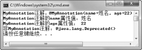

## 本章简介
&emsp;&emsp;从本章开始，将接触一个从JDK1.5开始引入的新技术—Java注解（Annotation）。在后续学习S（Struts）S（Spring）H（Hibernate）三大框架时，注解的作用将会体现出来。本章将围绕Java注解的概念、注解的分类和使用以及自定义注解三个方面，让大家对Java注解有一个初步的认识。

 

 

 

## 8.1  Java注解

 

&emsp;&emsp;从JDK1.5开始，引入了源代码中的注解这一机制。注解使得Java源代码中不但可以包含功能性的实现代码，还可以添加元数据。注解看起来有点类似于代码中的注释，所不同的是注解不是提供代码功能的说明，而是实现程序功能的重要组成部分。

&emsp;&emsp;在介绍注解的概念前，首先介绍元数据的概念。所谓元数据，就是描述数据的数据。举个例子来说，比如一张图片，图片的内容为主体数据，是需要展现给图片浏览者看到的信息，而图片的创建日期这类信息就是元数据，是用来描述图片内容这个数据的数据。

&emsp;&emsp;元数据有什么用呢？还是以图片创建日期为例，假设现在想找一张2013年8月1日拍的照片，在计算机中就可以根据这个创建日期查找到该照片。再举一个之前已经接触过的与Java有关的案例，在编写Java注释的时候，如果按照某种特定的规范编写Java注释，则可以通过javadoc工具将这些注释自动生成帮助文档，这些按规定编写的Java注释就属于元数据，用来描述程序。我们可以用元数据来创建文档、跟踪代码的依赖性和执行编译时格式检查，并可以代替原系统中原有的配置文件。

&emsp;&emsp;Java注解是Java代码里的特殊标记，为在代码中添加用Java程序无法表达的额外信息提供了一种形式化的方法，使我们可以在未来某个时刻方便地使用这些被注解修饰的程序元素（这些程序元素包括类、属性、方法等）。

&emsp;&emsp;注解看起来有些像注释，但其和注释还是有显著区别的。虽然注解和注释都属于对代码的描述，不过注释的作用只是简单地描述程序的信息，方便开发者再次阅读，不会被程序所读取。而注解则是Java代码中的特殊标记，这些标记可以在编译、类加载、运行时被读取，并执行相应的处理，两者作用相差很大。

&emsp;&emsp;通过使用注解，程序开发人员可以在不改变程序原有逻辑的情况下，在源代码中加入一些补充信息，代码分析工具、开发工具和部署工具可以通过这些补充信息进行验证和部署。下面的代码展示了注释和注解：

 
```
public class TestAnnotation{

public static void main(String[]args){

//本行是注释，下一行是注解

@SuppressWarnings(value="unused")

String name;

}

}
```
 

&emsp;&emsp;刚才介绍了Java注解的基本概念，现在来看一下Java注解的语法。使用注解时要在其前面加一个“@”符号，表明后面的内容为注解。Java注解有以下三种形式。

- 不带参数的注解：@Annotation，例如@Override；

- 带一个参数的注解：@Annotation(参数)，例如@SuppressWarings(value="unused")；

- 带多个参数的注解：@Annotiation({参数1, 参数2, 参数3...})，例如@MyTag(name= "jhon",age=20)。

 

## 8.2  内建注解

 

&emsp;&emsp;在Java的java.lang包中，预定义了三个注解，它们分别是限定重写父类方法的@Override注解，标记已过时的@Deprecated 注解和抑制编译器警告的@SuppressWarnings 注解，通常称这三个注解为内建注解或基本注解。

### 8.2.1  @Override注解  

&emsp;&emsp;@Override注解被用于标注方法，被该注解标注的方法是重写了父类的方法，起到了确定的作用。下面通过一个例子来演示@Override注解的作用。

&emsp;&emsp;假设“租车系统”中Vehicle类和Truck类的代码如下，其中Truck类继承自Vehicle类，且重写了Vehicle类的drive()方法（根据需求这个方法必须要重写）。

 
```
public class Vehicle 

{

String name = "汽车";

int oil = 20;

int loss = 0;

public Vehicle(String name)

{

this.name = name;

}

//车辆行驶的方法

public void drive()

{

if(oil < 10)

{       

System.out.println("油量不足10升，需要加油！");

}else{

System.out.println("正在行驶!");

oil = oil - 5;

loss = loss + 10;

}

}

}

public class Truck extends Vehicle 

{

private String load = "10吨";

public Truck(String name,String load){

super(name);

this.load = load;

}

public static void main(String[] args){

Vehicle t1 = new Truck("大力士","5吨");

t1.drive();

}

//子类重写父类的drive()方法

public void drive()

{

if(oil < 15)

{       

System.out.println("油量不足15升，需要加油！");

}else{

System.out.println("正在行驶!");

oil = oil - 10;

loss = loss + 10;

}

}

}

``` 

&emsp;&emsp;编译、运行Truck类，程序可以按用户需求执行。但是有可能程序员在写Truck类的代码时，误将drive()写成了driver()，然而在执行t1.drive()；语句时，因为drive()方法并未被重写，因此t1.drive()调用的还是Vehicle类的drive()方法。最不幸的是，这种错误程序编译时是不会报错的，即使在运行时如果不跟踪代码也不容易发现这个错误，这样最终会为以后修复这个错误带来很大的困难。

&emsp;&emsp;@Override注解就是为了解决类似问题出现的，我们可以在子类重写父类的方法前加上@Override，表示这个方法是覆盖了父类的方法。如果该方法不是覆盖了父类的方法，例如如上所述将drive()写成了driver()，此时在driver()方法前加上@Override注解的话，则代码编译不能通过，提示被@Override注解的方法必须在父类中存在同样的方法，程序才能编译通过。

&emsp;&emsp;需要补充一句，@Override注解只能用来修饰方法，不能用来修饰其他元素。

### 8.2.2  @Deprecated注解  

&emsp;&emsp;如果大家之前使用Eclipse等集成开发环境编写过Java程序，会经常在属性或方法提示中看到@Deprecated。如果某个类成员的提示中出现了@Deprecated，就表示这个类成员已经过时，在未来的JDK版本中可能被删除，不建议使用。之所以现在还保留，是因为给那些已经使用了这些类成员的程序一个缓冲期，否则如果现在就删除这个类成员，那么这些程序就无法在新的环境下编译运行了。

&emsp;&emsp;在学习多线程的时候，提到过终止一个线程可以调用这个线程的stop()方法，但该方法已被废弃，不建议使用。通过查看JDK API可以看到，Thread类的stop()方法是被@Deprecated注解标注的，所以准确来说，这个stop()方法是因为过时才不建议使用的。

&emsp;&emsp;简化前面Truck类的代码，并在drive()方法前使用@Deprecated注解标注。如果集成开发环境换成Eclipse，则在方法定义处、方法引用处以及在成员列表中都有变化，如图8.1所示。


<p align="center"></p>  
<p align="center">图8.1  @Deprecated注解的使用</p>  


&emsp;&emsp;在这个例子中，Truck类的drive()方法被@Deprecated注解标注，提醒程序员这是一个过时的方法，尽量不要使用，避免以后出现问题。假设有个BigTruck类继承Truck类，并且重写了这个过时drive()方法，又会怎样呢？编译程序，编译器会报错，提示“注意：BigTruck.java使用或覆盖了已过时的API。”和“注意：要了解详细信息，请使用-Xlint:deprecation重新编译。”

### 8.2.3  @SuppressWarnings注解  

&emsp;&emsp;这个世界总是这么奇妙，既然有可以使编译器产生警告信息的注解，那么通常也会有抑制编译器产生警告信息的注解，@SuppressWarnings注解就是为了这样一个目的而存在的。让我们先看看下面的代码：

 
```
import java.util.*;

public class TestZuChe 

{

public static void main(String[] args) 

{

List vehAL = new ArrayList();

Truck t1 = new Truck("大力士","5吨");

vehAL.add(t1);

}

}
```
&emsp;&emsp;编译程序，编译器会抛出如下的警告信息：“注意：TestZuChe.java使用了未经检查或不安全的操作。”和“注意：要了解详细信息，请使用-Xlint:unchecked重新编译。”

&emsp;&emsp;增加了-Xlint:unchecked编译参数之后重新编译，显示结果如图8.2所示。


<p align="center"></p>  
<p align="center">图8.2  编译器警告信息</p>  


&emsp;&emsp;这个警告信息提示List类必须使用泛型才是安全的，才可以进行类型检查，现在未做检查，所以存在不安全因素。如果想取消这些警告信息，具体代码如下：

 
```
import java.util.*;

public class TestZuChe 

{

@SuppressWarnings(value = "unchecked")

public static void main(String[] args) 

{

//List<Truck> vehAL = new ArrayList<Truck>();

List vehAL = new ArrayList();

Truck t1 = new Truck("大力士","5吨");

vehAL.add(t1);

}

}
```
 

&emsp;&emsp;再次编译程序，警告被抑制。当然，编译器出现警告，是要提醒程序员有哪些地方需要注意，抑制警告不是目的，正确的解决办法是使用泛型对集合中的元素进行约束，使对集合的操作可以被检查，如代码中被注释的部分那样。

&emsp;&emsp;@SuppressWarnings注解和前面两个注解不同之处在于，这个注解带一个参数，或者说有一个属性。这里注解@SuppressWarnings(value = "unchecked")的含义为抑制不检查的警告。当然还可以同时抑制其他警告，例如@SuppressWarnings(value = {"unchecked", "unused"})就是同时抑制了不检查和未被使用的警告。下面列举了@SuppressWarnings注解相关属性值的含义。

- deprecation：使用了过时的程序元素。

- unchecked：执行了未检查的转换。

- unused：有程序元素未被使用。

- fallthrough：switch程序块直接通往下一种情况而没有break。

- path：在类路径中有不存在的路径。

- serial：在可序列化的类上缺少serialVersionUID定义。

- finally：任何finally子句不能正常完成。

- all：所有情况。


 

## 8.3  上机任务


#### 目标：完成本章8.2节中的所有程序。

 

时间：30分钟。

 


形式：每个学员独立完成，小组组长检查。

 


工具：EditPlus。

 

 

 


 

## 8.4  自定义注解

 

&emsp;&emsp;本节会介绍自定义注解。不过要想让自定义注解真正起作用，必须要了解Java提供的四个元注解（用于修饰注解的注解）@Target、@Retention、@Documented和@Inherited。

### 8.4.1  自定义注解  

&emsp;&emsp;注解之所以强大，能被众多框架所使用的主要原因在于，它可以允许程序员自定义注解，使Java程序变成自描述的。注解的语法形式和接口差不多，只是在interface前面多了一个“@”符号。

 
```
public @interface MyAnnotation{

​         

}
```
 

&emsp;&emsp;上面的代码是一个最简单的注解，这个注解没有属性。我们可以在自定义注解时定义属性，在注解类型的定义中以无参方法的形式来声明，其方法名和返回值分别定义了该属性的名字和类型，其代码如下：

 
```
public @interface MyAnnotation{

//定义一个属性value

String value();

}
```
 

&emsp;&emsp;可以按如下格式使用MyAnnotation注解：

 
```
public class TestAnnotation{

//如果没有写属性名，而这个注解又有value属性，则将这个值赋给value属性

//@MyAnnotation("good")

@MyAnnotation(value = "good")

public void getObjectInfo(){

}

}
```
 

&emsp;&emsp;接下来修改自定义注解MyAnnotation，使其含两个属性，具体代码如下：

 
```
public @interface MyAnnotation{

//定义两个属性name和age

String name();

int age();

}
```
 

&emsp;&emsp;在注解中可以定义属性，也可以给属性赋默认值，具体代码如下：

 
```
public @interface MyAnnotation{

//定义带默认值的属性

String name() default "姓名";

int age() default 22;

}
```
 

&emsp;&emsp;定义了注解之后，接下来就可以在程序中使用注解，具体代码如下：

 
```
public class TestAnnotation{

//使用带属性的注解时，需要为属性赋值

@MyAnnotation(name = "柳海龙",age = 24)

//@MyAnnotation

public void getObjectInfo(){

}

}
```
 

&emsp;&emsp;请注意注释的描述，使用带属性的注解时，需要给属性赋值。不过如果在定义注解时给属性赋了默认值，则可使用不带属性值的注解，也就是让注解使用自己的默认值。

### 8.4.2  元注解  

&emsp;&emsp;上一小节虽然学习了自定义注解，但是肯定有不少人觉得学完之后，心里空空的，不知道自定义注解到底有什么用？下面的内容就是来解决这个问题的。

&emsp;&emsp;在自定义注解时，注解看起来和类、接口比较类似，尤其看起来更像接口。注解可以理解为和接口一样，是程序的一个基本组成部分。既然可以对类、接口、方法和属性等进行注解，那么当然也可以对注解进行注解。

&emsp;&emsp;使用不同注解对注解进行注解的方法，和对类、接口进行注解的方法一样，所不同的是，Java为注解单独提供了四种元注解，即@Target、@Retention、@Documented和@Inherited，下面分别介绍这四种元注解。

### 8.4.3  @Target注解  

&emsp;&emsp;@Target元注解很容易理解，Target中文含义为目标，使用@Target注解的目的是用于指定被修饰的注解能用于修饰哪些程序元素。如果注解定义中不存在@Target元注解，则此注解可以用在任一程序元素上，如果存在这样的元注解，则编译器强制实施指定的使用限制。

&emsp;&emsp;此注解类型有唯一的value作为成员变量，其定义为public abstract ElementType[] value。

&emsp;&emsp;接下来看这样一个案例，将之前自定义的注解用@Target进行注解，以限制此注解只能使用在属性上。此时如果将此注解使用在方法上，编译器会报出“注释类型不适用于该类型的声明”的错误。案例具体代码如下：

 
```
import java.lang.annotation.*;

//限制此注解只能使用在属性上

@Target({ElementType.FIELD})

public @interface MyAnnotation{

String name() default "姓名";

int age() default 22;

}

public class TestAnnotation{

//在方法上使用自定义注解

@MyAnnotation

public void getObjectInfo(){

}

}
```
 

&emsp;&emsp;@Target注解的属性value可以为以下值，被@Target注解的注解只能用来注解对应的目标。

- ElementType.ANNOTATION_TYPE：注解类型声明。  

- ElementType.CONSTRUCTOR：构造方法声明。  

- ElementType.FIELD：字段声明（包括枚举常量）。  

- ElementType.LOCAL_VARIABLE：局部变量声明。  

- ElementType.METHOD：方法声明。  

- ElementType.PACKAGE：包声明。  

- ElementType.PARAMETER：参数声明。  

- ElementType.TYPE：类、接口（包括注解类型）或枚举声明。  


### 8.4.4  @Retention注解  

&emsp;&emsp;@Retention 元注解用于指定被修饰的注解可以保留多长时间。如果注解定义中不存在 @Retention元注解，则保留策略默认为RetentionPolicy.CLASS。

&emsp;&emsp;@Retention包含一个RetentionPolicy类型的value属性，使用此注解时必须为该value属性指定值。@Retention注解的属性value允许的值及含义如下。

- RetentionPolicy.CLASS：编译器将把注解记录在class文件中，当运行Java程序时，虚拟机不再保留注解。

- RetentionPolicy.RUNTIME：编译器将把注解记录在class文件中，当运行Java程序时，虚拟机保留注解，程序可以通过反射获取该注解。

- RetentionPolicy.SOURCE：编译器将直接丢弃被修饰的注解。

&emsp;&emsp;接下来通过一个案例来演示通过反射获取注解，具体代码如下。案例中提供了较为详细的注释，请大家认真阅读。

 
```
import java.lang.annotation.*;

@Target({ElementType.TYPE,ElementType.FIELD,ElementType.METHOD

,ElementType.PARAMETER,ElementType.CONSTRUCTOR,ElementType.LOCAL_VARIABLE})

//当运行Java程序时，虚拟机保留注解

@Retention(RetentionPolicy.RUNTIME)

public @interface MyAnnotation{

String name() default "姓名";

int age() default 22;

}

import java.lang.annotation.Annotation;

public class TestAnnotation{

public static void main(String[] args) throws SecurityException,

NoSuchMethodException, ClassNotFoundException {

TestAnnotation ta = new TestAnnotation();

ta.getObjectInfo();        

}

@MyAnnotation

@Deprecated

public void getObjectInfo() throws ClassNotFoundException,

SecurityException, NoSuchMethodException{

//利用反射机制获取注解

Annotation[] arr = Class.forName("TestAnnotation")

.getMethod("getObjectInfo").getAnnotations();

//遍历每个注解对象

for(Annotation an:arr){

if(an instanceof MyAnnotation){//如果注解是MyAnnotation类型

System.out.println("MyAnnotation注解：" + an);

System.out.println("MyAnnotation注解的name属性值："+((MyAnnotation)an). 

name());

System.out.println("MyAnnotation注解的age属性值："+((MyAnnotation)an).age());

}else{

System.out.println("非MyAnnotation注解：" + an);

}

}

}

}
```
 

&emsp;&emsp;代码中getObjectInfo()方法有两个注解，@MyAnnotation和@Deprecated，其中，自定义注解@MyAnnotation的元注解@Retention的值为RetentionPolicy.RUNTIME，含义为当运行Java程序时，虚拟机保留注解，所以在运行时可以通过反射机制获取该注解。程序运行结果如图8.3所示。@Deprecated为内建注解，通过运行结果可以看出@Deprecated的元注解@Retention的值也是RetentionPolicy.RUNTIME。


<p align="center"></p>  
<p align="center">图8.3  通过反射机制获取注解</p>  


### 8.4.5  @Documented注解  

&emsp;&emsp;一看这个元注解的名字，就知道它一定和文档有关。在默认的情况下使用javadoc工具自动生成文档时，注解将被忽略掉。如果想在文档中也包含注解，必须使用@Documented 为文档注解。@Documented注解类型中没有成员变量。如果定义注解时使用了@Documented修饰，则所有使用该注解修饰的程序元素的API文档中都将包含该注解说明。

 

 
```
//@Documented

public @interface MyAnnotation{

String name() default "姓名";

int age() default 22;

}

@MyAnnotation

public class TestAnnotation{

}
```
 

&emsp;&emsp;使用javadoc生成文档，产生的文档对TestAnnotation类的描述如下：

 
```
class TestAnnotation extends java.lang.Object
```
 

&emsp;&emsp;如果取消对@Documented的注释，使其起作用，将会出现另一个结果：

 
```
@MyAnnotation 

class TestAnnotation extends java.lang.Object
```

### 8.4.6  @Inherited注解  

&emsp;&emsp;继承是面向对象的特性之一，Java是典型的面向对象语言，所以继承是Java语言典型的特性。前面讲过，注解是程序的一个基本组成部分，那么父类的注解是否被子类继承呢？默认情况下，父类的注解不被子类继承，如果要想继承父类注解，就必须使用@Inherited元注解。接下来通过下面的三小段代码，介绍@Inherited注解的含义。

```

import java.lang.annotation.*;

@Inherited

public @interface MyAnnotation{

String name() default "姓名";

int age() default 22;

}

@MyAnnotation

public class Vehicle 

{

public void drive()

{

//省略若干代码

}

}

public class Truck extends Vehicle 

{

//省略若干代码

}
```
 

&emsp;&emsp;通过以上的代码，Truck类和Vehicle类一样都被@MyAnnotation注解了。


 

## 8.5  上机任务


#### 目标：完成本章8.4节中的所有程序。

 


时间：60分钟。

 


形式：每个学员独立完成，小组组长检查。

 

工具：EditPlus。

 

 

 

 

## 8.6  本章练习

 

1  下列（    ）注解不是Java内建注解。（选择一项）

&emsp;&emsp;A．@Target

&emsp;&emsp;B．@Override

&emsp;&emsp;C．@Deprecated

&emsp;&emsp;D．@SuppressWarnings

2  请列出Java有哪几个内建注解，并描述每个内建注解的含义。

 

 

3  请列出Java有哪几个元注解，并描述每个元注解的含义。

 

 

4  请描述@SuppressWarnings注解的value属性有哪些属性值。

 

 

5  请描述@Target元注解的value属性有哪些属性值。

 

