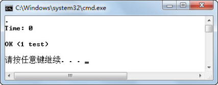
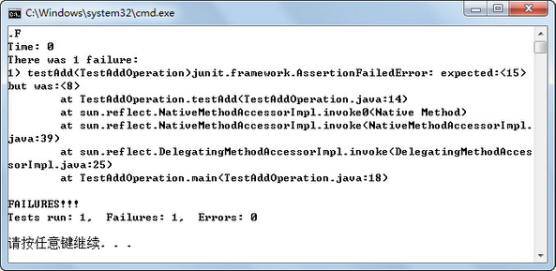
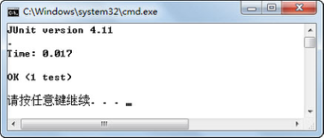
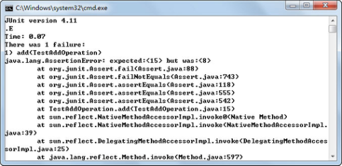
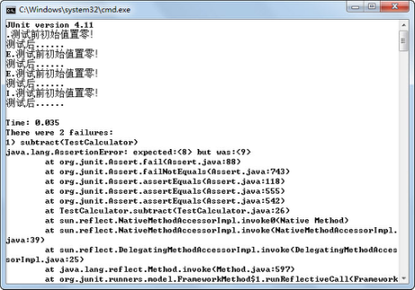
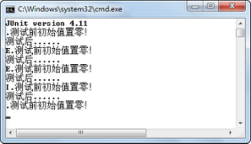
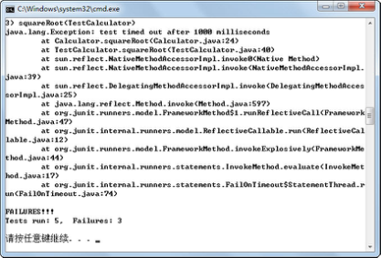
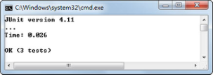

## 本章简介

 

 

&emsp;&emsp;本章主要介绍了JUnit这个常用的针对Java的单元测试工具的使用。

&emsp;&emsp;为了适用于不同场景的单元测试，本章讲解了JUnit最常见的两个版本JUnit3及JUnit4。

 

 

 

 

## 9.1  JUnit初探

 

&emsp;&emsp;JUnit是一个Java语言的单元测试框架，现已成为xUnit家族中最为成功的一个。JUnit 是Java语言事实上的标准测试库，多数Java的开发环境都已经集成了JUnit作为单元测试的工具。

&emsp;&emsp;在JUnit4推出前，由于三年未做更新，地位受到了其他Java单元测试工具的挑战。相对JUnit3而言，JUnit4是一个全新的Java单元测试框架，最大的特点是利用JDK1.5的注解特性简化测试用例的编写（所以要使用JUnit4，要求JDK必须是JDK1.5或以上版本）。

### 9.1.1 “加”类JUnit3测试  

&emsp;&emsp;首先从最简单的一个案例开始，学习如何使用JUnit3和JUnit4进行单元测试。被测对象“加”类的代码如下：


```
public class AddOperation{

public int add(int x,int y){

return x + y;

}

}
```


&emsp;&emsp;接下来使用JUnit3对“加”类进行单元测试，测试前需要导入JUnit3软件包。具体代码如下（其中对部分代码进行了注释，方便大家阅读）：


```
import junit.framework.*;

public class TestAddOperation extends TestCase{

public void setUp() throws Exception{}

public void tearDown() throws Exception{}

//测试AddOperation类的add()方法

public void testAdd(){

//输入值

int x = 3;

int y = 5;

AddOperation instance = new AddOperation();

int expResult = 8;                           //预期结果

int result = instance.add(x, y);        //获取实际结果

//通过断言判断实际结果和预期结果的差异，前者为预期，后者为实际

assertEquals(expResult,result);

}

}

```

&emsp;&emsp;从上面的代码可以看出，使用JUnit3进行单元测试，单元测试类TestAddOperation必须继承自 TestCase，执行测试的方法必须以test开头，并且使用各种类型的断言判断实际结果和预期结果的差异。

&emsp;&emsp;该单元测试类测试了被测类AddOperation中的add()方法。编译、运行程序（运行程序的命令为java -ea junit.textui.TestRunner TestAddOperation，含义为用JUnit3文本运行机的方式执行单元测试类TestAddOperation。），因为通过断言判断的add()方法的实际运行结果3+5=8和预期结果8一致，所以单元测试运行结果如图9. 1所示。


<p align="center"></p>  
<p align="center">图9.1  JUnit3测试“加”类显示结果一</p>  

&emsp;&emsp;假设针对该“加”类有这样的测试用例，输入数据仍然为3和5，预期结果为15，再次编译、运行程序，单元测试运行结果如图9.2所示。


<p align="center"></p>  
<p align="center">图9.2  JUnit3测试“加”类显示结果二</p>  


&emsp;&emsp;从运行结果可以看出，JUnit3单元测试框架发现，针对AddOperation类的add()方法进行单元测试，实际运行结果3+5=8和预期结果15不一致，所以提示出现了一个失败，并且明确指出了失败的原因。


### 9.1.2 “加”类JUnit4测试  

&emsp;&emsp;同样对“加”类进行单元测试，不过这次是使用 JUnit4 进行单元测试，测试前需要先导入JUnit4软件包，具体代码如下：


```
import org.junit.*;

import static org.junit.Assert.*;

public class TestAddOperation{

@Before

public void setUp() throws Exception{}

@After

public void tearDown() throws Exception{}

@Test//测试AddOperation类的add()方法

public void add(){

int x = 3;

int y = 5;

AddOperation instance = new AddOperation();

int expResult = 8;

int result = instance.add(x, y);

assertEquals(expResult,result);

}

}
```


&emsp;&emsp;注意，使用JUnit4对AddOperation类中的add()方法进行单元测试，导入的是org.junit包里的内容，已经不再是junit.framework包，并且单元测试类TestAddOperation不需要再继承自TestCase类。

&emsp;&emsp;使用了静态导入import static org.junit.Assert.*;，把org.junit.Assert包里的静态变量和方法导入到这个类中，调用Assert包里的assertEquals(expResult, result)方法和调用自己的方法没有区别。

&emsp;&emsp;测试方法也不必以test开头了，只要以@Test注解来描述即可。案例中还使用了一些其他的注解，如@Before、@After，JUnit4支持多种注解来简化测试类的编写，例如使用了@Before注解的方法在每个测试方法执行之前都要执行一次，使用了@After注解的方法在每个测试方法执行之后都要执行一次。并且@Before和@After标注的方法只能各有一个，这相当于取代了JUnit以前版本中的setUp()和tearDown()方法。当然在JUnit4中，还可以给被注解的方法继续起JUnit以前版本规定的名字，不过这对程序员来说只是个人喜好而已。

&emsp;&emsp;编译、运行程序（运行程序的命令为java -ea org.junit.runner.JUnitCore TestAddOperation，含义为用JUnit4运行机执行单元测试类TestAddOperation，这个JUnit4运行机可以运行JUnit3的单元测试类，但JUnit3的文本运行机不可以执行JUnit4的单元测试类），运行结果如图9.3所示。


<p align="center"></p>  
<p align="center">图9.3  JUnit4测试“加”类显示结果一</p>  


&emsp;&emsp;同样的，把预期结果从8改成15，再次编译、运行，其运行结果如图9.4所示。从运行结果来看，和JUnit3相比，还是有一些不同的。


<p align="center"></p>  
<p align="center">图9.4  JUnit4测试“加”类显示结果二</p>  


## 9.2  上机任务


#### 目标：完成本章9.1节中的所有程序。

 

时间：30分钟。

 


形式：每个学员独立完成，小组组长检查。

 


工具：EditPlus。

 

 

 


 

 

 

## 9.3  JUnit4应用

 

&emsp;&emsp;接下来通过对一个“计算器”类进行单元测试，来发现“计算器”类编写过程中出现的缺陷。

### 9.3.1 “计算器”类测试  

&emsp;&emsp;该“计算器”类功能简单，仅操作整数，并把运算结果存储在一个静态变量中。另外，这个“计算器”类有如下预设的错误。

&emsp;&emsp;（1）减法并不返回一个有效的结果。

&emsp;&emsp;（2）乘法还没有实现。

&emsp;&emsp;（3）开方方法中存在一个无限循环错误。

&emsp;&emsp;具体代码如下：


```
public class Calculator{

//存储运算结果的静态变量

private static int result;

//加法

public void add(int n){

result = result + n;

}

//减法，有错误，应该是“result = result - n”

public void subtract(int n){

result = result - 1;

}

//乘法，此方法尚未实现

public void multiply(int n){}

//除法

public void divide(int n){

result = result / n;

}

//平方

public void square(int n){

result = n * n;

}

//开方,有死循环错误 

public void squareRoot(int n){

for(;;){}

}

//清除结果

public void clear(){

result = 0;

}

//获取运算结果

public int getResult(){

return result;

}

}
```


&emsp;&emsp;使用JUnit4对“计算器”类进行单元测试，具体代码如下（本段代码中没有添加任何注释，希望大家在没有注释的情况下，尝试理解代码的含义）：


```
import static org.junit.Assert.*;

import org.junit.*;

public class TestCalculator{

Calculator calc = new Calculator();

@Before

public void setUp() throws Exception {

System.out.println("测试前初始值置零！");

calc.clear();

}

@After

public void tearDown() throws Exception {

System.out.println("测试后......");

}

@Test

public void add(){

calc.add(2);

calc.add(3);

int result = calc.getResult();

assertEquals(5, result);

}

@Test

public void subtract(){

calc.add(10);

calc.subtract(2);

int result = calc.getResult();

assertEquals(8, result);

}

@Test

public void divide(){

calc.add(8);

calc.divide(2);

assert calc.getResult() == 5;

}

@Test(expected = ArithmeticException.class)

public void divideByZero(){

calc.divide(0);

}

@Ignore("not Ready Yet Test Multiply")

@Test

public void multiply(){

calc.add(10);

calc.multiply(10);

int result = calc.getResult();

assertEquals(100, result);

}

}
```


&emsp;&emsp;下面对这个单元测试类中用到的技术类进行解释。

- 断言

&emsp;&emsp;在 JUnit4 中，新集成了一个 assert 关键字（见案例中的 divide()方法），我们可以像使用assertEquals()方法一样来使用它，因为它们都抛出相同的异常java.lang.AssertionError。

&emsp;&emsp;在JUnit4中，还引入了两个新的断言方法，它们专门用于数组对象的比较，其语法形式如下：


```
public static void assertEquals(String message,Object[] expected,Object[] actuals);

public static void assertEquals(Object[] expected,Object[] actuals);
```


&emsp;&emsp;原先JUnit3中的assertEquals(long,long)方法在JUnit4中都使用assertEquals (Object,Object)方法，对于assertEquals(byte,byte)、assertEquals(int,int)等也是如此，这是因为从JDK1.5开始支持自动拆箱、装箱机制。

- 异常

&emsp;&emsp;JUnit4的@Test注解支持可选参数，它可以声明一个测试方法应该抛出一个异常。如果这个方法不抛出或者如果它抛出一个与事先声明的不同的异常，那么该测试失败。在案例中（见案例中的divideByZero()方法），一个整数被零除应该抛出一个ArithmeticException异常，则该方法的@Test注解应该写成@Test(expected = ArithmeticException.class)。

- 忽略测试

&emsp;&emsp;在JUnit3中，临时禁止一个测试的方法是通过注释掉它或者改变命名约定，这样测试运行机就无法找到它。在JUnit4中，为了忽略一个测试，可以注释掉一个方法或者删除@Test注解（不能再改变命名约定，否则将抛出一个异常），该运行机将不理会也不报告这样一个测试。不过，在JUnit4中可以把@Ignore注解添加到@Test注解的前面或者后面，测试运行机将报告被忽略的测试的数目，以及运行的测试的数目和运行失败的测试数目。

- 运行测试 

&emsp;&emsp;在JUnit3中，可以选择使用若干运行机，包括文本型、AWT或者Swing，在JUnit4中仅支持文本测试运行机。

&emsp;&emsp;编译、运行程序，其运行结果如图9.5所示（截选部分内容）。从运行结果中可以看出测试失败的数目及详细信息。

 


<p align="center"></p>  
<p align="center">图9.5  JUnit4测试“计算器”类</p>  


### 9.3.2  JUnit4知识拓展  

- 高级环境预设

&emsp;&emsp;通过前面的学习可以知道，使用了@Before注解的方法在每个测试方法执行之前都要执行一次，使用了@After注解的方法在每个测试方法执行之后要执行一次。如果在测试时，仅需要分配和释放一次昂贵的资源，那么可以使用注解@BeforeClass 和@AfterClass，其含义为在所有的方法执行之前或之后执行一次。

- 限时测试 

&emsp;&emsp;在Calculator类中，编写的开方方法代码如下：


```
public void squareRoot(int n){

for(;;){}

}
```


&emsp;&emsp;很显然，方法体内是一个死循环。如果使用JUnit对该方法执行单元测试，即需要在TestCalculator测试类中增加如下代码：

```

@Test

public void squareRoot(){

calc.squareRoot(4);

int result = calc.getResult();

assertEquals(2, result);

}

```

&emsp;&emsp;再次编译、运行，其运行结果如图9.6所示。执行测试类，进入了死循环，不能正常退出。


<p align="center"></p>  
<p align="center">图9.6  JUnit4测试死循环方法</p>  

&emsp;&emsp;如何解决这个问题呢？尤其是对于那些逻辑很复杂，循环嵌套比较深的程序，很有可能出现死循环，因此一定要采取一些预防措施，JUnit4中的限时测试是一个很好的解决方案。如果给这些测试方法设定一个执行时间，并超过了这个时间，它们就会被系统强行终止，并且系统还会汇报该方法结束的原因是因为超时，这样就可以发现这些Bug了。要实现这一功能，只需要给@Test注解加一个参数即可，例如@Test(timeout = 1000)，timeout参数表示设定的时间，单位为毫秒。编译、运行程序，运行结果如图9.7所示，JUnit4会再报告一个失败，失败的原因是超过了这个时间未获得预期结果。


<p align="center"></p>  
<p align="center">图9.7 JUnit4限时测试</p>  


- 参数化测试

&emsp;&emsp;在Calculator类中有一个求平方的方法square()，TestCalculator测试类还没有对它进行单元测试。假设现在为测试该方法设计3个测试用例，输入值分别是2、0、-3，预期结果分别是4、0、9，则需要在TestCalculator测试类中增加如下代码。


```
@Test

public void square1(){

calc.square(2);

int result = calc.getResult();

assertEquals(4, result);

}

@Test

public void square2(){

calc.square(0);

int result = calc.getResult();

assertEquals(0, result);

}

@Test

public void square3(){

calc.square(-3);

int result = calc.getResult();

assertEquals(9, result);

}
```


&emsp;&emsp;前面在介绍自动化测试时提到过，如果步骤相同，只是输入数据和预期结果不一样的多次、重复的测试，可以考虑采用录制、回放的模式。录制一次执行步骤，然后将多组测试用例的输入数据和预期结果放入自动测试工具中，回放时每次执行一组输入数据，并将实际运行结果和预期结果进行比较判断，这样可以提高测试效率。

&emsp;&emsp;基于同样的思路，JUnit4提出了参数化测试的概念，只写一个测试方法，把若干种情况作为参数传递进去，一次性完成测试。其具体代码如下（代码中的注释非常重要，请认真阅读）：


```
import java.util.*;

import org.junit.*;

import org.junit.runner.RunWith;

import org.junit.runners.Parameterized;

import org.junit.runners.Parameterized.Parameters; 

import static org.junit.Assert.*;

//要为这个测试指定一个运行机，因为特殊的功能要用特殊运行机

@RunWith(Parameterized.class)

//为参数化测试专门生成一个新的类，不能与其他测试共用同一个类

public class TestSquare{

Calculator calc = new Calculator();

private int param;

private int result;

//定义测试数据集合，该方法可以任意命名，但是必须使用@Parameters注解进行修饰

@Parameters public static Collection data(){

return Arrays.asList(new Object[][]{ {2, 4},{0, 0},{-3, 9} });

}

//构造函数，其功能是对先前定义的两个参数进行初始化

public TestSquare(int param, int result) {

this.param = param;

this.result = result;

}

@Test

public void square(){

calc.square(param);

assertEquals(result, calc.getResult());

}

}
```


&emsp;&emsp;编译、运行程序，运行结果如图9.8所示。


<p align="center"></p>  
<p align="center">图9.8  JUnit4参数化测试</p>  


&emsp;&emsp;关于JUnit4的测试运行机，这里做简要的补充说明。

&emsp;&emsp;在 JUnit4 中，如果没有指定@RunWith，那么会使用一个默认运行机（org.junit.internal. runners.TestClassRunner）执行，但在参数化测试（使用@Parameterized注解）和马上要讲到的测试集测试（使用@Suite注解）的情况下，需要一个特定的运行机来执行测试用例。

- 测试集 

&emsp;&emsp;之前编写了TestCalculator测试类，刚才又编写了TestSquare测试类，现在要执行这些测试的话，需要分别使用JUnit4命令执行对这两个测试类的单元测试。如果需要测试的测试类比较多，逐个执行会非常麻烦。

&emsp;&emsp;在JUnit4之前的版本中，已经有测试集的概念，可以在一个测试集中运行若干个测试类，不过必须要在类中添加一个 suite()方法。而在 JUnit4 中，可以使用注解替代。为了运行TestCalculator和TestSquare这个两测试类，需要使用@RunWith和@Suite注解编写一个空类，具体代码如下：


```
import org.junit.runner.RunWith;

import org.junit.runners.Suite;

@RunWith(Suite.class)

@Suite.SuiteClasses({TestCalculator.class,TestSquare.class})

public class TestAllCalculator{}
```

 

## 9.4  上机任务


#### 目标：完成本章9.3节中的所有程序。

 


时间：40分钟。

 


形式：每个学员独立完成，小组组长检查。

 


工具：EditPlus。

 

 

 


 

## 9.5  本章练习

 

1  与JUnit3相比，JUnit4有什么改进之处？

 

 

2  JUnit4中的@Before注解，与JUnit3中的哪个方法相类似？

 

 

3  @BeforeClass、@Before有什么区别？

 

 

4  用JUnit4测试的方法，必须满足什么条件？

 

